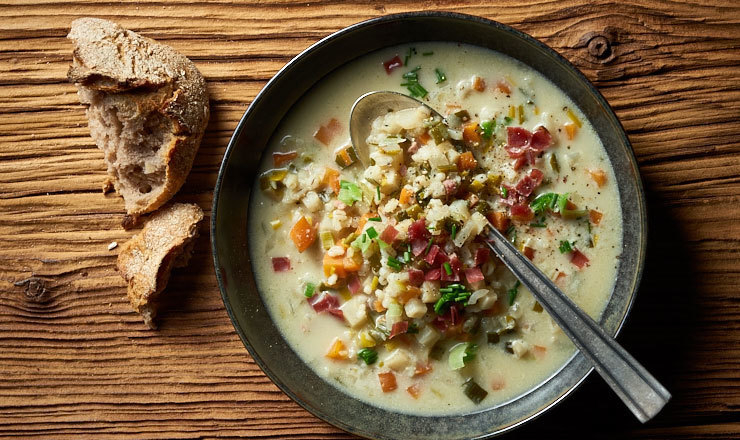

# Bündner Gerstensuppe

*Graubünden barley soup: pearl barley simmered with bündnerfleisch, smoked bacon, root vegetables and a bay leaf into a hearty Alpine pottage. The first course at any winter meal in the Grisons.*

**Serves:** 6

**Prep Time:** 15 minutes

**Cook Time:** 1 hour 30 minutes

## Overview
Bündner Gerstensuppe is the signature dish of Graubünden (the Grisons), the easternmost canton of Switzerland and the only one where Romansh is still spoken. The soup combines pearl barley (Gerste), root vegetables, dried cured beef (bündnerfleisch), and smoked bacon into a slow simmer that produces something hearty enough to be a meal on its own. It was originally herdsmen's food made from larder staples; today it appears on every restaurant menu in the canton and is served as a winter starter to thaw skiers and walkers. Made with stock, cream and a long slow cook, the texture is silky and the barley swells to a satisfying chew. A good one tastes deeply of cured meat and stock; a mediocre one tastes watery and worthy.

## Ingredients
- 200 g pearl barley
- 150 g smoked pancetta or smoked streaky bacon, cut into 1 cm dice
- 1 tbsp unsalted butter
- 1 large onion, finely diced
- 2 medium carrots, diced
- 2 celery sticks, diced
- 1 small leek, sliced
- 1 small turnip or 200 g celeriac, diced
- 2 cloves garlic, minced
- 2 bay leaves
- 1 tsp dried thyme (or 1 sprig fresh)
- 1.8 L beef or chicken stock
- 100 g bündnerfleisch (or prosciutto / pancetta), finely sliced
- 150 ml double cream
- Salt and freshly ground black pepper
- 2 tbsp flat-leaf parsley, chopped

## Method

### Stage 1 - Soak the barley
1. Rinse the pearl barley in a sieve under cold water.
2. Soak in cold water for 30 minutes (cuts the cooking time and softens the grain).

### Stage 2 - Render the bacon
1. Melt the butter in a large heavy pot over medium heat.
2. Add the diced bacon; cook 6-8 minutes until the fat renders and the bacon is just turning golden.

### Stage 3 - Sweat the vegetables
1. Add the onion, carrot, celery, leek and turnip; stir to coat in the bacon fat.
2. Sweat over medium-low heat 10 minutes, stirring occasionally, until softened but not coloured.
3. Add the garlic, bay and thyme; cook 1 minute.

### Stage 4 - Add the barley and stock
1. Drain the soaked barley; tip into the pot.
2. Stir to coat in the fat for 30 seconds.
3. Pour in the stock; bring to a boil.

### Stage 5 - Simmer
1. Reduce to a low simmer.
2. Cover loosely (a lid set ajar); cook 1 hour, stirring every 15 minutes to stop the barley sinking and catching.
3. The soup thickens as the barley swells and releases starch.
4. Test for tenderness; the barley should be soft but still have a little chew.

### Stage 6 - Finish
1. Add the bündnerfleisch slices, torn into rough strips (you want them to flavour the broth but not toughen, so don't add them earlier).
2. Stir in the cream.
3. Simmer 5 more minutes.
4. Discard the bay leaves and thyme sprig.
5. Taste for salt - the bacon and bündnerfleisch are salty, so you may need very little.
6. Plenty of black pepper.

### Stage 7 - Serve
1. Ladle into warm bowls.
2. Scatter with parsley.

## Notes
- **The barley swells dramatically:** A spoonful of dry barley becomes a ladleful of cooked. The soup thickens overnight in the fridge; thin with a little extra stock when reheating.
- **Smoked bacon, not unsmoked:** The character of the soup comes from the smoke. If you only have unsmoked bacon, add half a teaspoon of smoked paprika to compensate.
- **Bündnerfleisch:** The Grisons air-dried beef is what makes this Bündner Gerstensuppe (rather than generic barley soup). Substitute with bresaola or prosciutto if you can't find it - lean cured meat, sliced thin.

## Serving
Serve as a starter or a light main with crusty bread and butter. A glass of dry Swiss white (Müller-Thurgau, Chasselas) or a light Pinot Noir from the Grisons.

## Storage
- Refrigerates 4 days; the flavour deepens overnight.
- Thin with stock or water when reheating; gentle stovetop heat.
- Freezes 2 months; thaw in the fridge before reheating.
