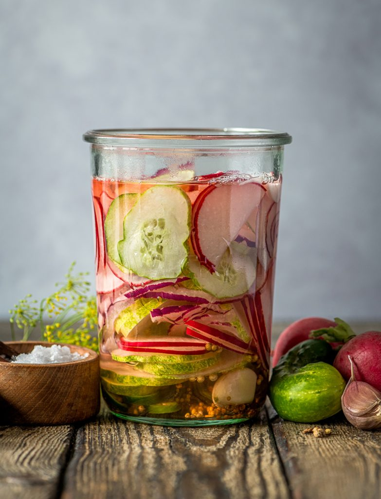

# Swiss Pickled Vegetables

*The pickle plate of Switzerland: cornichons, pearl onions and a few sharper picks served alongside any cheese course - fondue, raclette, or a board. Sharp, vinegary, crunchy.*

**Serves:** Makes 2 large jars (about 12 servings)

**Prep Time:** 20 minutes

**Cook Time:** 5 minutes (plus 1 week ferment)

## Overview
Every Swiss cheese course - fondue, raclette, a slate of cheese with crusty bread - arrives at the table with a small bowl of pickled vegetables alongside. The dairy fat is heavy; the vinegary crunch is what stops the meal becoming overwhelming. The classic pair is cornichons (tiny pickling cucumbers) and silverskin pearl onions; many homes also pickle cauliflower florets, baby carrots, and pearl onions with a mustardy brine. This recipe makes the latter: a quick-pickle of mixed vegetables in a hot vinegar brine sharp with mustard seed, dill and bay. Ready to eat the next day; even better after a week.

## Ingredients

### Vegetables
- 250 g pearl onions or shallots, peeled
- 250 g small pickling cucumbers (or thin-skinned mini cucumbers), whole if small, halved if larger
- 200 g cauliflower florets, broken into bite-size pieces
- 200 g baby carrots, halved lengthways if thick
- 1 small red chilli (optional)

### Brine
- 500 ml white wine vinegar (or cider vinegar)
- 250 ml water
- 80 g caster sugar
- 1.5 tbsp fine sea salt
- 2 tsp yellow mustard seeds
- 1 tsp coriander seeds
- 1 tsp black peppercorns
- 2 bay leaves
- 4 sprigs fresh dill (or 1 tsp dried)
- 4 cloves garlic, peeled

## Method

### Stage 1 - Prep the vegetables
1. Peel the pearl onions: drop them into a pot of boiling water for 30 seconds, drain, plunge in cold water; the skins slip off easily.
2. Halve the cucumbers if larger than thumb-sized.
3. Break the cauliflower into bite-size florets.
4. Halve the baby carrots if thick.
5. Halve the chilli, deseed.

### Stage 2 - Blanch
1. Bring a large pot of water to a boil; add a pinch of salt.
2. Blanch the cauliflower and carrots 90 seconds; lift out with a slotted spoon.
3. Plunge into ice water; drain.
4. The onions and cucumbers go in raw - they're better with crunch retained.

### Stage 3 - Pack the jars
1. Use 2 sterilised large preserving jars (1 L each).
2. Distribute the vegetables, garlic cloves, chilli, dill and bay leaves between the jars, packing snugly.

### Stage 4 - Make the brine
1. In a saucepan, combine the vinegar, water, sugar, salt, mustard seeds, coriander seeds and peppercorns.
2. Bring to a boil; stir to dissolve the sugar and salt.
3. Simmer 1 minute.

### Stage 5 - Fill
1. Pour the hot brine over the vegetables, fully submerging them. Leave 1 cm headspace.
2. Tap the jars on the counter to release air bubbles.
3. Seal with sterilised lids.

### Stage 6 - Cool and store
1. Let the jars cool at room temperature for 1 hour.
2. Refrigerate.
3. Wait at least 24 hours before opening; the flavour peaks after 1 week.

## Notes
- **Crunch is the point:** Don't over-blanch the cauliflower and carrots. 90 seconds is enough to take the raw edge off; longer and they go soft in the brine.
- **Sterilise the jars:** Wash in hot soapy water, rinse, dry in a 120°C oven 15 minutes. Or run through a hot dishwasher cycle and use straight after.
- **Refrigerator pickles, not shelf-stable:** This is a quick-pickle method; they need to live in the fridge and keep about 6 weeks.

## Serving
- Serve in a small bowl alongside fondue, raclette, or any cheese board. They're also good on a charcuterie plate, with cold roast meats, or chopped into a salad of cold boiled potatoes.

## Storage
- Refrigerate; eat within 6 weeks for best texture.
- The brine sharpens over time; the vegetables soften gradually.
- The leftover brine makes a sharp salad dressing or a sour pickleback to a glass of cold beer.
