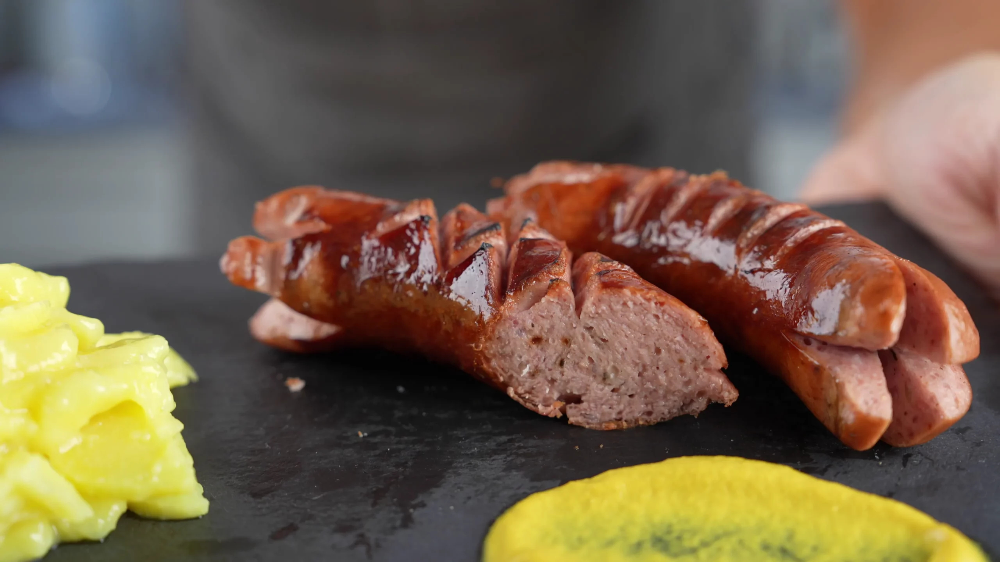

# Cervelat

*The national Swiss sausage: a stubby smoked beef-and-pork sausage, scored crosswise and grilled over an open fire until the cuts curl back into "flower" tips. Swiss campers and walkers eat them everywhere with mustard and bread.*

**Serves:** 4

**Prep Time:** 5 minutes

**Cook Time:** 10 minutes

## Overview
Cervelat is the sausage Switzerland eats more than any other - a smoked, cooked sausage made of beef, pork and bacon, encased in beef gut (or in modern times a synthetic skin), about the size of a thick frankfurter. Cold it's a lunchtime sandwich; hot, the classic method is to score each end in a cross, grill or roast over an open fire, and watch the cut tips peel back into petals as they cook. The result is a sausage with charred curling "flowers" at each end, served on a wooden stick with mustard and a hunk of bread - the Swiss national outdoor meal at every football pitch, Alpine hütte and barbecue. The name comes from the Latin for brain (cerebellum) - early versions contained pig brain; modern ones don't.

## Ingredients
- 8 cervelat sausages (or substitute: bockwurst, knackwurst, or smoked thick frankfurters)
- 1 baguette or 8 small bread rolls
- Strong yellow mustard (Thomy senf if you can get it; otherwise English or German mustard)
- Wholegrain mustard
- Salted butter for the bread
- Optional: pickled gherkins or onions to serve

## Method

### Stage 1 - Score the ends
1. With a small sharp knife, cut a cross into each end of each sausage, about 1.5 cm deep.
2. The cuts are what curl back during cooking - skip this and the sausage just bursts.

### Stage 2 - Cook
Choose one method:

**Open fire / barbecue (classic):**
1. Build a hot fire or get the barbecue to medium-high.
2. Spear each sausage on a long stick or hold with tongs.
3. Hold over the heat, turning, for 6-8 minutes until the skin blisters and the scored ends curl back into petals.
4. Some charring is desired.

**Grill pan:**
1. Heat a ridged grill pan over medium-high heat.
2. Add the sausages (no oil needed - they have enough fat).
3. Grill 8-10 minutes total, turning every 2 minutes, until the skin is dark and the cut ends curl open.

**Oven:**
1. Preheat the oven to 200°C.
2. Place the sausages on a tray; roast 12-15 minutes until the skin browns and the ends curl.

### Stage 3 - Bread
1. Slice the baguette into thick rounds, or split the rolls.
2. Butter the cut sides generously.

### Stage 4 - Serve
1. Pile the sausages on a board or plate.
2. Set the mustards out in small bowls with spoons.
3. Eat: hold the sausage in one hand, the bread in the other, alternate bites with smears of mustard.
4. Don't put the sausage inside the bread - that's an American hot dog and a different dish.

## Notes
- **Score deep enough:** A shallow cross won't curl. Aim for 1.5 cm; the cuts open as the inside steams against the casing.
- **No oil:** Cervelat are pre-cooked and pre-smoked. You're just heating them through and crisping the skin; they have enough fat to slide around the pan.
- **Eat with bread, not in bread:** The Swiss tradition is sausage in one hand, bread in the other, alternating bites. The cut ends should be visible on the plate.

## Serving
- The campfire and football-stadium classic. Serve at a barbecue, after a walk, with a glass of cold lager or apple juice. Mustard, bread, sausage; that's the dish.

## Storage
- Raw uncooked cervelat refrigerates a week, or freezes 2 months.
- Cooked cervelat refrigerates 3 days; eat cold next day in a sandwich or sliced into a cervelat salad (with vinaigrette, cheese, onion).
