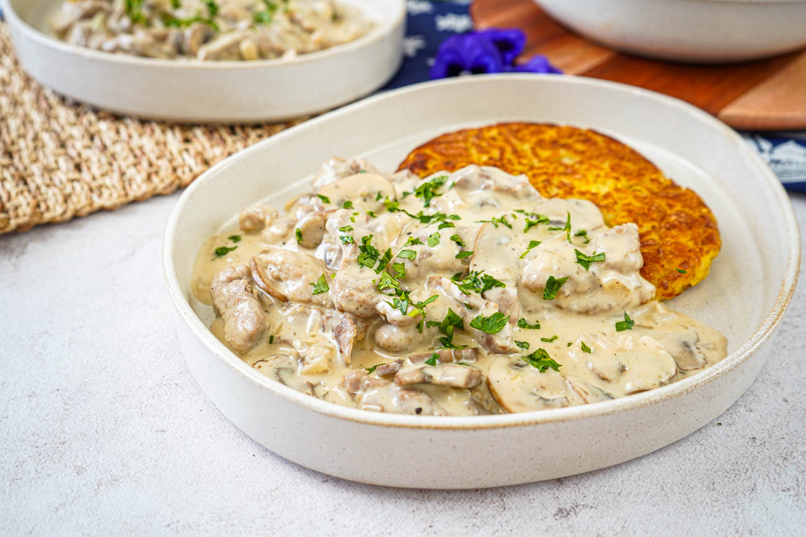

# Zürcher Geschnetzeltes

*Zurich-style veal in cream sauce: thin strips of veal flash-fried then folded into a buttery mushroom-cream-white wine sauce, finished with lemon and a swirl of cream. Served with rösti.*

**Serves:** 4

**Prep Time:** 20 minutes

**Cook Time:** 20 minutes

## Overview
Geschnetzeltes - "small cuts" - is the Swiss German term for strips of meat in cream sauce, and the Zurich version is the most famous: veal escalope cut into ribbons, flash-fried in butter so it stays pale and tender, then folded into a cream sauce built on shallots, mushrooms, white wine and a squeeze of lemon. Always served with rösti, the crisp grated-potato cake that catches the sauce. The version dates to early-twentieth-century Zurich restaurant cooking; some recipes also use the veal kidney for extra savour. Quick to cook, looks elegant, and pairs with a glass of dry Zürichsee white wine. Make the rösti first and keep it warm while you cook the sauce - the meat takes minutes.

## Ingredients
- 600 g veal escalope, sliced into thin strips (5 mm wide, 5 cm long)
- 2 tbsp plain flour
- Salt
- Freshly ground black pepper
- 50 g unsalted butter (in three batches)
- 1 tbsp vegetable oil
- 2 shallots, finely diced
- 250 g chestnut mushrooms, sliced
- 150 ml dry white wine (Riesling, Müller-Thurgau, or any dry European white)
- 250 ml double cream
- 1 tbsp Dijon mustard
- Juice of half a lemon
- 1 tbsp finely chopped flat-leaf parsley

## Method

### Stage 1 - Prep the veal
1. Pat the veal strips dry with kitchen paper - dry meat browns; wet meat steams.
2. Toss in a bowl with the flour, salt and pepper. Shake off excess.

### Stage 2 - Sear the veal
1. Heat 20 g butter and the oil in a large heavy frying pan over high heat until the butter foams subside.
2. Add half the veal in one layer (don't crowd the pan); sear 1 minute, turning briefly.
3. Lift out to a warm plate; sear the second half the same way.
4. The strips should be just sealed and barely cooked through - they finish in the sauce.

### Stage 3 - Mushroom-shallot base
1. Reduce heat to medium; add another 20 g butter to the pan.
2. Add the shallots; cook 2 minutes until softened.
3. Add the mushrooms; cook 5-6 minutes until they release their liquid and it cooks away.

### Stage 4 - Build the sauce
1. Pour in the white wine; let it bubble and reduce by half (1-2 minutes).
2. Pour in the cream; stir in the Dijon mustard.
3. Simmer 3-4 minutes, stirring, until the sauce thickens enough to coat the back of a spoon.

### Stage 5 - Return the veal
1. Add the veal and any juices on the resting plate back to the pan.
2. Fold through the sauce; warm through for 1 minute (don't simmer long or the veal toughens).
3. Off the heat, squeeze in the lemon juice; add the remaining 10 g butter; swirl to gloss the sauce.
4. Taste for salt and pepper.

### Stage 6 - Serve
1. Spoon onto warm plates alongside rösti.
2. Scatter parsley.

## Notes
- **Veal cut:** Escalope (the topside) is classic. Chicken breast or pork tenderloin make decent substitutions but the dish is no longer geschnetzeltes; just call it "chicken in cream sauce" if you sub.
- **High heat, short time:** Veal strips overcook fast. Sear in two batches over high heat to brown without stewing, then keep the time in the sauce to under a minute.
- **The mustard isn't traditional in every recipe:** A modern Zurich addition for depth. Leave it out for a purer version; you may want a touch more salt.

## Serving
- Serve immediately with rösti on the side. A small green salad. Dry Swiss white wine - a Riesling-Sylvaner from the Zürichsee, a Chasselas from Vaud, or any dry European white.

## Storage
- Best fresh. Veal in cream sauce reheats poorly - the meat toughens.
- Leftover sauce alone refrigerates 2 days; toss with fresh pasta as a sauce for a different dish.
