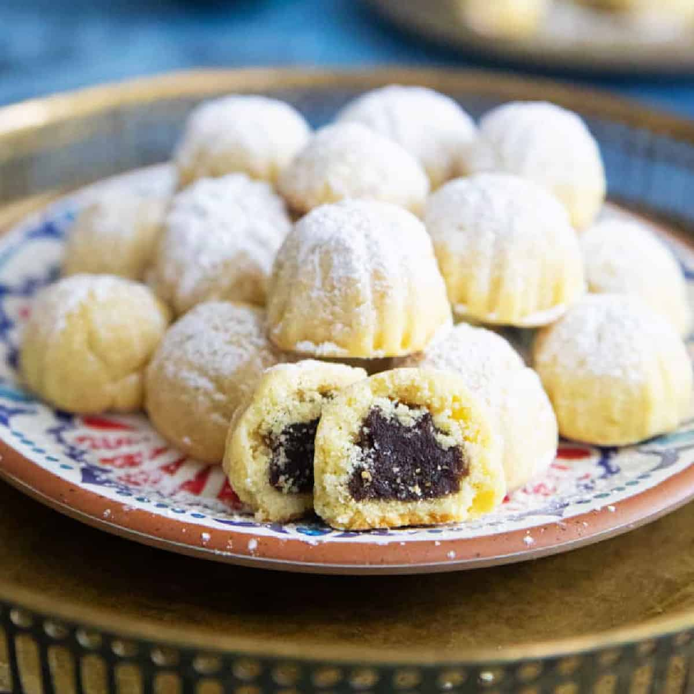

# Ma'amoul

*Syria's iconic stuffed semolina cookies: a tender butter-and-semolina shortbread shell wrapped around a date paste (or walnut, or pistachio) filling, pressed into wooden moulds with decorative patterns, baked till just-set and pale, dusted with icing sugar. The Easter, Eid and family-celebration cookie of every Damascus household.*

**Serves:** Makes about 30 cookies

**Prep Time:** 1 hour 30 minutes (plus 4 hours dough rest)

**Cook Time:** 25 minutes

## Overview
Ma'amoul is one of the Levant's most iconic cookies and a Syrian household tradition for every major celebration: Easter for Christians, Eid al-Fitr for Muslims, weddings, christenings, family gatherings. A tender semolina-and-butter shortbread shell wraps a sweet filling, pressed into carved wooden moulds with decorative patterns. The three traditional fillings are date with orange blossom water, walnut with rose water and cinnamon, and pistachio with rose water; each filling gets a different mould shape (round for dates, dome for pistachios, oval for walnuts) so they can be told apart on the platter without opening one. The long dough rest is the technique home cooks new to the cookie most often skip; four hours or overnight after mixing is essential for the semolina to absorb the butter and give the proper melt-in-the-mouth texture, and a rushed dough gives gritty ma'amoul. Pale-bake is non-negotiable; pale tops with only the underside lightly golden, where browned ma'amoul tastes wrong. Dusted with icing sugar after cooling.

## Ingredients

### Dough
- 500 g fine semolina (smeed; the fine variety, not the coarse couscous-like one)
- 200 g plain flour
- 300 g unsalted butter (softened to room temperature; or use clarified butter / ghee for the proper Syrian version)
- 80 g caster sugar
- ½ teaspoon mahleb (ground cherry kernel; the traditional Levantine spice; or substitute with ½ teaspoon vanilla extract)
- 1 teaspoon ground anise seed (optional but very Syrian)
- 1 teaspoon ground cardamom
- ½ teaspoon fine sea salt
- 2 tablespoons orange blossom water
- 2 tablespoons rose water
- 80-100 ml warm milk (the exact amount depends on flour absorbency)

### Date filling
- 350 g pitted Medjool dates (or other soft dates)
- 50 g unsalted butter
- 1 teaspoon ground cinnamon
- ½ teaspoon ground nutmeg
- 1 tablespoon orange blossom water

### Walnut filling
- 250 g shelled walnuts (finely chopped, not powdered)
- 80 g caster sugar
- 1 teaspoon ground cinnamon
- 2 tablespoons rose water
- 1 tablespoon orange blossom water

### Pistachio filling (the most luxurious)
- 250 g shelled pistachios (finely chopped; the natural unsalted ones)
- 60 g caster sugar
- 2 tablespoons rose water
- 1 tablespoon orange blossom water

### To finish
- 150 g icing sugar (for dusting)

### Equipment
- Wooden ma'amoul moulds (sold at Middle Eastern markets and online; one round, one dome and one oval is the proper set)
- Or use a flat surface and shape by hand without patterns

## Method

### Stage 1 - Make the dough
1. In a wide bowl, combine the semolina, plain flour, mahleb (or vanilla), anise, cardamom and salt.
2. Add the softened butter; rub in with your fingertips till the mixture looks like coarse breadcrumbs with the butter fully integrated.
3. Add the sugar; mix in.
4. Add the orange blossom water, rose water and start with 60 ml of the warm milk.
5. Mix; add more milk gradually till the dough comes together to a soft pliable consistency. It should hold together when squeezed but not be wet.
6. Wrap in cling film; refrigerate 4 hours (or overnight).

### Stage 2 - Make the date filling
1. Place the dates in a food processor; pulse to a smooth paste (or chop very finely by hand).
2. Transfer to a small pan; add the butter, cinnamon, nutmeg and orange blossom water.
3. Cook over low heat for 3-4 minutes, stirring frequently, till the mixture is smooth and combined.
4. Cool to room temperature.
5. Once cool, divide into walnut-sized balls (about 12 g each); place on a tray.

### Stage 3 - Make the walnut filling
1. Combine the finely chopped walnuts, sugar, cinnamon, rose water and orange blossom water in a bowl.
2. Mix till the nuts are evenly coated; the mixture should be moist but not wet.
3. Divide into walnut-sized portions (about 12 g each); shape into small balls.

### Stage 4 - Make the pistachio filling
1. Combine the chopped pistachios, sugar, rose water and orange blossom water; mix.
2. Shape into walnut-sized balls.

### Stage 5 - Shape the ma'amoul
1. Preheat the oven to 150°C (300°F).
2. Line 2 large baking sheets with parchment paper.
3. Divide the rested dough into 30 equal pieces (about 33 g each).
4. Working one at a time, flatten one dough ball into a thin disc about 6 cm across in your palm.
5. Place a filling ball in the centre.
6. Bring the edges of the dough up around the filling; pinch closed at the top.
7. Roll into a ball, then flatten gently.
8. Press the filled cookie into a wooden ma'amoul mould (lightly dust the mould with flour first to prevent sticking); press firmly so the dough fills the carved pattern.
9. Invert the mould over the baking sheet; gently tap to release the cookie.
10. If not using a mould: just shape into a slightly flattened ball and use a fork to make a pattern on top.
11. Repeat with the remaining dough and fillings.

### Stage 6 - Bake
1. Place the trays in the oven.
2. Bake at 150°C (300°F) for 20-25 minutes till the bottoms are very lightly golden but the tops are still pale.
3. Don't let the tops brown; ma'amoul should be pale.

### Stage 7 - Cool and dust
1. Let cool on the trays for 10 minutes (the cookies are very fragile when hot).
2. Transfer carefully to a wire rack; cool completely.
3. Once fully cool, dust generously with icing sugar.

### Stage 8 - Serve
1. Arrange on a platter or in a decorative tin.
2. Serve with strong sweet Arabic coffee or sweet mint tea.

## Notes
- **Rest the dough properly:** 4 hours minimum, overnight ideal. The semolina needs to absorb the butter fully; under-rested dough gives gritty cookies.
- **Don't over-handle the dough:** the proper ma'amoul dough is tender and slightly crumbly. Over-kneading develops the proteins and gives tough cookies.
- **Don't brown:** ma'amoul should be pale. Bake at low temperature (150°C); take out when the bottoms are just barely golden. Browned ma'amoul is overbaked.
- **The wooden moulds give the iconic look:** traditional ma'amoul moulds carved with patterns are sold at Middle Eastern markets and online. One round (for dates), one dome (for pistachios), one oval (for walnuts) is the proper set.
- **Mahleb gives the Levantine character:** the ground cherry-pit spice (sold at Middle Eastern markets) is what gives ma'amoul its distinctive flavour. Vanilla is a workable substitute but not the same.

## Variations
**Pistachio-only ma'amoul:** make only the pistachio filling; the most luxurious version, often saved for Eid. The bright green of pistachio shows through the pale shell.
**Date-only ma'amoul (the everyday):** make only the date filling; the most common everyday Syrian version.
**Honey-glazed ma'amoul:** while still warm, brush with a thin warm honey-and-orange-blossom-water syrup; gives a shinier sweeter result. Common variation.
**Mini ma'amoul:** make smaller cookies (20 g each); gives 50+ smaller cookies. Common for parties and platters.

## Serving
On a decorative platter or in a tin lined with parchment, with strong Arabic coffee (small ceramic cups, very strong, slightly bitter), sweet mint tea, or hot chocolate. At Easter (Christian Syria), Eid al-Fitr (Muslim Syria), weddings, christenings; or as a Sunday afternoon treat with family.

## Storage
- Keeps in a sealed tin at room temperature 2 weeks; the cookies stay tender and the flavour deepens.
- Don't refrigerate; the cookies dry out.
- Freeze 3 months in a sealed container; defrost at room temperature for 2-3 hours; dust with fresh icing sugar before serving.
- The unbaked dough freezes 2 months wrapped tightly; defrost in the fridge overnight before shaping.
- The fillings keep refrigerated 1 week; bring to room temperature before shaping.
