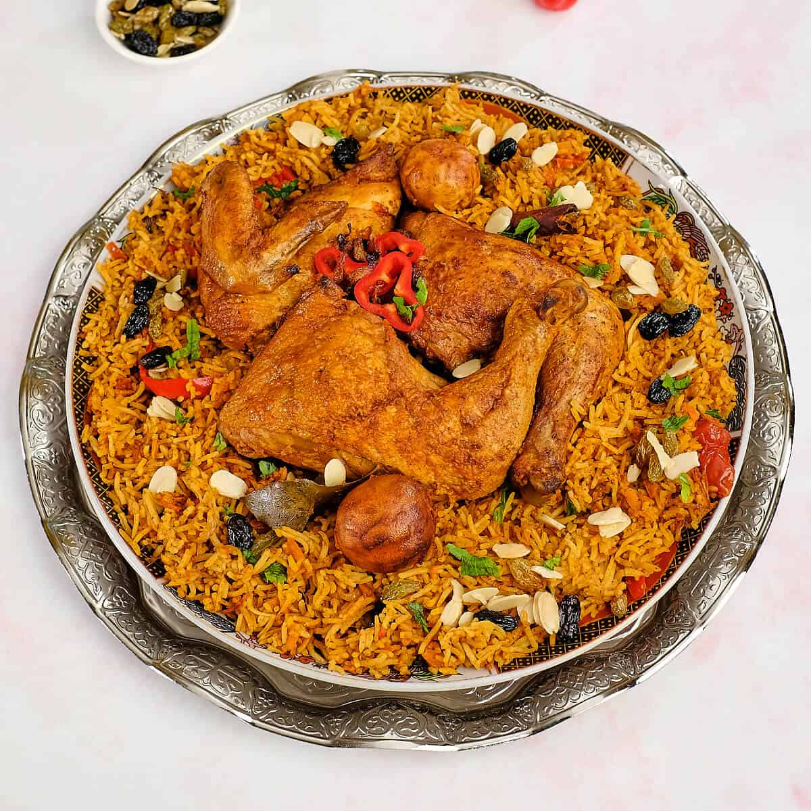

# Syrian Kabsa

*Syria's spiced rice-and-chicken one-pot: long-grain rice cooked through with onion, garlic, tomato and the canonical Levantine spice mix (cumin, coriander, cinnamon, cardamom, allspice, black lime), a bone-in chicken laid on top and slow-roasted till the rice absorbs the chicken juices and the spice profile becomes layered. The Damascus dinner-table classic shared with the wider Arabian peninsula.*

**Serves:** 6

**Prep Time:** 25 minutes (plus 30 minutes chicken marination)

**Cook Time:** 1 hour 30 minutes

## Overview
Syrian kabsa (sometimes spelled "kabseh") is the Damascus and Aleppo variation of the famous spiced rice-and-meat dish that spans the Arabian peninsula and the Levant: long-grain rice (basmati is canonical) cooked in a generous broth of chicken, onion, tomato, garlic and the layered Levantine spice mix (cumin, coriander, cinnamon, cardamom, allspice, black pepper, and the canonical Levantine touch of dried black lime, "loomi", which gives the rice its distinctive faintly bitter floral character), with a whole bone-in chicken laid on top of the rice and roasted till the chicken skin crisps and the meat falls from the bone. The dish is served on a large platter with the rice spread underneath and the chicken laid over it, topped with toasted almonds and pine nuts, garnished with chopped parsley, and accompanied by a small bowl of fresh tomato-cucumber salad and a yogurt sauce. The dish sits between the Saudi kabsa, the Yemeni mandi, the Emirati machboos and the various other Arabian one-pot rice-and-meat traditions; the Syrian version distinguishes itself with the use of black lime (more common than in some other variants), the Levantine spice profile (less heat-forward than Saudi versions), and the tomato-rich rice. Three details define proper Syrian kabsa. First, the spice mix is essential. Dried black lime (loomi), cardamom, cinnamon, cumin, coriander, allspice and a small touch of dried rose petals or sumac (some cooks include) make up the Levantine kabsa spice. Skipping these or substituting curry powder gives generic chicken-and-rice. Second, the rice is cooked in the chicken's broth. Don't boil the rice in plain water; the rice must absorb the chicken-cooking broth for the proper layered flavour. Third, the chicken sits on top of the rice and roasts together. The dish is one-pot in its proper Syrian style; the chicken's fat and juices drip down into the rice during the slow cooking.

## Ingredients

### Chicken and marinade
- 1 whole chicken (about 1.8 kg; or 8 chicken thighs bone-in skin-on)
- 2 tablespoons olive oil
- 6 garlic cloves (crushed)
- Juice of 1 lemon
- 2 teaspoons salt
- 2 teaspoons ground cumin
- 1 teaspoon ground coriander
- 1 teaspoon ground cinnamon
- 1 teaspoon ground allspice
- 1 teaspoon ground cardamom
- ½ teaspoon ground black pepper
- 1 teaspoon paprika

### Kabsa rice
- 500 g basmati rice (rinsed 2-3 times till the water runs mostly clear)
- 3 tablespoons olive oil (or ghee)
- 2 large onions (finely chopped)
- 6 garlic cloves (crushed)
- 3 medium tomatoes (chopped); or 1 can (400 g) of chopped tomatoes
- 3 tablespoons tomato paste
- 2 dried black limes (loomi; pierce each with a knife; or substitute with 1 tablespoon lime zest + juice of 1 lemon)
- 4 cardamom pods (lightly crushed)
- 1 cinnamon stick (5 cm)
- 4 whole cloves
- 3 bay leaves
- 1 teaspoon ground cumin
- 1 teaspoon ground coriander
- 1 teaspoon ground allspice
- ½ teaspoon ground cinnamon
- ½ teaspoon ground turmeric (optional, for colour)
- 2 teaspoons fine sea salt
- 1 teaspoon ground black pepper

### Liquid
- 1.2 litres hot chicken stock (or water; the chicken cooking liquid will be reused)

### Garnish
- 80 g blanched almonds (slivered or whole)
- 40 g pine nuts
- 30 g raisins or sultanas (soaked briefly in warm water, drained)
- 2 tablespoons butter (for toasting the nuts)
- 1 large bunch fresh parsley (chopped)
- 1 lemon (cut into wedges)

### Yogurt sauce
- 300 g thick Greek-style yogurt
- 2 garlic cloves (crushed)
- 1 teaspoon dried mint
- 1 tablespoon olive oil
- Pinch of salt

## Method

### Stage 1 - Marinate the chicken
1. Pat the chicken dry; if using a whole bird, cut into 8 pieces (or have the butcher do it).
2. Combine the olive oil, crushed garlic, lemon juice, salt, cumin, coriander, cinnamon, allspice, cardamom, pepper and paprika in a bowl.
3. Rub the marinade all over the chicken pieces; into and under the skin.
4. Cover and refrigerate at least 30 minutes (or up to overnight).

### Stage 2 - Brown the chicken
1. Heat 2 tablespoons of olive oil in a large heavy ovenproof pot (or deep wide saucepan) over medium-high heat.
2. Lift the chicken pieces from the marinade (reserve any leftover marinade); brown 4-5 minutes per side till deeply golden.
3. Transfer the browned chicken to a plate.

### Stage 3 - Build the rice base
1. Reduce the heat to medium.
2. Add the chopped onions to the pan; cook 6-7 minutes till soft and golden.
3. Add the crushed garlic; cook 1 minute.
4. Add the tomato paste; cook 2 minutes till deepened in colour.
5. Add the chopped tomatoes; cook 5 minutes till they break down.
6. Add the pierced black limes (or substitute), cardamom pods, cinnamon stick, cloves, bay leaves.
7. Add the ground cumin, coriander, allspice, cinnamon, turmeric, salt and pepper.
8. Stir well and cook 1 minute till fragrant.

### Stage 4 - Add the chicken back and simmer
1. Return the browned chicken to the pot, nestling into the tomato base.
2. Pour in the chicken stock; the chicken should be mostly submerged.
3. Bring to a low simmer.
4. Cover with the lid slightly ajar.
5. Cook 30-40 minutes till the chicken is cooked through and the broth has reduced slightly and developed flavour.
6. Lift the chicken pieces out; transfer to a warm plate; cover loosely with foil.

### Stage 5 - Strain the broth and cook the rice
1. Strain the cooking liquid through a fine sieve into a clean pot or bowl; discard the solids (or reserve the cooked onion-tomato mixture and return some to the pot if you want a more rustic rice).
2. Measure the liquid; you should have about 1 litre. Top up with hot stock or water to 1 litre if short.
3. Return the strained liquid to the pot.
4. Add the rinsed-and-drained rice; stir once.
5. Taste the liquid; adjust salt.
6. Bring to a boil.

### Stage 6 - Layer chicken and finish cooking
1. Place the chicken pieces on top of the rice; arrange in a single layer if possible.
2. Reduce the heat to low; cover with the lid.
3. Cook 18-20 minutes till the rice has absorbed the liquid and the chicken is hot through.
4. Take off the heat; let stand covered for 10 minutes to finish steaming.

### Stage 7 - Toast the nuts
1. While the rice finishes, melt the butter in a small pan.
2. Add the blanched almonds; toast 2-3 minutes till golden.
3. Add the pine nuts; toast 1-2 minutes more (they brown faster).
4. Stir in the soaked-drained raisins; toss 30 seconds.
5. Set aside.

### Stage 8 - Make the yogurt sauce
1. Combine the yogurt, crushed garlic, dried mint, olive oil and salt in a bowl.
2. Whisk to combine; refrigerate till needed.

### Stage 9 - Plate
1. Tip the rice onto a large warm serving platter; spread evenly.
2. Lay the chicken pieces over the rice.
3. Scatter the toasted nuts and raisins generously over.
4. Garnish with chopped parsley.
5. Serve with lemon wedges and the yogurt sauce in a small bowl alongside.

## Notes
- **Black limes (loomi) are the Syrian signature:** the dried black limes give the dish its distinctive bitter-floral character. Available at Middle Eastern markets; pierce each with a knife so they release flavour during cooking. Lemon zest + juice is a workable substitute.
- **Marinate properly:** the 30-minute minimum (overnight ideal) lets the spices penetrate the chicken. Skipping the marinade gives bland chicken.
- **Strain the broth:** the broth becomes the cooking liquid for the rice. Strain to get a smooth flavoured broth; some cooks return some of the cooked onion-tomato mixture to the rice for body, others don't. Both are acceptable.
- **Don't lift the lid during rice cooking:** the rice cooks by absorption-and-steam. Every glance loses steam. 18-20 minutes covered, then 10 minutes resting.
- **Toast the nuts in butter:** the nuts are not garnish but a structural part of the dish. Toast generously and don't skip.

## Variations
**Lamb kabsa:** swap the chicken for 1.2 kg of lamb shoulder cubed; brown the same way; increase cooking time to 60 minutes before adding rice. Traditional festive Syrian variant.
**Vegetarian kabsa:** skip the meat; double the spices and aromatics; add 200 g of chickpeas (canned) and 2 medium aubergines (cubed) for body. Less canonical but valid.
**Saffron kabsa:** add ½ teaspoon of saffron threads infused in 2 tablespoons of warm water to the rice cooking liquid; gives a golden colour and floral note. Common celebration variation.
**Aleppo-style with pomegranate molasses:** add 2 tablespoons of pomegranate molasses to the tomato base; gives a sweet-sour Aleppo profile.

## Serving
On a large communal platter, often placed at the centre of the table and eaten from with hands or with bread (Syrian flatbread). Yogurt sauce, fresh tomato salad and the lemon wedges around the platter; warm flatbread on a side plate. Drink: ayran, mint tea, or fresh lemonade with mint.

## Storage
- Keeps refrigerated 4 days; the flavour deepens overnight.
- Reheat in a covered oven dish at 160°C / 320°F for 25-30 minutes till hot through; or microwave individual portions with a splash of water.
- The chicken and rice separately keep well; combine and reheat together.
- Freezes 3 months in portioned containers; defrost in the fridge.
- Day-old kabsa is excellent for lunch the next day with a fresh squeeze of lemon and extra herbs.
