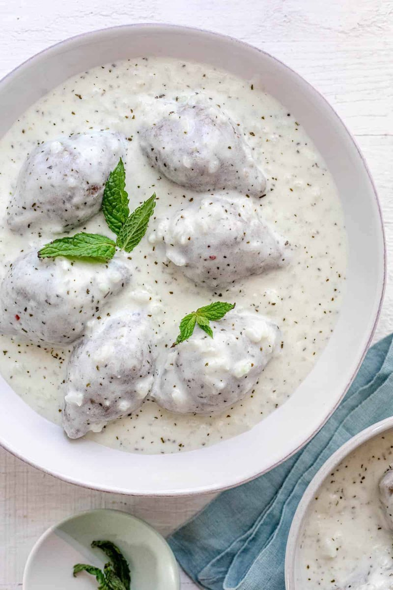

# Kibbeh Bil Laban

*Syria's kibbeh in yogurt: small lamb-and-bulgur torpedoes with a fried lamb-and-pine-nut filling, dropped into a warm stabilised yogurt-garlic sauce.*

**Serves:** 4

**Prep Time:** 1 hour 15 minutes (plus 30 minutes bulgur soaking)

**Cook Time:** 30 minutes

## Overview
Fine bulgur soaks; lamb mince blends with bulgur, grated onion, allspice and salt to a smooth paste; small torpedoes are shaped around a separately-cooked lamb-onion-pine-nut filling. Torpedoes deep-fry briefly until golden, then slip into the warm stabilised yogurt sauce (whisked with egg white, cornflour and garlic), simmer for 4 minutes to warm through. Garlic-mint butter on top.

## Ingredients

### Kibbeh shell
- 250 g fine bulgur (#1 grade)
- 400 g lamb mince (lean shoulder)
- 1 onion (small, very finely grated)
- 1 teaspoon salt
- 1 teaspoon ground allspice
- ½ teaspoon ground black pepper
- ¼ teaspoon ground cinnamon
- 2-3 tablespoons ice water (as needed)

### Filling
- 250 g lamb mince (fattier shoulder)
- 1 tablespoon olive oil
- 1 onion (medium, very finely chopped)
- 30 g pine nuts (toasted)
- 1 teaspoon ground allspice
- ½ teaspoon ground cinnamon
- 1 tablespoon pomegranate molasses
- salt
- pepper
- 1 tablespoon fresh parsley (chopped)

### To fry shells
- 800 ml vegetable oil

### Yogurt sauce
- 800 g full-fat natural yogurt (Greek or strained)
- 1 egg white (large)
- 1 tablespoon cornflour
- 3 garlic cloves (crushed)
- 1 teaspoon salt
- 200 ml warm water

### Garlic-mint butter
- 3 tablespoons unsalted butter
- 3 garlic cloves (crushed)
- 1 tablespoon dried mint

## Method

### Stage 1 - Bulgur
1. Rinse the bulgur in a fine sieve; tip into a bowl; cover with cold water 30 minutes.
1. Drain; squeeze out excess water by hand.

### Stage 2 - Filling
1. Heat the olive oil. Brown the lamb mince; add onion; cook 5 minutes.
1. Stir in allspice, cinnamon and pomegranate molasses; cook 1 minute.
1. Off the heat, fold in pine nuts, parsley, salt and pepper. Cool.

### Stage 3 - Shell paste
1. In a food processor, blitz the soaked bulgur, lamb mince, grated onion, allspice, cinnamon, salt and pepper to a smooth paste, adding ice water 1 tablespoon at a time as needed.
1. Tip into a bowl; knead briefly by hand until smooth and pliable.

### Stage 4 - Shape
1. Wet your hand. Take a walnut-sized piece of shell paste; form into a ball.
1. Hollow out with your index finger; rotate to thin and lengthen the walls.
1. Spoon in 1 teaspoon of filling.
1. Pinch closed at the top to a small point; smooth into a torpedo shape, 5-6 cm long.
1. Repeat - you should get 20-24 torpedoes.

### Stage 5 - Fry shells
1. Heat the oil to 175°C.
1. Fry torpedoes in batches of 5-6, 3-4 minutes until deep gold all over.
1. Lift onto kitchen paper.

### Stage 6 - Yogurt sauce
1. In a wide pan, whisk yogurt, egg white, cornflour, garlic and salt with the warm water.
1. Place on medium-low; stir constantly in one direction 8-10 minutes until just thickened and gently bubbling. Don't let it boil hard.

### Stage 7 - Combine
1. Lower the fried kibbeh torpedoes into the warm yogurt; simmer gently 4-5 minutes.

### Stage 8 - Garlic-mint butter
1. Melt the butter; add garlic; sizzle 30 seconds. Off heat, stir in dried mint.

### Stage 9 - Serve
1. Spoon kibbeh and yogurt into wide bowls.
1. Drizzle with garlic-mint butter.
1. Tear pita and dive in.

## Notes
- **Fine bulgur grade #1:** Coarse bulgur won't blend into a workable paste; the kibbeh shell needs to be smooth and elastic.
- **Yogurt stabiliser:** Egg white + cornflour + constant stirring. Skipping any one of these and your sauce splits.
- **Hand-shape practice:** The first three or four kibbeh will tear or split. After that, the wrist motion clicks. The shell should be 3-4 mm thick - thinner cracks open in the fryer.

## Storage
- Fried kibbeh alone keep 2 days refrigerated; re-crisp in a hot oven.
- Combined with sauce, eat same day; reheat very gently.
- Freeze raw shaped kibbeh 2 months; fry from frozen, adding 1 minute.
