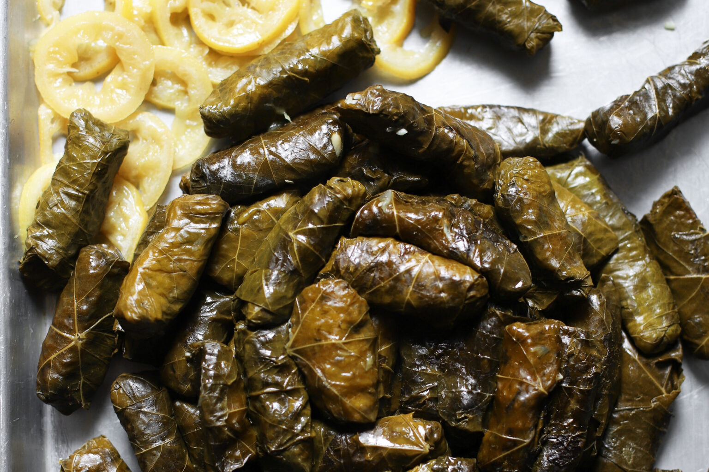

# Mahshi Warak Enab

*Syria's stuffed vine leaves: fresh or brined vine leaves rolled around a fragrant filling of rice, minced lamb, parsley, mint, tomato and the Levantine seven-spice blend, packed tight into a heavy pot with lamb chops, slow-simmered in a lemony broth till the leaves go tender and the rice fully cooks. The Damascus and Aleppo family-Sunday-dinner centrepiece.*

**Serves:** 6-8

**Prep Time:** 1 hour

**Cook Time:** 1 hour 30 minutes

## Overview
Mahshi warak enab (literally "stuffed vine leaves"; warak = leaves, enab = grape; also called yabraq, yabrak or yalanji depending on the region) is one of Syria's most beloved family-meal centrepieces and a Levantine classic shared with Lebanon, Palestine, Jordan, Iraq and the wider region: fresh or brined grape vine leaves are rolled around a fragrant filling of short-grain rice, finely minced lamb (or beef, or sometimes pure vegetarian), finely chopped onion, parsley, mint, tomato, lemon and the canonical Levantine "seven-spice" blend (baharat: allspice, black pepper, cumin, coriander, cardamom, cinnamon, cloves), then packed tightly into a heavy pot lined with bones and lamb chops, weighted down with a plate, covered with a salty lemony broth, and slow-simmered for 90 minutes till the leaves are properly tender, the rice has fully cooked, and the meaty lamb chops at the bottom have given their flavour to the pot. The dish is served warm or at room temperature with a small bowl of yogurt (often garlic yogurt) and lemon wedges. The work of rolling the leaves is the time-intensive part; Syrian grandmothers can roll 100 in under 30 minutes, while the rest of us take longer. Three details define proper Syrian mahshi warak. First, the leaves. Fresh young vine leaves (the small tender ones from the tip of the vine) are best; brined vine leaves from a jar are the everyday substitute and are good. Don't use frozen leaves; they tear. Second, the filling must be properly seasoned. The seven-spice (baharat) is the canonical Levantine spice. Without it, you have generic stuffed cabbage rolls; with it, you have proper Syrian mahshi. Third, the cooking method. The leaves are packed tightly in a heavy pot with a weight on top; this is what keeps them from unrolling during the long simmer. Don't try to cook loose; they'll unravel.

## Ingredients

### Vine leaves
- 1 large jar (about 350 g drained weight) brined grape vine leaves (or 60 fresh young vine leaves; or 60 frozen vine leaves defrosted)

### Filling
- 200 g short-grain rice (Egyptian or Calrose; not basmati which is too long)
- 300 g minced lamb (or minced beef)
- 1 large onion (very finely chopped)
- 4 garlic cloves (crushed)
- 3 medium tomatoes (very finely chopped; or 1 small tin of finely chopped tomatoes)
- 1 large bunch fresh flat-leaf parsley (about 50 g; finely chopped)
- 1 small bunch fresh mint (about 20 g; finely chopped)
- 4 tablespoons olive oil
- 3 tablespoons fresh lemon juice
- 1 tablespoon pomegranate molasses (optional but very Syrian)
- 2 tablespoons tomato paste
- 1 ½ teaspoons fine sea salt
- 1 teaspoon ground black pepper
- 1 tablespoon Levantine baharat (or substitute with: ½ teaspoon allspice + ½ teaspoon black pepper + ½ teaspoon cumin + ½ teaspoon coriander + ¼ teaspoon cardamom + ¼ teaspoon cinnamon + ¼ teaspoon cloves)
- 1 teaspoon ground cumin
- 1 teaspoon ground coriander
- 1 teaspoon Aleppo pepper (pul biber) or sweet paprika

### Pot base
- 8 lamb chops (or 6 chicken thighs bone-in)
- 2 medium tomatoes (sliced thick)
- 4 garlic cloves (whole, lightly crushed)

### Cooking liquid
- 600 ml hot water (or lamb/chicken stock)
- 100 ml fresh lemon juice
- 3 tablespoons olive oil
- 1 teaspoon fine sea salt
- 1 teaspoon dried mint

### To serve
- Yogurt-and-garlic sauce (300 g thick Greek yogurt mixed with 2 crushed garlic cloves and 1 teaspoon salt)
- Fresh lemon wedges

## Method

### Stage 1 - Prepare the leaves
1. If using brined leaves: drain and rinse 3-4 times under cold water to remove excess salt.
2. Lay the leaves flat in a colander; drain thoroughly.
3. Separate any stuck-together leaves.
4. If using fresh leaves: blanch briefly in boiling water for 30 seconds, then plunge into ice water; drain.

### Stage 2 - Make the filling
1. Rinse the rice in cold water 2-3 times.
2. In a wide bowl, combine the drained rice, minced lamb, finely chopped onion, crushed garlic, chopped tomatoes, parsley, mint, olive oil, lemon juice, pomegranate molasses, tomato paste, salt, pepper, baharat, cumin, coriander and Aleppo pepper.
3. Mix thoroughly with your hands or a wooden spoon till the mixture is properly combined and slightly wet (the rice absorbs moisture as it cooks; the filling should be moist now).

### Stage 3 - Layer the pot base
1. Choose a wide heavy pot (about 28 cm diameter and 12 cm deep).
2. Place the lamb chops in a single layer in the bottom of the pot.
3. Lay the sliced tomatoes over the chops.
4. Scatter the crushed garlic.

### Stage 4 - Roll the vine leaves
1. Lay one vine leaf flat on a board with the dull (vein) side up; the stem end towards you.
2. Trim off the stem if it's tough.
3. Place 1 tablespoon of filling in a line near the stem end (don't over-fill; the rice expands during cooking).
4. Fold the bottom of the leaf up over the filling.
5. Fold both sides in over the filling (so the filling is enclosed).
6. Roll up tightly from the bottom to the tip of the leaf; you should have a small tight cigar about 7 cm long.
7. Place seam-side-down in the prepared pot, arranging the rolls tightly together in a circle starting from the outside edge.
8. Continue till you've used all the filling; you should have about 50-60 rolls.
9. If you have multiple layers, place a sliced tomato or a vine leaf between layers.

### Stage 5 - Weight and cook
1. Place a heatproof plate (slightly smaller than the pot diameter) directly on top of the rolled leaves; this weight keeps them from unrolling during cooking.
2. Combine the hot water, lemon juice, olive oil, salt and dried mint in a bowl; whisk together.
3. Pour the liquid carefully over the leaves; the liquid should reach to the top of the rolls (not cover the weighting plate; about 2 cm below).
4. Add more hot water if needed.

### Stage 6 - Simmer
1. Bring to a boil over high heat.
2. Reduce to lowest heat; cover the pot with the lid.
3. Simmer 90 minutes; check liquid levels at 45 minutes and add hot water if needed (the rolls should not go dry).

### Stage 7 - Rest
1. Take off the heat; let stand covered for 15 minutes; the rolls finish setting and the rice fully absorbs.

### Stage 8 - Unmould and serve
1. Lift off the weighting plate carefully.
2. Place a large serving platter upside-down over the pot; in one quick movement, flip the pot over so the mahshi inverts onto the platter. The lamb chops should now be on top, with the leaves underneath.
3. Or: lift out the leaves carefully with a slotted spoon; arrange on a platter with the lamb chops alongside.
4. Spoon some of the cooking broth over.
5. Serve warm with the yogurt-garlic sauce in a small bowl and lemon wedges.

## Notes
- **Don't over-fill the leaves:** 1 tablespoon of filling per leaf is the right amount. The rice expands during cooking; over-filled rolls burst.
- **Roll tightly:** loose rolls unravel during the long simmer. Roll like a cigar, pressing as you go.
- **Weight the rolls:** the plate on top is essential; it keeps the rolls from floating and unrolling. A small saucer or plate slightly smaller than the pot diameter works perfectly.
- **The lamb chops at the bottom give the flavour:** the rendered lamb fat and meat juices flavour the cooking liquid, which the leaves absorb. Don't skip the chops.
- **Pomegranate molasses for the proper Syrian profile:** the small amount of pomegranate molasses gives Syrian mahshi a slightly sweet-tart character that distinguishes it from Lebanese or Palestinian versions.

## Variations
**Vegetarian mahshi (yalanji):** skip the meat; double the rice; add 100 g of soaked chickpeas to the filling; use vegetable stock. Lighter version; common Lent-friendly Levantine recipe.
**Without lemon (Lebanese style):** skip the lemon juice in both the filling and the cooking liquid; gives a milder less-sour mahshi. Less canonical Syrian but valid.
**With pine nuts in the filling:** add 80 g of toasted pine nuts to the filling for extra texture. Common Aleppo variation.
**Stuffed cabbage instead of vine leaves (malfouf):** swap the vine leaves for tender cabbage leaves (blanched 2-3 minutes); roll the same way. Different but the same idea.

## Serving
On a large platter, often as the centrepiece of a Syrian Sunday lunch alongside fattoush salad, hummus, baba ganoush and warm flatbread. The yogurt-garlic sauce and lemon wedges in small bowls around the platter. Eat with hands or a fork; popular ritual is to dip each roll in yogurt and have a squeeze of lemon. Drink: ayran (the salted yogurt drink), mint tea, or fresh lemonade.

## Storage
- Keeps refrigerated 4 days; the flavour deepens noticeably overnight (many Syrian cooks make a day ahead).
- Reheat gently in a covered pan with a splash of water and a squeeze of lemon over low heat.
- Or serve at room temperature; many Syrians prefer cold or room-temperature mahshi.
- Freezes 2 months in portioned containers; defrost in the fridge; reheat gently.
- Don't microwave aggressively; the leaves tear.
