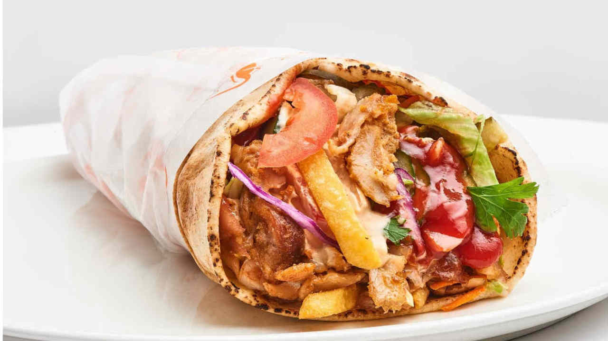

# Damascus Shawarma

*Syria's iconic spiced lamb wrap: thin slices of lamb (or chicken) marinated overnight in yogurt, garlic and the Levantine seven-spice blend, traditionally cooked on a vertical spit then wrapped in flatbread with tahina sauce, pickled turnips, tomato and parsley. The Damascus street-food classic, slow-built at home using a roasting tin and the oven.*

**Serves:** 6 (about 12 wraps)

**Prep Time:** 35 minutes (plus 12 hours marinating)

**Cook Time:** 1 hour 30 minutes

## Overview
Shawarma is one of the most iconic Middle Eastern street foods, claimed by Lebanon, Turkey, Syria and Iraq with slightly different styles in each; the Damascus version is one of the traditional originals. Thin slices of marinated lamb (or chicken, or a mix) stack on a vertical rotating spit and slow-roast till the outside crisps; the cooked outer layer shaves off as it's ready, served in fresh khubz with tahina sauce, pickled turnips, tomato, cucumber, parsley, and sometimes pickled chillies or sumac onions. The spit is restaurant-only; at home, thinly slice the marinated meat, layer in a heavy roasting tin with onion between, weight the top with a brick or heavy pan, slow-roast ninety minutes till the meat releases its juices. The marinade matters: yogurt, olive oil, garlic, lemon, Levantine seven-spice (baharat) and Aleppo pepper, twelve hours minimum. Tahina sauce: equal parts tahina, lemon and cold water, plus garlic and salt. Pickled turnips give Syrian shawarma its signature bright pink.

## Ingredients

### Meat and marinade
- 1.5 kg boneless lamb shoulder (or boneless chicken thigh; or 50/50 mix; sliced 5 mm thick across the grain)
- 200 g plain yogurt (thick Greek-style)
- 4 tablespoons olive oil
- 8 garlic cloves (crushed)
- Juice of 2 lemons
- 2 tablespoons pomegranate molasses (optional but Syrian)
- 2 teaspoons fine sea salt
- 2 teaspoons ground cumin
- 2 teaspoons ground coriander
- 1 tablespoon Levantine baharat (or substitute mix as in mahshi recipe)
- 1 ½ teaspoons Aleppo pepper
- 1 teaspoon ground sumac
- 1 teaspoon ground turmeric
- 1 teaspoon ground cinnamon
- ½ teaspoon ground cardamom
- 1 teaspoon ground black pepper

### Layering
- 3 large onions (sliced into rings)

### Tahina sauce
- 200 g tahina (sesame paste; the Lebanese or Syrian brands are best)
- Juice of 2 lemons
- 4 garlic cloves (crushed)
- 1 teaspoon fine sea salt
- 200-250 ml cold water (start with 200, add more to thin)
- 2 tablespoons chopped fresh parsley

### Pickled turnips (make 5 days ahead; or substitute shop-bought)
- 500 g turnips (peeled, cut into batons or wedges)
- 1 small beetroot (peeled, sliced)
- 4 tablespoons white vinegar
- 2 tablespoons salt
- 600 ml hot water

### Assembly
- 12 large Syrian flatbreads (or pita, or lavash, or large tortillas as a substitute)
- 4 large tomatoes (sliced)
- 2 large cucumbers (sliced)
- 1 large red onion (thinly sliced)
- 1 large bunch fresh parsley (chopped)
- Olive oil (for drizzling)
- Extra sumac

### To serve
- Pickled chillies (optional)
- Hot sauce

## Method

### Stage 1 - Marinate the meat (the night before)
1. Combine all marinade ingredients in a wide bowl; whisk to combine.
2. Add the sliced lamb (or chicken); toss thoroughly to coat.
3. Cover and refrigerate at least 12 hours; up to 24 hours.

### Stage 2 - Make the pickled turnips (5 days ahead or use shop-bought)
1. Pack the turnip batons and beetroot slices into a clean jar.
2. In a small pan, combine the white vinegar, salt and hot water; stir to dissolve the salt.
3. Pour over the turnips; the brine should fully cover them.
4. Seal the jar; leave at room temperature 24 hours, then refrigerate.
5. Wait 5 days for the turnips to take on the pink colour and develop the proper sour-sweet flavour.

### Stage 3 - Layer the meat for slow-roasting
1. Take the marinated lamb out of the fridge 1 hour before cooking; let come to room temperature.
2. Preheat the oven to 180°C (350°F).
3. Choose a heavy roasting tin (about 25 cm × 35 cm).
4. Layer the meat and sliced onions: a layer of meat, then onion, then meat, then onion, building up.
5. Compact the layers gently.

### Stage 4 - Weight and roast
1. Cover the tin tightly with foil.
2. Place a heavy heatproof object on top (a brick wrapped in foil; or a heavy ovenproof pan with weights inside; or a deep cast-iron pan); this compresses the layers and approximates the vertical-spit pressure.
3. Roast at 180°C for 90 minutes till the meat is tender and the outside is starting to crisp at the edges.

### Stage 5 - Crisp the outside
1. Remove the foil and the weight.
2. Turn the oven up to 220°C / 425°F.
3. Roast uncovered for 15-20 minutes till the meat on top is crisp and the edges have charred.

### Stage 6 - Rest and slice
1. Take out of the oven; let rest 10 minutes.
2. Use a sharp knife to slice the meat thinly (about 3 mm thick) across the layers; you want shaved-thin slices like the vertical-spit version.

### Stage 7 - Make the tahina sauce
1. In a bowl, combine the tahina, lemon juice, crushed garlic, salt and start with 200 ml of cold water.
2. Whisk vigorously; the tahina will first seize up into a thick paste, then loosen.
3. Add more cold water 1 tablespoon at a time till the sauce reaches a thick, pourable consistency (like single cream).
4. Stir in the chopped parsley.
5. Taste; adjust salt and lemon.

### Stage 8 - Warm the flatbreads
1. Wrap the flatbreads in foil; warm in a 150°C / 300°F oven for 5 minutes.
2. Or warm individually in a hot dry pan for 30 seconds per side.

### Stage 9 - Assemble each wrap
1. Place a warm flatbread on a board.
2. Smear a generous tablespoon of tahina sauce down the centre.
3. Lay sliced shawarma meat over the tahina.
4. Add a few pickled turnip batons, slices of tomato, cucumber and red onion.
5. Sprinkle chopped parsley and a small dust of sumac over.
6. Drizzle with extra tahina sauce if you want.
7. Fold the sides in and roll up tightly.
8. Wrap in greaseproof paper if eating from the hand.

## Notes
- **Marinate overnight properly:** 12 hours minimum, ideally 24. The yogurt tenderises and the spices penetrate. Skipping the long marinade gives bland tough shawarma.
- **Weight during roasting:** the heavy weight compresses the layers and helps approximate the vertical-spit pressure that gives shawarma its distinct texture. Don't skip.
- **Tahina sauce technique:** the trick is adding cold water gradually; the tahina seizes up before loosening into a smooth sauce. Don't be alarmed by the seizure; keep whisking.
- **Pickled turnips are traditional:** the bright pink turnips are iconic for Damascus shawarma. Make 5 days ahead or buy shop-bought from a Middle Eastern market.
- **Slice thin:** shaved-thin slices give the proper shawarma texture; thick slices feel like a different dish.

## Variations
- **Chicken shawarma:** swap the lamb for chicken thigh; reduce cooking time to 60 minutes covered + 15 minutes uncovered. Lighter, very common.
- **Mixed shawarma:** use a 50/50 mix of lamb and chicken; common at Damascus shawarma stalls.
- **Shawarma platter (not wrapped):** serve the sliced meat over a bed of rice or French fries with the tahina sauce, salad and pickled turnips around; common restaurant presentation.
- **Spicier shawarma:** add 2 tablespoons of harissa or 1 tablespoon of Aleppo pepper to the marinade; gives a properly warm version.

## Serving
- Wrapped in greaseproof paper from the hand; or as a platter with sides. With chilled fresh lemonade with mint, ayran, or mint tea. As lunch, dinner, late-night street food, or a party meal where everyone builds their own wrap from a spread.

## Storage
- The roasted meat keeps refrigerated 4 days; reheat in a hot dry pan with a small splash of water, or in a 160°C / 320°F oven for 10 minutes.
- The tahina sauce keeps refrigerated 1 week.
- Pickled turnips keep refrigerated 1 month; they get more sour as they sit.
- Freeze the roasted meat (sliced) in portions for 2 months; defrost in the fridge.
- The marinated raw meat keeps refrigerated 2 days before cooking; freeze for 3 months.
