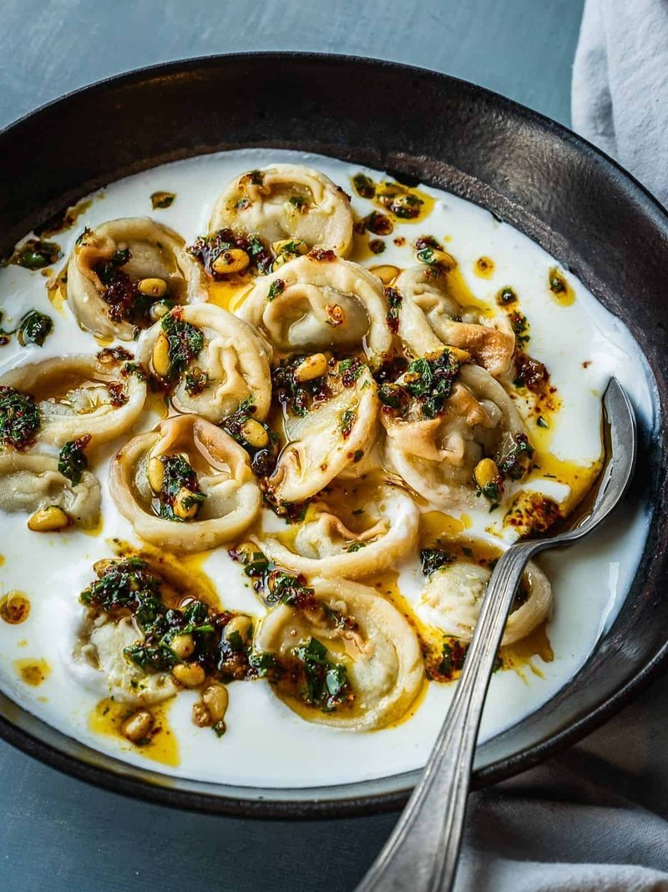

# Shish Barak

*Syria's lamb dumplings in hot yogurt: small ravioli-sized lamb parcels bathed in a stabilised garlic-mint yogurt sauce, finished with mint butter.*

**Serves:** 4

**Prep Time:** 1 hour (plus 30 minutes resting)

**Cook Time:** 30 minutes

## Overview
Shish barak is the Damascene Sunday lunch: small lamb-filled dumplings bathed in a stabilised yogurt sauce with crushed garlic, finished with a sizzle of garlic-mint butter on top. The shape is unmistakable. Each dumpling looks like a tiny tortellini, folded into a half-moon then the two corners brought together and pinched into a chubby ring. The shape marks this as Damascus or Beirut style; in Aleppo the same parcels go into a tomato broth instead of yogurt. A soft flour-and-water dough rolls thin (2 mm), stamps into 4 cm rounds, gets a small ball of cooled lamb filling (browned mince, onion, garlic, allspice, cinnamon, pine nuts, parsley), folds and pinches. The shaped dumplings pre-bake at 200 °C for twelve to fifteen minutes till lightly gold so they don't burst when slipped into the yogurt. The sauce stabilises with egg white and cornflour, heated low while stirred constantly in one direction so it doesn't split. Drizzled with garlic-mint butter. Eat with a spoon, warm pita on the side.

## Ingredients

### Dough
- 350 g plain flour
- 1 teaspoon salt
- 2 tablespoons olive oil
- 180 ml warm water

### Filling
- 300 g lamb mince
- 2 tablespoons olive oil
- 1 onion (medium, very finely chopped)
- 2 garlic cloves (crushed)
- 1 teaspoon ground allspice
- ½ teaspoon ground cinnamon
- ½ teaspoon ground black pepper
- 2 tablespoons pine nuts (toasted)
- 2 tablespoons fresh parsley (chopped)
- ½ teaspoon salt

### Yogurt sauce
- 800 g full-fat natural yogurt (Greek or strained)
- 1 egg white (large)
- 1 tablespoon cornflour
- 4 garlic cloves (crushed)
- 1 teaspoon salt
- 200 ml warm water (more if needed)

### Garlic-mint butter
- 3 tablespoons unsalted butter (or samna)
- 3 garlic cloves (crushed)
- 1 tablespoon dried mint
- 1 tablespoon fresh parsley (chopped)

## Method

### Stage 1 - Dough
1. Whisk flour and salt; drizzle in olive oil and warm water; mix to a soft dough.
1. Knead 6 minutes until smooth and elastic. Cover; rest 30 minutes.

### Stage 2 - Filling
1. Heat the oil in a wide pan over medium-high heat.
1. Brown the lamb hard, breaking up clumps. Pour off excess fat.
1. Add the onion; cook 5 minutes.
1. Stir in garlic, allspice, cinnamon and pepper; cook 1 minute.
1. Splash in 80 ml water; simmer 4 minutes until dry.
1. Off the heat, stir in pine nuts, parsley and salt. Cool completely.

### Stage 3 - Shape
1. Roll the dough to 2 mm thick on a lightly floured surface.
1. Stamp out 4 cm rounds with a small cutter (or glass).
1. Place a small ball of filling (about ½ teaspoon) in the centre of each.
1. Fold in half to a half-moon; press the curved edge to seal. Bring the two pointed corners together and pinch firmly (tortellini fold).
1. Arrange on a lined tray.

### Stage 4 - Pre-bake
1. Heat oven to 200°C (180°C fan).
1. Brush the shaped dumplings lightly with olive oil.
1. Bake 12-15 minutes until lightly gold.

### Stage 5 - Yogurt sauce
1. In a wide heavy pan, whisk the yogurt, egg white, cornflour, garlic and salt with the warm water until smooth.
1. Place on medium-low heat. Stir constantly in one direction with a wooden spoon as it heats - never let it boil hard, and never stop stirring (this prevents splitting).
1. After 8-10 minutes the sauce thickens slightly and bubbles gently at the edges.

### Stage 6 - Combine
1. Slip the pre-baked dumplings into the warm yogurt; simmer gently 5 minutes.

### Stage 7 - Garlic-mint butter
1. In a small pan, melt the butter; add garlic; sizzle 30 seconds until fragrant but not coloured.
1. Off the heat, stir in dried mint and parsley.

### Stage 8 - Serve
1. Tip the shish barak into a wide warm bowl.
1. Drizzle with the garlic-mint butter.
1. Eat with a spoon; warm pita on the side.

## Notes
- **Stabilise the yogurt:** Egg white + cornflour + constant-direction stirring + no hard boil keeps it from splitting. Don't skip any.
- **Pre-bake the dumplings:** Boiling them straight in yogurt would burst the seals. Baking firms them first.
- **Damascene roots:** Aleppo cooks make a similar version with a tomato-based broth instead of yogurt; this is the Damascus / Beirut style.

## Storage
- Best fresh. Refrigerate 2 days; reheat very gently on low heat, never boiling.
- Freeze shaped uncooked dumplings 2 months. Bake from frozen; then proceed.
