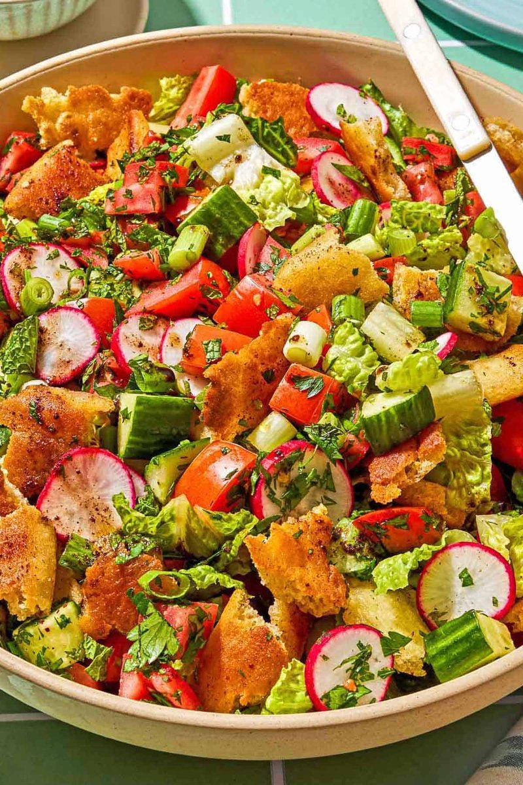

# Fattoush

*The Levantine chopped salad: cucumber, tomato, radish, sumac onion and herbs dressed with lemon, sumac and pomegranate, with toasted pita shards.*

**Serves:** 4

**Prep Time:** 20 minutes

**Cook Time:** 5 minutes (toasting pita)

## Overview
A torn pita is brushed with olive oil and grilled or fried until golden and crisp. Cucumber, tomato, radish, romaine, spring onion, parsley and mint are roughly chopped into a wide bowl. A dressing of lemon juice, pomegranate molasses, sumac, garlic, olive oil and salt is whisked. The salad is tossed with the dressing just before serving; the pita is scattered on top so it stays crisp.

## Ingredients

### Salad
- 1 large pita (or 2 small ones)
- 2 tablespoons olive oil (for the pita)
- 1 large cucumber (deseeded, diced)
- 4 small tomatoes (or 2 large) - diced
- 6 radishes (sliced thin)
- 1 small romaine heart (chopped)
- 4 spring onions (sliced thin)
- 1 small handful fresh parsley (chopped)
- 1 small handful fresh mint (chopped)
- 1 small handful purslane (if you can find it, optional but classic)

### Dressing
- 4 tablespoons olive oil
- 2 tablespoons lemon juice
- 1 tablespoon pomegranate molasses
- 2 teaspoons sumac
- 1 small garlic clove (crushed)
- ½ teaspoon salt
- ¼ teaspoon ground black pepper

## Method

### Stage 1 - Toast the pita
1. Heat oven to 200°C (180°C fan).
1. Brush the pita lightly on both sides with olive oil; sprinkle with a pinch of salt and sumac.
1. Tear into 3-4 cm pieces; spread on a baking tray.
1. Bake 5-7 minutes until deep gold and crisp.
1. Cool on the tray.

### Stage 2 - Prep the vegetables
1. In a wide salad bowl, combine cucumber, tomato, radish, romaine, spring onions, parsley, mint and purslane.

### Stage 3 - Dressing
1. Whisk olive oil, lemon juice, pomegranate molasses, sumac, garlic, salt and pepper.

### Stage 4 - Assemble
1. Just before serving, pour the dressing over the salad; toss gently.
1. Scatter the pita shards over the top - keep them on top, not folded in, so they stay crisp.
1. Finish with another small pinch of sumac.

### Stage 5 - Serve
1. Eat within 20-30 minutes.

## Notes
- **Pita on top, not stirred in:** The pita is meant to be crisp. Folded into the dressing it goes soggy in minutes. Scatter on top; let people lift it with their forks.
- **Sumac is the signature:** The dark-red ground sumac berry gives the salad its characteristic lemony tartness. Don't substitute - skip it instead and add more lemon.
- **Purslane:** A succulent green popular in Levantine salads. Hard to find outside Mediterranean grocers. Optional - the salad works without.

## Storage
- Don't store dressed. Components keep separately 24 hours.
