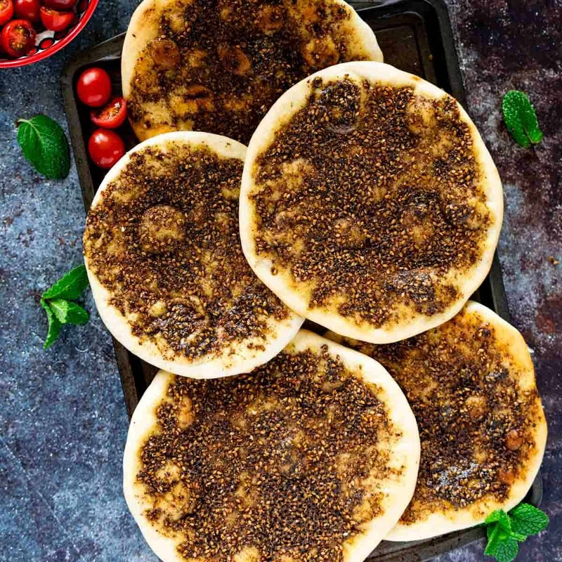

# Manakish Zaatar

*Soft Levantine flatbread topped with a generous slick of za'atar paste (the dried thyme-sumac-sesame blend mixed with olive oil) and baked at high heat. Syria's breakfast, eaten folded in half with cucumber, tomato and salty white cheese, or alone in three bites at a bakery counter. The unofficial Damascus alarm clock.*

**Serves:** 4 (makes 6)

**Prep Time:** 15 minutes (plus 1 hour rising)

**Cook Time:** 20 minutes

## Overview
Manakish zaatar is the morning bread of Syria: soft yeasted flatbread slicked with a generous spread of za'atar-and-olive-oil paste and baked hot till the dough turns gold underneath and the herby oil bubbles across the top. Damascus mornings start at the corner bakery counter with one folded round in a paper bag, eaten in three bites walking to work, or folded around cucumber, tomato and salty white akkawi cheese for breakfast at home. The two non-negotiables are a properly Levantine za'atar (dried wild thyme or oregano, sumac, toasted sesame and salt; any blend with cumin is not za'atar) and generous olive oil. A simple yeasted dough rises an hour till doubled, divides into six and rolls into 18 cm rounds. The za'atar mixes with olive oil into a thick spoonable paste, rests ten minutes so the herbs hydrate, then spreads almost to the edge. Bake at 230 °C on a preheated stone for seven to nine minutes till the bottom is deep gold.

## Ingredients

### Dough
- 500 g plain flour
- 1 sachet (7 g) fast-action yeast
- 1 ½ teaspoons salt
- 1 tablespoon caster sugar
- 2 tablespoons olive oil
- 320 ml warm water

### Za'atar paste
- 6 tablespoons za'atar (dried Syrian or Lebanese blend - thyme, sumac, sesame, salt)
- 8-10 tablespoons olive oil (enough to make a loose, spoonable paste)

## Method

### Stage 1 - Dough
1. Whisk flour, yeast, salt and sugar.
1. Add olive oil and warm water; mix to a soft dough.
1. Knead 8 minutes until smooth and elastic.
1. Cover; rise 1 hour until doubled.

### Stage 2 - Za'atar paste
1. In a small bowl, combine the za'atar and enough olive oil to make a loose paste - spreadable but not runny.
1. Let it sit 10 minutes so the herbs hydrate.

### Stage 3 - Shape
1. Knock back; divide into 6 equal balls.
1. Cover; rest 10 minutes.
1. Roll each ball into a 18 cm round, about 5 mm thick.

### Stage 4 - Heat the oven
1. Heat oven to 230°C (210°C fan), ideally with a baking stone or steel on the top rack for 30 minutes.

### Stage 5 - Top
1. Place rounds on baking trays (or a stone via peel).
1. Spread a generous tablespoon of za'atar paste over each round, almost to the edge.
1. Use your fingertips to press small dimples into the dough through the za'atar (the dimples help hold the oil).

### Stage 6 - Bake
1. Bake 7-9 minutes - the bottom should be deep gold and the za'atar oil should bubble.

### Stage 7 - Serve
1. Eat warm, on its own, or folded around white cheese (akkawi / feta), tomato, cucumber and olives.

## Notes
- **Za'atar quality:** Look for a properly made Levantine blend - dried wild thyme (or oregano), sumac, toasted sesame, salt. Avoid blends with cumin or "Middle Eastern spice mix" - that's not za'atar.
- **Generous oil:** Don't be stingy. A dry topping makes a sad manakish; the oil is what makes it sing.
- **Cheese version:** A cheese manakish (jibneh) uses 100 g grated akkawi or mozzarella in place of za'atar. Same dough, same bake.

## Storage
- Best fresh. Will keep wrapped 24 hours at room temperature; refresh in a hot oven 3 minutes.
- Freeze 1 month.
