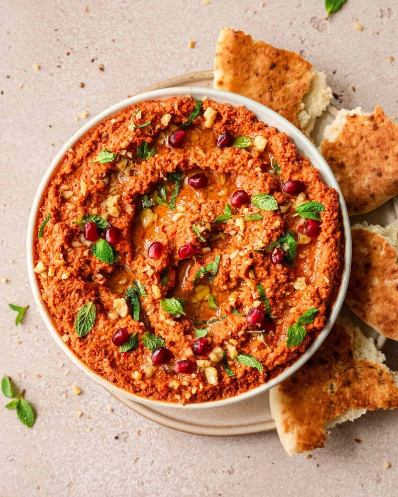

# Muhammara

*Aleppo's deep-crimson dip: roasted red pepper and walnut pounded with pomegranate molasses, Aleppo pepper and cumin. Scooped with warm pita.*

**Serves:** 6 as a mezze

**Prep Time:** 15 minutes (plus 30 minutes resting)

**Cook Time:** 25 minutes (if roasting the peppers fresh)

## Overview
Muhammara is Aleppo's deep-crimson dip: charred red peppers pounded with walnuts, breadcrumbs, pomegranate molasses, Aleppo pepper and cumin into a thick chunky paste scooped up with warm pita. The character of the dish is the slow fruity heat of Aleppo pepper (the gentle red flake from northern Syria with its slow burn; Hungarian or Turkish red flake substitutes, never cayenne) and the dark sour-sweet hit of pomegranate molasses against the smoky char of the peppers. The peppers char under a hot grill or in a screaming-hot oven till blackened and blistered all over, then steam in a covered bowl ten minutes so the skins slip off. Peeled, deseeded and pulsed with toasted walnuts, fresh breadcrumbs from day-old sourdough or pita, pomegranate molasses, Aleppo pepper, cumin, garlic, lemon juice and olive oil. Don't run it smooth; the walnut texture is part of the dish. Rest at least thirty minutes for the flavours to mingle. Spread on a wide plate with ridges drawn through, drizzled with olive oil, scattered with walnut halves and pomegranate seeds.

## Ingredients

- 4 red bell peppers (large, or 2 jars / 350 g drained jarred roasted red peppers)
- 150 g walnut halves (lightly toasted)
- 60 g fresh breadcrumbs (from a day-old sourdough or pita)
- 2 tablespoons pomegranate molasses
- 1 tablespoon ground Aleppo pepper (or 1 ½ tsp paprika + ½ tsp chilli flakes)
- 1 teaspoon ground cumin
- 2 garlic cloves
- ½ lemon (juice)
- 3 tablespoons extra-virgin olive oil (plus more to drizzle)
- ½ teaspoon salt (to taste)

### To finish
- 6 walnut halves
- 1 tablespoon olive oil
- 1 teaspoon Aleppo pepper
- 1 tablespoon pomegranate seeds (optional)

## Method

### Stage 1 - Roast the peppers (if using fresh)
1. Heat the grill to high.
1. Place the peppers on a foil-lined tray; grill 15-20 minutes, turning, until blackened and blistered all over.
1. Transfer to a bowl; cover; steam 10 minutes.
1. Peel off the skins (they slip off); remove stems and seeds; pat dry.

### Stage 2 - Blitz
1. Place the peppers, walnuts, breadcrumbs, pomegranate molasses, Aleppo pepper, cumin, garlic, lemon juice, olive oil and salt in a food processor.
1. Pulse to a thick, slightly chunky paste, some walnut texture is welcome. Don't run it smooth.

### Stage 3 - Rest
1. Taste; adjust pomegranate molasses (more for sourness), salt or Aleppo pepper (more for heat).
1. Refrigerate at least 30 minutes, the flavours need to mingle.

### Stage 4 - Serve
1. Spread on a wide plate (or in a shallow bowl), pushing the surface with the back of a spoon to make ridges.
1. Drizzle with olive oil; sprinkle with Aleppo pepper.
1. Top with walnut halves and pomegranate seeds.
1. Serve with warm pita, vegetable crudités or as part of a wider mezze.

## Notes
- **Jarred peppers:** Save 25 minutes; texture and flavour are slightly less smoky but very good. Look for ones in brine, not vinegar.
- **Aleppo pepper:** The signature heat, a gentle, fruity, slow chilli. Hungarian or Turkish red pepper flakes are the substitutes. Don't use cayenne (too sharp).
- **Walnut quality:** Slightly toasted walnuts have more flavour. Stale walnuts are bitter; toast for 5 minutes at 180°C to refresh.

## Storage
- Refrigerate 4 days. Bring to room temperature before serving.
- Don't freeze, the texture goes coarse.
