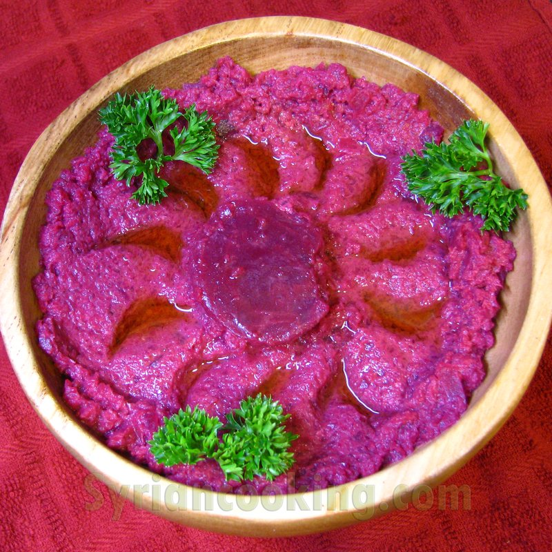

# Mutabbal Shawandar

*Syria's beetroot mutabbal: roasted beetroot blended with tahini, lemon, garlic and yogurt into a vivid magenta dip. Earthy and bright.*

**Serves:** 4 as a mezze

**Prep Time:** 10 minutes

**Cook Time:** 45 minutes (roasting beets)

## Overview
Whole beetroots roast in foil at 200°C until a knife slides through (45 minutes for medium beets). Peeled while still warm. Blended with tahini, lemon juice, garlic, yogurt, salt, cumin and a small drizzle of olive oil into a thick, vivid pink-purple dip. Topped with a final swirl of tahini, a sprinkle of sumac, parsley and a few pomegranate seeds.

## Ingredients

- 500 g medium beetroots (about 3)
- 4 tablespoons tahini
- 2 tablespoons Greek yogurt
- 1 lemon (juice)
- 1 garlic clove
- ½ teaspoon ground cumin
- ½ teaspoon salt
- 1 tablespoon olive oil

### To finish
- 1 tablespoon tahini (to swirl)
- 1 tablespoon olive oil (to drizzle)
- 1 teaspoon sumac
- 2 tablespoons fresh parsley (chopped)
- 2 tablespoons pomegranate seeds (optional)

## Method

### Stage 1 - Roast the beetroot
1. Heat oven to 200°C (180°C fan).
1. Wash the beets (don't peel); wrap each in foil with a splash of water and a pinch of salt.
1. Roast 45-60 minutes until a knife slides through easily.
1. Open the foil; cool 10 minutes.
1. Slip off the skins with paper towels (the warm skin slides off easily).

### Stage 2 - Blend
1. Roughly chop the peeled beets.
1. Place in a food processor with tahini, yogurt, lemon juice, garlic, cumin, salt and olive oil.
1. Blitz to a smooth thick dip.
1. Taste; adjust lemon and salt.

### Stage 3 - Plate
1. Tip onto a wide plate; spread with the back of a spoon, creating ridges.
1. Swirl extra tahini over the top.
1. Drizzle with olive oil.
1. Sprinkle with sumac; scatter parsley and pomegranate seeds.

### Stage 4 - Serve
1. Eat with warm pita or fresh vegetable batons.

## Notes
- **Roast not boil:** Boiling waterlogs the beets and dilutes the flavour. Roasting concentrates the sweetness; foil-wrap protects from drying.
- **Tahini quality:** Use a Middle Eastern tahini (Lebanese, Syrian or Palestinian brands). Supermarket-aisle versions are often bitter; look for a light, runny tahini that pours.
- **Vivid colour:** Beetroot stains. Wear an apron and protect the worktop.

## Storage
- Refrigerate 3 days. The colour deepens slightly.
- Doesn't freeze well.
