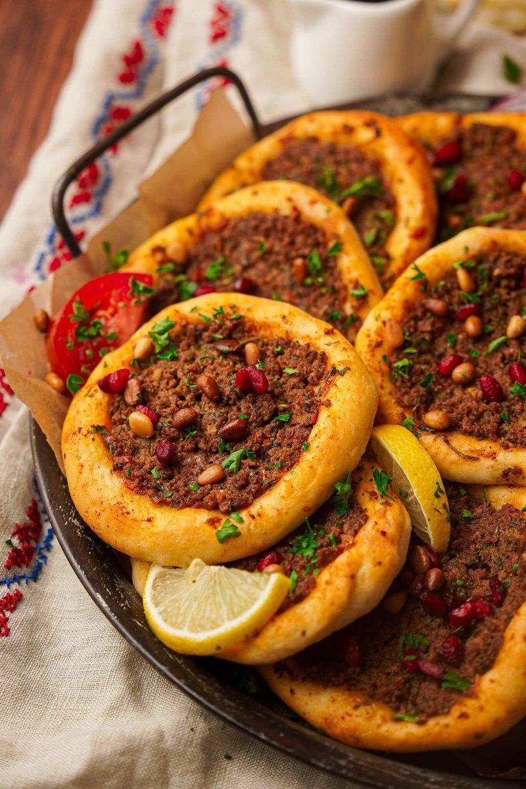

# Sfeeha

*Aleppo's open-faced lamb pies: small dough rounds topped with a tangy mince of tomato, pomegranate molasses, pine nuts and Aleppo pepper. Baked hot.*

**Serves:** 6 (makes 24)

**Prep Time:** 45 minutes (plus 1 hour rising)

**Cook Time:** 15 minutes

## Overview
Sfeeha is Aleppo's contribution to the great Levantine family of open-faced flatbread pies: small dough rounds topped with a tart raw mince of lamb, tomato, pomegranate molasses, Aleppo pepper and pine nuts, baked hot till the dough crisps gold and the meat is just cooked through. Pomegranate molasses is the Aleppo signature, the dark sour-sweet note that distinguishes sfeeha from its Turkish (lahmacun) and Egyptian (hawawshi) cousins. A simple yeasted dough rises till doubled, divides into twenty-four balls and rolls into 9 cm rounds about 3 mm thick. The topping mixes by hand: lamb mince with grated onion (juices and all, the moisture keeps the meat from drying), deseeded tomato, tomato puree, pomegranate molasses, Aleppo pepper, allspice, cinnamon. Pine nuts and parsley fold in just before topping. Spread thin to the edge, leaving a small border. Bake at 230 °C for twelve to fourteen minutes. Eat warm with a squeeze of lemon and yogurt on the side.

## Ingredients

### Dough
- 500 g plain flour
- 1 sachet (7 g) fast-action yeast
- 1 teaspoon salt
- 1 tablespoon caster sugar
- 2 tablespoons olive oil
- 320 ml warm water

### Topping
- 500 g lamb mince (shoulder, slightly fatty)
- 1 onion (medium, very finely grated, juices reserved)
- 2 tomatoes (small, deseeded, very finely chopped)
- 2 tablespoons tomato puree
- 3 tablespoons pomegranate molasses
- 1 tablespoon Aleppo pepper (or 1 ½ tsp paprika + ½ tsp chilli flakes)
- 1 teaspoon ground allspice
- ½ teaspoon ground cinnamon
- 1 teaspoon salt
- ½ teaspoon ground black pepper
- 3 tablespoons pine nuts
- 2 tablespoons fresh parsley (chopped)

### To serve
- 1 lemon (cut into wedges)
- 300 g Greek yogurt

## Method

### Stage 1 - Dough
1. Whisk flour, yeast, salt and sugar in a bowl.
1. Add olive oil and warm water; mix to a soft dough.
1. Knead 8 minutes until smooth and elastic.
1. Cover; rise 1 hour until doubled.

### Stage 2 - Topping
1. Combine all topping ingredients (except parsley and pine nuts) in a bowl; mix well with hands. Cover; refrigerate 20 minutes.
1. Just before using, stir in pine nuts and parsley.

### Stage 3 - Shape
1. Knock back; divide into 24 equal balls.
1. Cover; rest 10 minutes.
1. Roll each ball into a thin 9 cm round, about 3 mm thick.
1. Place on lined baking trays, spaced 3 cm apart.

### Stage 4 - Top
1. Heat oven to 230°C (210°C fan).
1. Spread a generous tablespoon of topping over each round, almost to the edge but leaving a small 5 mm border.
1. Spread thin - thick meat won't cook through in the bake.

### Stage 5 - Bake
1. Bake 12-14 minutes, until the dough is gold underneath and the meat is just cooked and slightly bubbling at the edges.

### Stage 6 - Serve
1. Stack on a plate. Eat warm with a squeeze of lemon and a spoonful of yogurt.

## Notes
- **Grate the onion, save the juice:** The onion juice keeps the meat moist as it bakes. Don't squeeze it out.
- **Raw mince on the dough:** The high heat cooks both at once. Spread thin so the meat doesn't stay raw.
- **Aleppo signature:** Pomegranate molasses gives the dark sour-sweet note that distinguishes Aleppo / Syrian sfeeha from its Turkish (lahmacun) or Egyptian (hawawshi) cousins. Don't skip.

## Storage
- Refrigerate 2 days; re-warm at 200°C for 5 minutes.
- Freeze 2 months (after baking and cooling).
