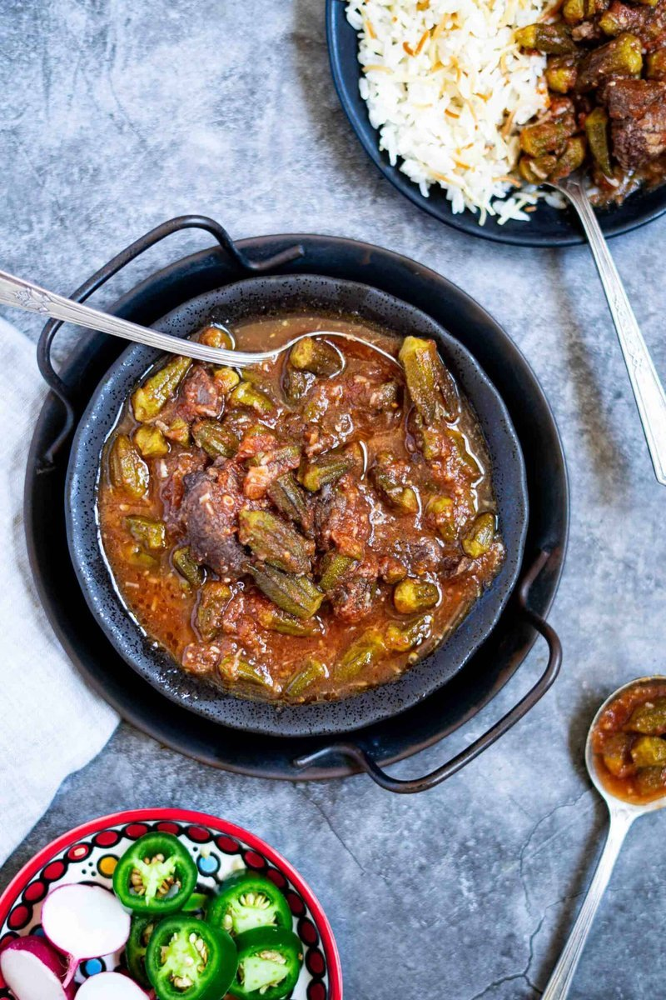

# Yakhneh Bamia

*A Syrian okra stew: okra and lamb in a tomato-and-pomegranate sauce, slow-braised till the meat falls apart and the molasses gives a signature dark sourness.*

**Serves:** 4

**Prep Time:** 20 minutes

**Cook Time:** 1 hour 45 minutes

## Overview
Yakhneh bamia is the slow-simmered Syrian okra stew, lamb shoulder braised with tomato and pomegranate molasses till the meat falls apart and the sauce darkens to a sour-sweet gloss, finished with whole small okra pods that hold their shape and a final sizzle of garlic-coriander butter (taqliya) poured over at the table. The two non-negotiables are pomegranate molasses (the signature dark-sour-fruity note that defines the dish) and small whole okra (sliced okra turns slimy; whole pods stay structural). Pat lamb shoulder cubes dry and season with salt, then brown hard in oil for five minutes per batch in a heavy pot till deeply coloured. Soften chopped onions in the same pot for eight or ten minutes till pale gold, add half the garlic and the spices (allspice, ground coriander, cinnamon, pepper) for thirty seconds, then stir in tinned tomato, tomato puree and pomegranate molasses for five minutes till reduced. Return the lamb with bay, a pierced dried black lime if you have one, salt and hot stock; cover and simmer low for an hour and a quarter till the lamb is fork-tender. Add the okra (fresh or straight from frozen, no need to thaw) pushed under the sauce, cook uncovered another 25 to 30 minutes till tender and the sauce has reduced and clings. Just before serving, make the taqliya: melt butter or samna in a small pan, sizzle the remaining crushed garlic 30 seconds till aromatic but not coloured, off the heat with chopped fresh coriander. Tip the yakhneh into a wide warm bowl and pour the taqliya across the top so everyone smells the garlic-coriander hit at the table, serve over rice with vermicelli and a lemon wedge.

## Ingredients

### Stew
- 800 g lamb shoulder (or neck, cut into 4 cm chunks)
- 3 tablespoons vegetable oil (or samna)
- 2 onions (chopped)
- 6 garlic cloves (crushed)
- 1 (400 g) tin chopped tomatoes
- 2 tablespoons tomato puree
- 2 tablespoons pomegranate molasses
- 1 teaspoon ground allspice
- 1 teaspoon ground coriander
- ½ teaspoon ground cinnamon
- 1 teaspoon ground black pepper
- 2 bay leaves
- 1 dried black lime (loomi, pierced, optional)
- 1 ½ teaspoons salt
- 800 ml hot lamb stock (or beef stock)
- 600 g small whole okra (fresh or frozen)

### Taqliya
- 3 tablespoons butter (or samna)
- 6 garlic cloves (crushed)
- 1 small bunch fresh coriander (chopped)

### To serve
- 4 servings cooked rice (with vermicelli, optional)
- Lemon wedges

## Method

### Stage 1 - Brown
1. Pat the lamb dry; season with salt.
1. Heat the oil in a heavy pot over medium-high. Brown the lamb in batches, 5 minutes per batch. Set aside.

### Stage 2 - Base
1. In the same pot, soften the onion 8-10 minutes until pale gold.
1. Add 3 of the garlic cloves; cook 30 seconds.
1. Add allspice, coriander, cinnamon, pepper; cook 30 seconds.
1. Stir in tomato, tomato puree and pomegranate molasses; reduce 5 minutes.

### Stage 3 - Braise
1. Return the lamb. Add bay, dried lime (if using), salt, and hot stock.
1. Cover; simmer on low 1 hour 15 minutes until the lamb is tender.

### Stage 4 - Okra
1. Add the okra (fresh or frozen, no need to thaw); push under the sauce.
1. Cook uncovered 25-30 minutes until the okra is tender but holds shape and the sauce has reduced and clings.

### Stage 5 - Taqliya
1. In a small pan, melt the butter; add the remaining 3 crushed garlic cloves; sizzle 30 seconds until aromatic but not coloured.
1. Off the heat, stir in chopped coriander.

### Stage 6 - Serve
1. Tip the yakhneh into a warm wide bowl. Pour the taqliya over the top.
1. Serve over rice with vermicelli and a lemon wedge.

## Notes
- **Small whole okra:** Don't slice. Sliced okra goes slimy. Whole pods, especially small ones, stay structural.
- **Pomegranate molasses is the signature:** Don't substitute - the dish takes its character from the dark-sour-fruity note.
- **Taqliya at the end:** The fresh garlic-coriander-butter sizzle is the Syrian signature. Don't pre-mix it into the stew; the freshness matters.

## Storage
- Refrigerate 3 days. Reheats well.
- Freezes 2 months.
