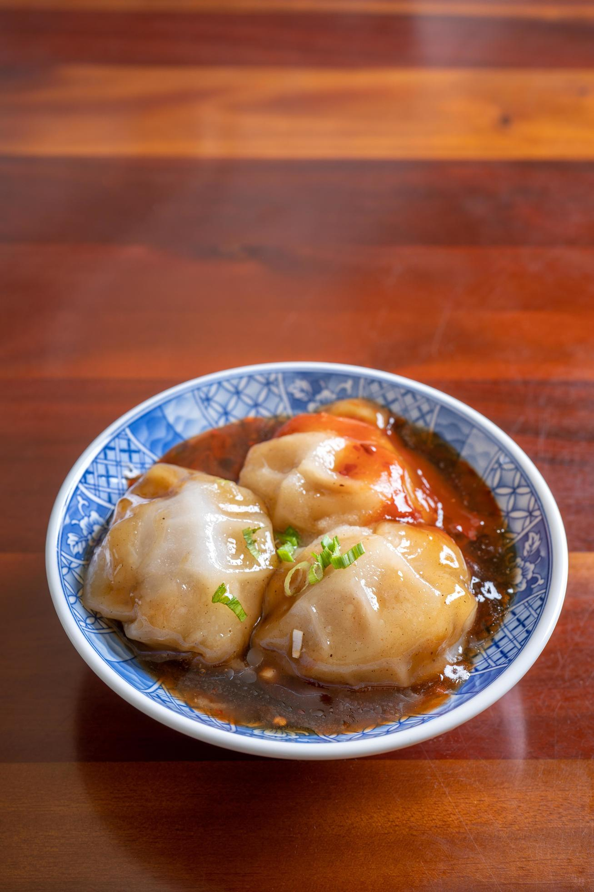

# Bawan

*Taiwan's translucent meatball: a sweet-potato-starch dumpling shell wrapped around a savoury pork-and-bamboo filling, steamed then briefly deep-fried, served in a warm garlic-soy sauce. The slightly glutinous, gelatinous, deeply Taiwanese snack from Changhua and Taichung that few outside the island know.*

**Serves:** 4 (8 bawan total)

**Prep Time:** 50 minutes (plus 1 hour resting dough)

**Cook Time:** 35 minutes

## Overview
Bawan ("meatball" in Taiwanese Hokkien) is one of Taiwan's most distinctive snacks, particular to central Taiwan (Changhua, Taichung, Nantou) and rarely seen outside the island: a translucent jelly-like outer shell of sweet potato starch and rice flour wrapped around a savoury filling of marinated minced pork, bamboo shoots, dried shrimp and sometimes mushroom. Steamed first to set the shell into the slightly gelatinous translucent texture that defines the dish, then briefly pan-fried or deep-fried for a thin golden crust, served warm with a generous spoonful of garlic-soy-vinegar sauce ladled over. The texture is the point: the shell goes from chewy-soft to slightly bouncy as it cools, with the savoury pork at the centre giving a meaty hit. Not a dumpling in the Chinese sense; bawan is its own category. Sweet potato starch is essential to the texture; cornstarch and potato starch give worse results. The dried shrimp gives an umami depth that is hard to replicate; a teaspoon of shrimp paste substitutes.

## Ingredients

### Pork filling
- 400 g pork shoulder or pork belly (minced; or buy ground pork)
- 100 g fresh or canned bamboo shoots (drained, finely diced)
- 30 g dried shrimp (soaked in 50 ml hot water 15 minutes, drained and chopped; reserve soaking water)
- 4 spring onions (white parts only, finely sliced)
- 3 garlic cloves (finely crushed)
- 1 thumb (2 cm) fresh ginger (finely grated)
- 2 tablespoons light soy sauce
- 1 tablespoon dark soy sauce
- 1 tablespoon Shaoxing wine (or dry sherry)
- 1 tablespoon caster sugar
- 1 teaspoon five-spice powder
- 1 teaspoon white pepper
- 1 tablespoon cornstarch
- 2 tablespoons reserved shrimp soaking water (or chicken stock)
- 1 teaspoon toasted sesame oil

### Starch dough (the translucent shell)
- 150 g sweet potato starch
- 50 g rice flour (or 30 g rice flour + 20 g tapioca starch)
- 2 tablespoons plain flour
- 400 ml hot water (just-off-the-boil)
- 1 teaspoon salt
- 1 tablespoon vegetable oil

### Sauce
- 5 tablespoons light soy sauce
- 2 tablespoons dark soy sauce
- 3 tablespoons caster sugar
- 3 tablespoons rice vinegar
- 6 garlic cloves (finely crushed)
- 1 tablespoon toasted sesame oil
- 200 ml chicken stock (or water)
- 2 teaspoons cornstarch
- 2 tablespoons water (for the cornstarch slurry)

### For the brief deep-fry
- Vegetable oil for shallow frying (3 cm depth)

### To serve
- Fresh coriander leaves
- Sliced fresh red chilli (optional)

## Method

### Stage 1 - Make the pork filling
1. In a wide bowl, combine the minced pork, diced bamboo shoots, chopped dried shrimp, sliced spring onions, crushed garlic and grated ginger.
2. Add the soy sauces, Shaoxing wine, sugar, five-spice, white pepper and cornstarch.
3. Mix vigorously with a wooden spoon (or hands) for 2-3 minutes; the proper texture is achieved by working the mixture till it becomes slightly sticky and elastic.
4. Add the reserved shrimp soaking water and the sesame oil; mix again till incorporated.
5. Cover and refrigerate 15 minutes (or longer) while you make the dough.

### Stage 2 - Make the starch dough
1. In a wide heatproof bowl, whisk together the sweet potato starch, rice flour and plain flour.
2. Pour in the hot water in a steady stream, whisking constantly.
3. Add the salt and vegetable oil.
4. Whisk till you have a thick smooth paste; it should look like a thin paste of glue (gelatinous when cool).
5. Cover and let rest 1 hour at room temperature; the texture firms up to a thick spoonable dough.

### Stage 3 - Form the bawan
1. Prepare 8 small heatproof bowls (or ramekins, or small saucers) of about 10 cm diameter and 3-4 cm deep. Lightly oil the insides.
2. Spoon 2 tablespoons of the starch dough into each bowl; spread to cover the bottom and partway up the sides.
3. Place 2 tablespoons of the pork filling in the centre of each bowl.
4. Cover the filling with another 2 tablespoons of the starch dough, spreading to enclose the meat completely; the top should be smooth.

### Stage 4 - Steam
1. Set up a large steamer (or a wide pan with a rack) over simmering water.
2. Place the bowls in the steamer; steam for 25 minutes till the starch shell turns from white-opaque to translucent.
3. Don't overcook; 25 minutes is right.

### Stage 5 - Cool briefly
1. Lift the bowls out of the steamer carefully.
2. Let cool for 5 minutes; the shells continue to set as they cool.

### Stage 6 - Make the sauce
1. In a small saucepan, combine the light soy, dark soy, sugar, rice vinegar, crushed garlic, sesame oil and stock.
2. Bring to a low simmer over medium heat.
3. Mix the cornstarch with 2 tablespoons of water; whisk into the simmering sauce.
4. Cook 1-2 minutes till the sauce thickens to a glossy coating consistency.
5. Take off the heat; keep warm.

### Stage 7 - Brief deep-fry (or pan-fry)
1. Heat 3 cm of vegetable oil in a wide heavy pan to 170°C (340°F).
2. Lift each bawan out of its bowl with a spoon and your fingers (carefully; they're slippery).
3. Slide each bawan into the hot oil one at a time; work in batches of 4.
4. Fry for 30-60 seconds per side; the outside should turn slightly golden and develop a thin crust.
5. Don't over-fry; you want the shell to stay translucent inside while the outside crisps.
6. Lift out with a slotted spoon; drain briefly.

### Stage 8 - Serve
1. Place 2 bawan in each serving bowl.
2. Spoon generous warm sauce over each bawan; the sauce should pool in the bowl.
3. Garnish with coriander leaves and sliced chilli.
4. Eat immediately with chopsticks and a Chinese spoon; cut through the shell to reach the meat filling; combine each bite with the sauce.

## Notes
- **Sweet potato starch is essential:** the proper texture of bawan comes from sweet potato starch specifically. Cornstarch gives a less-stretchy more-brittle shell; tapioca starch gives an over-bouncy shell. Use sweet potato starch from an Asian market.
- **Brief deep-fry, not full fry:** the goal is a thin slightly-golden crust, not a deep crisp. 30-60 seconds per side is right; longer cooks the shell from translucent to opaque and the dish loses its character.
- **Work the pork filling till sticky:** the mixing of the pork (2-3 minutes of vigorous stirring) develops the proteins and gives the filling a properly elastic chewy texture. Lazy mixing gives a crumbly filling.
- **The sauce is traditional:** garlic-soy-vinegar-sugar in roughly equal balanced quantities, slightly thickened, generously ladled over. Don't substitute generic soy sauce.
- **Translucent shell:** if the shell is opaque white after steaming, it wasn't steamed long enough. 25 minutes is the proper time. The shell should be translucent enough to see the meat filling vaguely through.

## Variations
- **Chicken bawan:** swap the pork for chicken thigh (minced); reduce the soaking time of the dried shrimp by half; cook 25 minutes the same way.
- **Mushroom-only filling (vegetarian):** swap the pork for 300 g of finely chopped shiitake mushrooms (rehydrated) and 100 g of diced firm tofu; cook the filling slightly longer in a pan with the seasonings before assembling.
- **Larger bawan:** use 4 larger bowls (15 cm diameter) for half the filling each; steam 30 minutes. Common at restaurants; gives one large bawan per person.
- **With shrimp head sauce:** if you can find shrimp head paste (xia tou jiang) at an Asian market, swap 1 tablespoon of the soy sauce in the sauce for this; gives a deeply umami sauce that's very Taiwanese.

## Serving
- 2 per person in a small bowl with the warm sauce ladled over. A pair of chopsticks and a Chinese spoon. Drink: Taiwan Beer; a small glass of strong oolong tea; or bubble tea for the night-market combo.

## Storage
- Bawan is best eaten warm and fresh.
- Keeps refrigerated 3 days; reheat by steaming for 8-10 minutes till warmed through (don't microwave; the texture suffers).
- Freezes 2 months after steaming (before the brief deep-fry); defrost in the fridge, then steam to reheat, then briefly deep-fry as in the recipe.
- The sauce keeps refrigerated 1 week; reheat to a low simmer before serving.
- Day-old bawan is good cold for breakfast, eaten with a small splash of soy sauce.
