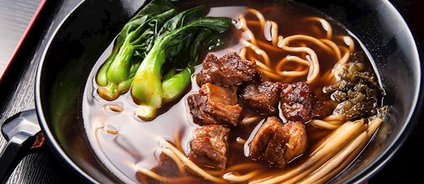

# Taiwanese Beef Noodle Soup

*Niúròu miàn - Taiwan's national obsession. A slow-braised beef shank in a rich, slightly spicy soy-and-doubanjiang broth, served over hand-pulled or wide flat wheat noodles, topped with pickled mustard greens, spring onions and chilli oil. The broth gets at least 2 hours; the meat falls apart at the touch of chopsticks. Annual beef noodle festivals in Taipei pick a winner each year.*

**Serves:** 4

**Prep Time:** 25 minutes

**Cook Time:** 2 ½-3 hours

## Overview
Beef shank parboils briefly to remove scum. Aromatics - ginger, garlic, scallion, star anise, cinnamon, dried chilli, Sichuan peppercorn, doubanjiang (fermented chilli broad bean paste) - fry in oil until fragrant. Tomato deepens the broth. Beef stock, soy, rice wine, and rock sugar build the body. The shank simmers 2-3 hours until fork-tender. Noodles cook fresh; broth ladles over; pickled greens and chilli oil top.

## Ingredients

### Beef
- 1 kg beef shank (with sinew; or beef short ribs)

### Aromatics and paste
- 3 tablespoons vegetable oil
- 6 cm fresh ginger (sliced)
- 6 garlic cloves (smashed)
- 4 spring onions (whole, smashed)
- 1 medium onion (quartered)
- 4 star anise
- 1 cinnamon stick
- 4 dried red chillies
- 2 tablespoons Sichuan peppercorns (lightly crushed)
- 3 tablespoons doubanjiang (Pixian-style)
- 2 medium tomatoes (quartered)

### Liquid and seasoning
- 100 ml Shaoxing rice wine
- 100 ml light soy sauce
- 2 tablespoons dark soy sauce (for colour)
- 30 g rock sugar (or 2 tablespoons brown sugar)
- 2 litres beef stock or water
- 1 teaspoon salt (or to taste)

### To serve
- 400 g fresh wheat noodles (wide flat are traditional; udon as a substitute)
- 200 g pickled mustard greens (suan cai; sold at Asian grocers)
- 4 spring onions (sliced)
- A small bunch of coriander (chopped)
- Chilli oil (to drizzle)
- Bok choy or pak choi (blanched briefly, optional)

## Method

### Stage 1 - Parboil the beef
1. Cut the shank into 5 cm chunks.
1. Place in a pot; cover with cold water; bring to the boil.
1. Boil 3-4 minutes; drain and rinse the beef thoroughly under cold water - this removes the scum and leaves you with a clean broth.

### Stage 2 - Aromatics
1. Heat the oil in a large heavy pot over medium-high heat.
1. Add the ginger, garlic, spring onions and onion; cook 4-5 minutes until fragrant.
1. Add the star anise, cinnamon, dried chillies and Sichuan peppercorns; cook 1 minute.
1. Stir in the doubanjiang; cook 2 minutes - the oil should turn red.

### Stage 3 - Tomato and deglaze
1. Add the tomatoes; cook 4-5 minutes, mashing slightly, until they break down.
1. Pour in the rice wine; cook 1 minute.

### Stage 4 - Build the broth
1. Add the parboiled beef.
1. Pour in the soy sauces; add the rock sugar.
1. Cover with stock or water; bring to the boil.
1. Reduce to lowest heat; partly cover.
1. Cook 2-3 hours until the beef is fork-tender.

### Stage 5 - Strain (optional but cleaner)
1. Lift the beef out into a bowl.
1. Strain the broth through a fine sieve into a clean pot - discard the spices and aromatics.
1. Return the beef to the strained broth.
1. Taste and adjust salt.

### Stage 6 - Cook the noodles
1. Bring a wide pan of water to a vigorous boil.
1. Cook the noodles per packet instructions (usually 3-4 minutes).
1. Blanch the bok choy (if using) in the same water 60 seconds.
1. Drain and divide between 4 bowls.

### Stage 7 - Serve
1. Ladle hot broth over the noodles, with 3-4 chunks of beef per bowl.
1. Top with pickled mustard greens, sliced spring onions, coriander and a drizzle of chilli oil.
1. Eat while hot - chopsticks for noodles and beef, spoon for the broth.

## Notes
- **Parboil first:** This is the secret to a clean, clear broth. Skipping gives a cloudy, scummy soup.
- **Doubanjiang is the soul:** Sichuan-style fermented broad bean and chilli paste. Other chilli pastes don't give the same depth.
- **Pickled mustard greens:** Suan cai or zha cai, sold in pouches at Asian grocers. Adds the salty-sour crunch that completes the bowl.

## Storage
- Broth + beef keep 4 days refrigerated, freezes 3 months. Cook noodles fresh.
