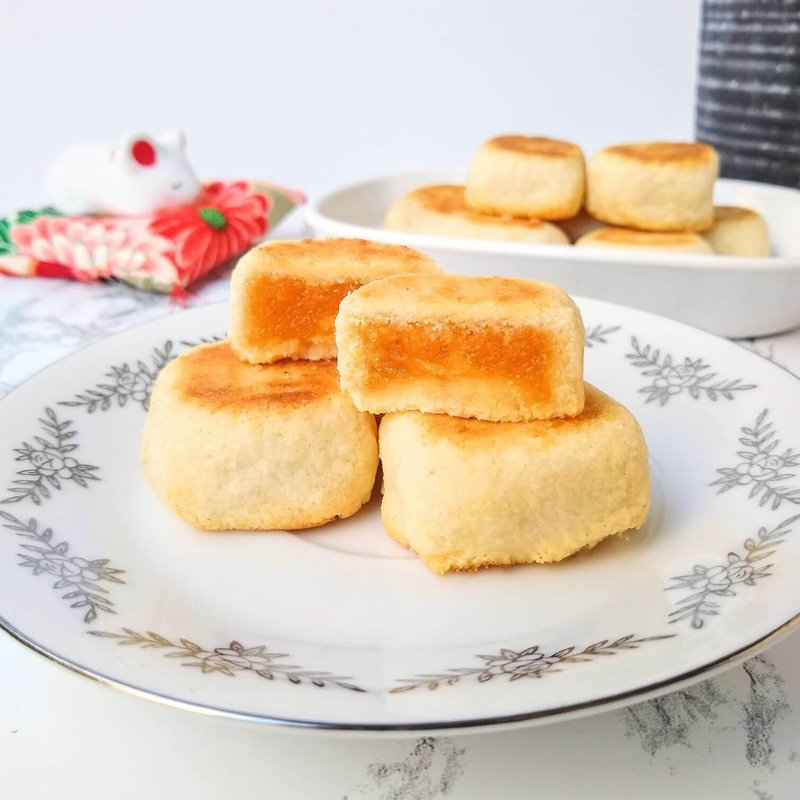

# Pineapple Cake

*Taiwan's signature gift cake: small shortbread rectangles filled with thick chewy pineapple jam, baked golden in metal moulds and individually wrapped.*

**Makes:** 16 cakes

**Prep Time:** 1 hour (plus 30 min chilling)

**Cook Time:** 45 minutes

## Overview
The filling cooks first: fresh or tinned pineapple (drained well), maltose syrup, sugar, and butter cook down for 30+ minutes into a thick, golden, chewy jam. The dough is a classic shortbread of butter, icing sugar, egg yolk and flour with milk powder for tenderness. Each cake wraps a ball of cooled pineapple paste in dough, presses into a square or rectangular metal mould, bakes pale gold.

## Ingredients

### Pineapple paste
- 600 g fresh pineapple (peeled, cored; or drained tinned pineapple chunks)
- 100 g caster sugar
- 50 g maltose syrup (or honey + 1 tablespoon glucose syrup)
- 30 g unsalted butter
- A pinch of salt

### Dough
- 200 g unsalted butter (softened)
- 60 g icing sugar (sifted)
- 2 large egg yolks
- 30 g full-fat milk powder
- 280 g plain flour
- A pinch of salt

### Equipment
- 16 small rectangular pineapple cake moulds (about 5 x 4 cm) - or use mini-loaf tins, or shape free-form

## Method

### Stage 1 - Pineapple paste
1. Pulse the pineapple in a food processor to a coarse rubble (or grate by hand). Squeeze out and discard about half the juice - too much liquid means the paste won't thicken.
1. Tip the squeezed pulp into a wide heavy pan.
1. Add the sugar, maltose syrup, butter and salt.
1. Cook over medium-low heat, stirring often, 30-40 minutes until the mixture is thick, golden, and pulls away from the pan when the spoon is drawn through. The colour should deepen to caramel-gold.
1. Cool fully; refrigerate at least 30 minutes (warm filling is too soft to wrap).

### Stage 2 - Divide the filling
1. Once cool and firm, divide the paste into 16 equal balls (about 18 g each); roll each into a small oval. Refrigerate while you make the dough.

### Stage 3 - Dough
1. Cream the butter and icing sugar in a wide bowl until pale.
1. Beat in the egg yolks one at a time.
1. Mix in the milk powder, flour and salt with a spatula until just combined.
1. Wrap and rest 15 minutes (don't refrigerate fully - too cold and it cracks during shaping).

### Stage 4 - Shape
1. Heat the oven to 170°C (150°C fan).
1. Divide the dough into 16 equal pieces (about 35 g each).
1. Flatten one piece in your palm into a disc.
1. Place a pineapple ball in the centre; bring the edges of the dough up around the filling; pinch closed and roll smooth.
1. Place the wrapped ball into a metal mould; press flat to fill the mould evenly.
1. Set the mould on a parchment-lined baking sheet.
1. Repeat for all 16.

### Stage 5 - Bake
1. Bake 18-22 minutes until pale gold (don't take them brown).
1. After 12 minutes, flip each mould (with the cake inside) so the other side colours evenly.
1. Cool 5 minutes; carefully unmould while still warm.
1. Cool fully on a wire rack.

### Stage 6 - Serve
1. Eat at room temperature with hot tea.
1. Wrap individually in plastic if giving as gifts; the cakes keep their shape and stay tender.

## Notes
- **Maltose vs honey:** Maltose syrup gives the chewy texture that's authentic pineapple cake. Honey works as a substitute but the filling is slightly stickier.
- **Drain the pineapple hard:** Excess liquid means the paste won't reach the right consistency in cooking time. Squeeze through a sieve or muslin.
- **Pale, not golden:** Pineapple cakes are baked light. Deep gold means overdone - the texture goes from tender shortbread to dry biscuit.

## Storage
- Keeps 2 weeks at room temperature in an airtight tin; flavour deepens.
- Don't refrigerate (firms the shortbread); freezes 2 months.
