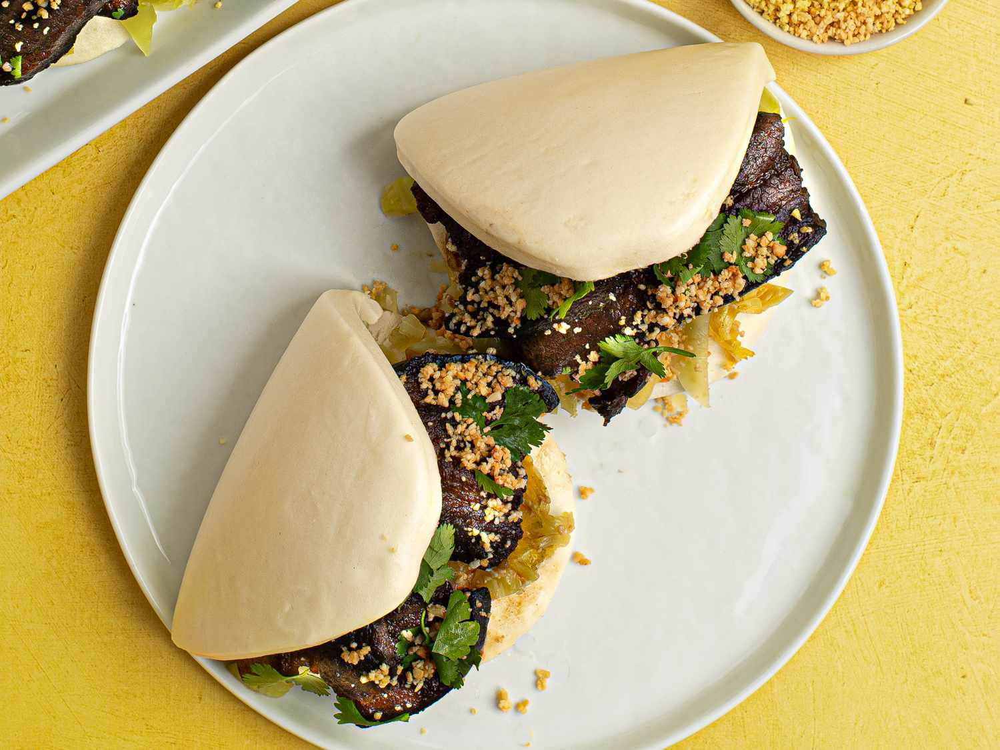

# Gua Bao

*Taiwan's iconic pork-belly sandwich: pillowy steamed white buns folded around slow-braised soy-and-five-spice pork belly, with pickled mustard greens, crushed peanuts and fresh coriander. The "Taiwanese hamburger" of every Taipei night market.*

**Serves:** 4 (8 buns total, 2 per person)

**Prep Time:** 30 minutes (plus 4 hours marinating + 90 minutes braising)

**Cook Time:** 2 hours (mostly hands-off pork braising)

## Overview
Gua bao (kong bah pao in Taiwanese Hokkien, "Taiwanese hamburger" in tourist parlance) is the iconic Taiwan night-market street food: a pillowy white steamed bun shaped like a half-moon clam shell folded around slow-braised soy-and-five-spice pork belly, with pickled mustard greens (suan cai), crushed roasted peanuts and fresh coriander. The combination is what Taiwanese have eaten on the street for generations and what every Taipei gastrobar tries to recreate. Three parts: the braised pork belly (the main work, slow-cooked 90 minutes till meltingly tender and the fat renders into the sauce), the steamed buns (frozen lotus-leaf buns from an Asian market are excellent and save four hours over making from scratch), and the toppings. The pork belly is red-braised (hong shao): blanched briefly, then slow-cooked in soy, dark soy, rice wine, rock sugar, ginger, scallions and a bundle of star anise, cinnamon and Sichuan peppercorns till the sauce reduces to a glossy syrup. Eat with the hands; the dish is messy by design.

## Ingredients

### Pork belly braise
- 800 g pork belly (with skin if possible; cut into 4 cm cubes)
- 2 tablespoons vegetable oil
- 4 thumb-sized pieces fresh ginger (sliced)
- 4 spring onions (cut into 4 cm lengths)
- 6 garlic cloves (lightly crushed)
- 3 star anise
- 1 cinnamon stick (5 cm)
- 1 teaspoon Sichuan peppercorns (or black peppercorns)
- 100 ml Shaoxing rice wine (or dry sherry)
- 4 tablespoons light soy sauce
- 2 tablespoons dark soy sauce
- 80 g rock sugar (or 4 tablespoons palm sugar; or 4 tablespoons brown sugar)
- 1 litre water (or chicken stock)
- 1 teaspoon five-spice powder

### Buns
- 8 frozen lotus leaf buns (gua bao buns; available at Asian markets in the freezer section)

### Toppings
- 100 g pickled mustard greens (suan cai; from a jar, drained and roughly chopped; or substitute with Korean kimchi if you can't find)
- 60 g roasted peanuts (unsalted; crushed coarsely with the side of a knife or pulsed in a food processor)
- 1 tablespoon caster sugar (mixed with the crushed peanuts)
- 1 large bunch fresh coriander
- 4 fresh red chillies (sliced, optional)
- Hoisin sauce (about 4 tablespoons)

## Method

### Stage 1 - Blanch the pork belly
1. Place the pork belly cubes in a large pot; cover with cold water.
2. Bring to a hard boil; cook 5 minutes (this draws out blood and impurities).
3. Drain; rinse the pork under cold water to remove any scum.
4. Pat dry with kitchen paper.

### Stage 2 - Brown the pork (optional but recommended)
1. Heat the vegetable oil in a heavy casserole or deep wok over medium-high heat.
2. Add the pork belly cubes in a single layer; brown 3-4 minutes per side till deeply golden.
3. Don't overcrowd; work in batches if needed.
4. Transfer browned pork to a plate.

### Stage 3 - Build the braising liquid
1. Reduce the heat to medium; in the same pan, add the sliced ginger, spring onion lengths and crushed garlic.
2. Stir-fry 1 minute till fragrant.
3. Add the star anise, cinnamon stick and Sichuan peppercorns; stir 30 seconds till the kitchen fills with warm spice fragrance.
4. Pour in the Shaoxing wine; let bubble for 30 seconds (the alcohol evaporates).
5. Add the light soy, dark soy, rock sugar and water (or stock).
6. Stir till the sugar dissolves.

### Stage 4 - Slow-braise
1. Return the browned pork to the pot.
2. Add the five-spice powder.
3. Bring to a simmer.
4. Cover with the lid slightly ajar (or use a lid with a small steam hole).
5. Reduce heat to low; simmer 90 minutes till the pork is fall-apart tender (a fork should slide through easily).
6. The sauce will reduce considerably during cooking; if it reduces too much before the pork is tender, add more hot water (or stock).

### Stage 5 - Reduce the sauce
1. Once the pork is tender, lift it out of the pot with a slotted spoon; transfer to a warm plate.
2. Bring the braising liquid to a hard simmer; reduce 5-7 minutes till the sauce thickens to a glossy syrup that coats the back of a spoon.
3. Strain the sauce through a fine sieve to remove the aromatics; return to the clean pot.
4. Return the pork to the reduced sauce; toss to coat.

### Stage 6 - Prepare the toppings
1. In a small bowl, mix the crushed peanuts with the sugar; this is the peanut sugar (peanut floss).
2. Drain the pickled mustard greens; chop roughly if the pieces are large.
3. Pick the coriander leaves from their stems.
4. Slice the chillies if using.

### Stage 7 - Steam the buns
1. Set up a steamer with simmering water in the base.
2. Place the frozen buns in the steamer basket (don't crowd; work in batches if needed); leave 2 cm between buns for expansion.
3. Steam for 10-12 minutes from frozen (or 5-6 minutes from thawed) till the buns are puffy and tender.
4. Don't oversteam; the buns can collapse.

### Stage 8 - Assemble
1. Take a steamed bun; open it along the fold (it'll be like a half-moon clam shell).
2. Smear a small amount of hoisin sauce inside (optional).
3. Place 2-3 chunks of braised pork belly inside; drizzle with a small amount of the reduced sauce.
4. Top with a small spoonful of pickled mustard greens.
5. Sprinkle generously with the peanut-sugar mix.
6. Add a few coriander leaves and a slice or two of chilli.
7. Fold the bun over the filling; serve immediately.

## Notes
- **Blanch the pork first:** the 5-minute hard boil and rinse removes blood and impurities; the braising liquid stays cleaner and the pork tastes purer. Don't skip.
- **Rock sugar gives the proper glossy sauce:** rock sugar (the small yellow lumps from Chinese markets) gives a glossier syrupy sauce than refined sugar. Brown sugar or palm sugar are reasonable substitutes; refined caster sugar is the last resort.
- **Don't oversteam the buns:** 10-12 minutes from frozen is enough. Longer and the buns can collapse or go gummy. Once steamed, eat within 30 minutes; they harden as they cool.
- **The peanut-sugar mix is essential:** the sweetened crushed peanuts (a small spoonful sprinkled inside each bun) are what makes gua bao distinct from other pork-belly sandwiches. Don't skip.
- **Frozen buns are fine:** making bao buns from scratch takes 4 hours and the frozen ones from Asian markets are excellent. Use them.

## Variations
**Chicken thigh gua bao:** swap the pork belly for 800 g of chicken thigh; braise the same way (reduce cooking time to 45 minutes). Different but excellent; common modern variation.
**Vegan gua bao:** swap the pork for 600 g of king oyster mushrooms (sliced thick) braised in the same liquid (use vegetable stock and reduce cooking to 30 minutes). The texture mimics pork belly remarkably well.
**Fried chicken gua bao:** instead of braised pork, deep-fry chicken thigh schnitzel-style (panko crumbed) and place in the bun with the toppings; modern Taipei gastrobar version.
**Spicy gua bao:** add 2-3 dried red chillies to the braise; finish with a drizzle of Sichuan chilli oil. Properly fierce variation.

## Serving
On a small plate or in a folded square of parchment, 2 buns per person. Eat with your hands; the bun should be folded around the filling like a taco. The mess is part of the experience. Drink: Taiwan Beer (the local lager); Taiwanese bubble tea for the proper Taipei night-market combo; or chrysanthemum tea.

## Storage
- The braised pork keeps refrigerated 5 days; the flavour deepens noticeably overnight. Reheat gently in a covered pan or microwave.
- The pork freezes 3 months in the sauce; defrost overnight in the fridge.
- The buns are best steamed and eaten the same day; don't refrigerate cooked buns (they go gummy).
- The toppings (peanut mix, mustard greens, coriander) should be prepared fresh; don't pre-assemble bao buns.
- Day-old braised pork makes excellent fried rice or pulled-pork tacos.
