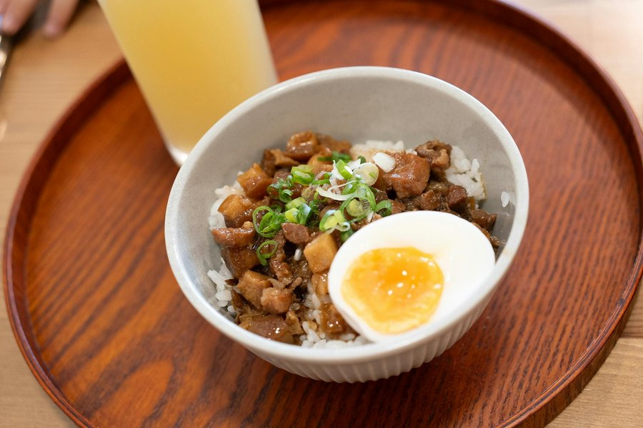

# Lu Rou Fan

*Taiwan's comfort dish: hand-diced pork belly braised glossy in soy, rice wine and five-spice, ladled over a bowl of hot steamed rice.*

**Serves:** 4

**Prep Time:** 25 minutes

**Cook Time:** 1 ½ hours

## Overview
Lu rou fan is Taiwan's everyday comfort bowl: hand-diced pork belly braised glossy in soy, Shaoxing wine, five-spice and a generous handful of fried shallots, ladled over a steaming mound of jasmine rice with a soy-braised egg cradled to one side. The technique that defines the dish is hand-dicing the pork rather than mincing; cubes of skin-on belly cook down to little gelatinous pillows that hold their shape and let you taste skin, fat and meat distinctly. The collagen in the skin is what thickens the braise into its signature lacquered gloss, so keep the skin on every cube. Fried shallots from a tub at any Asian grocer are the essential shortcut that carries most of the savoury depth. Rock sugar caramelises into the signature sheen better than brown sugar. Served with pickled mustard greens or blanched pak choi alongside.

## Ingredients

### Pork
- 800 g pork belly, skin on (one piece)
- 2 tablespoons vegetable oil

### Aromatics
- 80 g fried shallots (sold in tubs at Asian grocers), plus extra to garnish
- 6 garlic cloves (finely chopped)
- 4 cm fresh ginger (finely chopped)
- 2 star anise
- 1 cinnamon stick (small)
- 1 teaspoon Chinese five-spice powder
- ½ teaspoon white pepper

### Braise
- 100 ml Shaoxing rice wine
- 80 ml light soy sauce
- 2 tablespoons dark soy sauce (for colour)
- 40 g rock sugar (or 2 tablespoons soft brown sugar)
- 700 ml water (or unsalted chicken stock)

### To serve
- 4 eggs (large, soft-boiled, peeled)
- Steamed jasmine rice
- Pickled mustard greens (or quick-pickled cucumber)
- 1 spring onion (finely sliced)
- Blanched pak choi (optional)

## Method

### Stage 1 - Prep the pork
1. Slice the pork belly into 1 cm thick strips, then into 1 cm cubes. Keep the skin on every piece, this is the texture that defines the dish.
2. Bring a saucepan of water to the boil. Add the pork; boil for 3 minutes to remove scum. Drain and rinse under cold water. Pat dry.

### Stage 2 - Build the aromatics
1. Heat the oil in a heavy-based saucepan or small casserole over medium heat.
2. Add the chopped garlic and ginger; cook 1 minute until fragrant.
3. Add the fried shallots, star anise, cinnamon stick, five-spice and white pepper. Stir for 30 seconds.
4. Tip in the pork and stir to coat in the aromatics. Cook 3-4 minutes until the edges of the pork start to colour and render.

### Stage 3 - Braise
1. Pour in the Shaoxing rice wine; let it bubble for a minute.
2. Add both soy sauces, the rock sugar and enough water or stock to just cover the pork.
3. Bring to a simmer. Reduce to the lowest heat, cover with the lid slightly ajar, and braise for 1 ¼ hours, stirring every 20 minutes, until the pork is meltingly tender and the sauce is glossy and reduced to a sticky coating.

### Stage 4 - The eggs
1. Bring a small pan of water to a rolling boil. Lower in the eggs and cook 6 ½ minutes for jammy yolks. Plunge into iced water; peel.
2. Add the peeled eggs to the braise in the last 20 minutes so they take on colour.

### Stage 5 - Serve
1. Spoon a generous mound of jasmine rice into each bowl.
2. Ladle pork belly and sauce over the top.
3. Halve a soy-braised egg and rest it on the side.
4. Scatter spring onion and extra fried shallots; serve pickled greens or pak choi on the side.

## Notes
- **Hand-dice the pork:** Don't be tempted to mince. The texture comes from cubes that hold their shape and let you taste skin, fat and meat distinctly.
- **Fried shallots are not optional:** They carry most of the savoury depth. Tubs of crispy fried shallots from Asian grocers (a Thai or Vietnamese brand is fine) save the trouble of frying your own.
- **Rock sugar gives gloss:** Rock sugar (binglang) caramelises into the signature lacquered sheen. Brown sugar works but the finish is duller.
- **Skin on:** Hard rule. The collagen from the skin thickens the braise and gives mouthfeel.

## Variations
- **Mushroom-enriched:** Soak 4 dried shiitake in warm water for 30 minutes; chop and add with the aromatics. The soaking liquid replaces some of the stock.
- **Lu rou fan with bamboo shoots:** Stir 150 g sliced bamboo shoots into the braise for the last 30 minutes.

## Serving
- Serve with: steamed jasmine rice, blanched pak choi or Chinese broccoli, pickled mustard greens, soy-braised egg.

## Storage
- Keeps 4 days refrigerated and improves overnight; the gelatine sets so reheat gently with a splash of water.
- Freezes well for 2 months.
