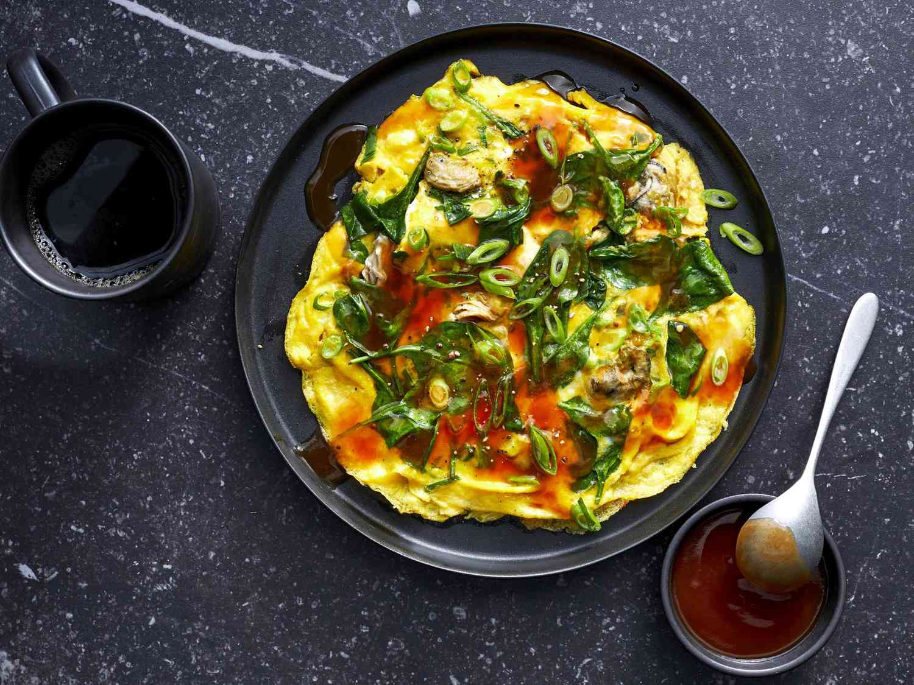

# Oyster Omelette

*Taiwan's night-market signature: a slightly gelatinous, stretchy sweet potato starch and egg pancake studded with plump fresh oysters and chopped greens, topped with a sweet-savoury orange sauce of soy, sugar, ketchup and chilli. The dish that defines Shilin and Raohe night markets.*

**Serves:** 2 (1 large pancake)

**Prep Time:** 15 minutes

**Cook Time:** 10 minutes

## Overview
Oyster omelette (ô-á-tsian in Taiwanese Hokkien, é-zi-jian in Mandarin) is one of Taiwan's most iconic night-market dishes: a slightly gelatinous, stretchy pancake made from a slurry of sweet potato starch, eggs and water, with plump fresh oysters scattered through and chopped chrysanthemum greens folded in, fried in plenty of oil till the bottom crisps and the top stays soft and slightly translucent, then topped with the traditional sweet-savoury orange sauce of soy, sugar, ketchup, chilli and sesame oil. The texture is what makes this dish distinctive: chewy and slightly bouncy where the starch dominates, tender and eggy where the eggs dominate, with the soft brine of fresh oysters running through. Not a French omelette, not a Chinese fried egg; its own thing. Sweet potato starch is non-negotiable. Fresh oysters are best; pre-packaged ones lack the proper brininess. The orange sauce is traditional; without it the dish is incomplete.

## Ingredients

### Sweet potato starch slurry
- 50 g sweet potato starch (available at Asian markets; or substitute with cornstarch in a pinch)
- 200 ml cold water

### Pancake
- 8 fresh small oysters (shucked; about 80-100 g of oyster meat)
- 3 large eggs
- 100 g chrysanthemum greens (tong ho; or substitute with baby spinach, watercress, or chopped Chinese cabbage)
- 3 spring onions (white parts finely sliced, green parts cut into 4 cm lengths)
- 4 tablespoons vegetable oil (for frying)
- A small pinch of fine sea salt
- A pinch of ground white pepper

### Sauce (the traditional orange topping)
- 3 tablespoons tomato ketchup
- 2 tablespoons light soy sauce
- 1 tablespoon dark soy sauce
- 2 tablespoons caster sugar
- 1 tablespoon chilli garlic sauce (lao gan ma or [sambal oelek](../../base-ingredients/sambal/sambal-oelek.md))
- 1 teaspoon Chinese black vinegar
- 1 teaspoon toasted sesame oil
- 100 ml water
- 1 teaspoon cornstarch (for thickening)
- 1 tablespoon water (to mix with the cornstarch)

### To serve
- Fresh coriander leaves
- Sliced fresh red chilli (optional)

## Method

### Stage 1 - Make the sauce
1. Combine the ketchup, light soy, dark soy, sugar, chilli garlic sauce, vinegar, sesame oil and 100 ml water in a small saucepan.
2. Whisk to combine; bring to a low simmer over medium heat.
3. Mix the cornstarch with 1 tablespoon of water; pour into the simmering sauce; whisk till the sauce thickens to a glossy syrup that coats the back of a spoon.
4. Take off the heat; keep warm.

### Stage 2 - Make the starch slurry
1. In a small bowl, whisk together the sweet potato starch and 200 ml cold water till smooth.
2. The slurry should be slightly thicker than milk; if it looks watery, add 1 more tablespoon of starch.
3. Set aside; whisk again just before using (the starch settles).

### Stage 3 - Prepare the oysters and eggs
1. If using oysters in shell: shuck them and reserve the meat in a small bowl with their liquor.
2. Lightly rinse the oyster meat under cold water; drain on kitchen paper. The oysters should be plump and intact.
3. In a separate bowl, crack the eggs; whisk lightly with the salt and white pepper. Don't over-whisk; just break the yolks and combine.
4. Roughly chop the chrysanthemum greens.

### Stage 4 - Cook the pancake (the technique is fast)
1. Heat a wide heavy frying pan (or wok) over medium-high heat till hot.
2. Add 3 tablespoons of the oil.
3. When the oil is shimmering, scatter the oysters in a wide circle in the pan (give them 30 seconds to lightly cook).
4. Re-whisk the starch slurry and pour it over the oysters; the slurry will start to set into a translucent gelatinous pancake almost immediately.
5. After 30 seconds, pour the beaten egg over the starch pancake; tilt the pan to spread the egg.
6. Scatter the chrysanthemum greens and most of the spring onions over the egg.

### Stage 5 - Brown the bottom
1. Reduce heat to medium.
2. Cook for 2-3 minutes till the bottom is set, lightly browned and crisp at the edges. The egg should be just set; the starch base should be translucent.
3. Add the remaining tablespoon of oil around the edges of the pan.

### Stage 6 - Flip (optional)
1. The Taiwanese street version is often flipped briefly to brown the other side: slide the pancake onto a plate, invert the pan over the plate, flip carefully. Cook the second side for 1 minute.
2. If flipping seems daunting, you can just cook a little longer on the first side (4-5 minutes total) and serve the egg side up.

### Stage 7 - Plate and sauce
1. Slide the cooked pancake onto a serving plate.
2. Spoon the warm sauce generously over the top; cover most of the pancake but leave the edges slightly exposed.
3. Scatter the reserved green parts of the spring onions over.
4. Add a few fresh coriander leaves and sliced chilli if using.
5. Serve immediately; the texture is best when fresh and hot.

### Stage 8 - Eat
1. Cut into wedges with a fork and knife (or scoop with chopsticks).
2. Eat with the sauce in every bite; the proper Taiwanese way is to make sure the gelatinous starch, the egg, the oyster and the sauce all hit the tongue together.

## Notes
- **Sweet potato starch is non-negotiable:** the distinctive chewy-bouncy texture comes from sweet potato starch specifically. Cornstarch gives a softer less-stretchy result; tapioca starch gives a more rubbery result; potato starch is closest but still different. Buy sweet potato starch from any Asian market.
- **Fresh oysters are best:** freshly shucked or in-shell oysters give the proper sweet briny flavour. Pre-packaged supermarket oyster tubs work but tend to be less briny. Pre-cooked smoked oysters don't work at all.
- **Chrysanthemum greens are traditional:** tong ho (chrysanthemum greens) have a slightly bitter herby note that balances the rich pancake. Available at Asian markets; substitute with baby spinach if not.
- **Don't whisk the eggs too much:** lightly beaten eggs give a more textured streaky pancake; over-whisked eggs go to uniform yellow and lose the visual character.
- **The sauce makes the dish:** unsauced oyster omelette is bland; the sweet-savoury chilli orange sauce is what makes it Taiwanese street food.

## Variations
- **Shrimp omelette (xia ren jian):** swap the oysters for 100 g of small peeled raw shrimp; cooks the same way. Common at restaurants that don't have fresh oysters.
- **Mushroom oyster omelette (vegetarian-friendly):** add 100 g of sliced shiitake mushrooms along with the oysters; or swap the oysters entirely for 200 g of mushrooms for a vegetarian version.
- **Without flip:** the home-cook version skips the flip and just cooks longer on the first side; equally good if you're not confident with the flip.
- **Black sauce version:** swap the orange sauce for a savoury black sauce of soy sauce, dark soy, sugar and chilli oil (no ketchup); common in some southern Taiwan stalls.

## Serving
- On a warm plate with the sauce spooned over generously. Eat immediately while hot; the texture is best fresh. Drink: Taiwan Beer; bubble tea; or chrysanthemum tea for the proper night-market combination.

## Storage
- Oyster omelette is best eaten immediately; the texture goes off as it cools (the starch goes harder and chewier).
- The sauce keeps refrigerated 2 weeks; reheat gently before use.
- Don't refrigerate or freeze cooked oyster omelette; it doesn't reheat well.
- Pre-prep is helpful: have the starch slurry, eggs and chopped greens ready; the actual cook is 5 minutes once the pan is hot.
