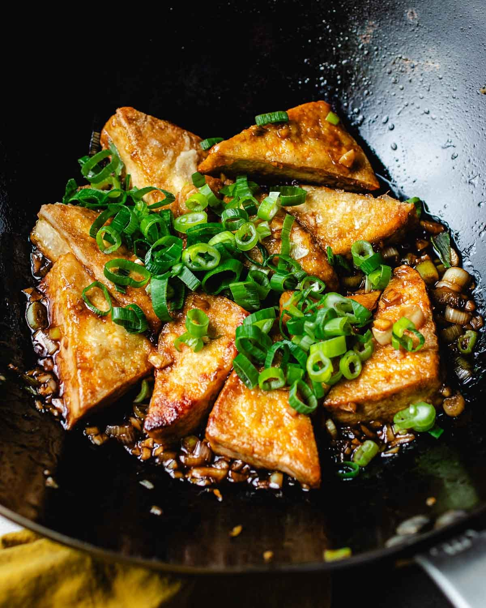

# Taiwanese Braised Tofu

*Taiwan's iconic tofu side: cubes of firm tofu slow-braised in a soy-spice broth with star anise, cinnamon, ginger and rock sugar till the outside turns deep mahogany and the inside soaks up the sauce. The everyday Taiwanese side that turns up at every "lu wei" (braised goods) stall in Taipei.*

**Serves:** 4

**Prep Time:** 15 minutes

**Cook Time:** 1 hour (mostly hands-off)

## Overview
Taiwanese braised tofu (lu dou fu) is part of the wider lu wei (slow-braised goods) tradition that defines Taiwanese cuisine: firm tofu cubes simmered in a fragrant master sauce of soy, dark soy, rock sugar, ginger, scallions, garlic and a small bundle of star anise, cinnamon, Sichuan peppercorns and clove till the tofu absorbs the sauce, the outside turns deep mahogany and the inside takes on the layered Asian-spice flavour profile. The tofu sits among other lu wei items at street stalls across Taiwan: braised eggs (often the iconic tea egg), braised seaweed knots, braised pig ear, braised duck wings, all cooked in the same master sauce. The tofu must be firm or extra-firm; silken disintegrates over the long simmer. A brief fry before braising gives a slightly crispy skin that adds texture and helps it survive. The master sauce develops flavour with use; strain and refrigerate the spiced broth after cooking and reuse it for the next round.

## Ingredients

### Tofu
- 800 g firm or extra-firm tofu (drained, cut into 3 cm cubes; pat dry thoroughly)
- 3 tablespoons vegetable oil (for browning)

### Aromatics
- 4 thumb-sized pieces fresh ginger (sliced)
- 6 garlic cloves (lightly crushed)
- 4 spring onions (cut into 4 cm lengths)

### Warm spices (the master spice bundle)
- 3 star anise
- 1 cinnamon stick (5 cm)
- 1 teaspoon Sichuan peppercorns (or black peppercorns)
- 3 cloves
- 2 dried bay leaves
- 1 teaspoon fennel seeds

### Braising liquid
- 6 tablespoons light soy sauce
- 3 tablespoons dark soy sauce
- 80 g rock sugar (or 4 tablespoons palm sugar; or brown sugar)
- 60 ml Shaoxing wine (or dry sherry)
- 1 tablespoon Chinese black vinegar
- 1 litre water (or vegetable stock)
- 1 teaspoon five-spice powder

### To finish
- 2 spring onions (finely sliced)
- 1 tablespoon toasted sesame oil (optional)
- Fresh coriander leaves
- 1 fresh red chilli (sliced, optional)

## Method

### Stage 1 - Drain and brown the tofu
1. Drain the tofu; pat dry with kitchen paper.
2. Cut into 3 cm cubes.
3. Heat the oil in a wide heavy frying pan (or wok) over medium-high heat till shimmering.
4. Add the tofu cubes in a single layer; don't crowd; work in batches if needed.
5. Brown each side for 1-2 minutes; you want a thin golden crust on at least 2-3 sides of each cube. Move the cubes gently with tongs and a wooden spoon to avoid breaking them.
6. Lift out and set aside.

### Stage 2 - Build the braising liquid
1. Reduce the pan to medium heat.
2. Add the ginger slices, crushed garlic and spring onion lengths to the same pan (with whatever oil remains).
3. Stir-fry 1 minute till fragrant.
4. Add all the warm spices (star anise, cinnamon, Sichuan peppercorns, cloves, bay leaves, fennel seeds); toast 30 seconds, stirring, till the kitchen fills with warm fragrance.
5. Pour in the Shaoxing wine; let bubble for 30 seconds.
6. Add the light soy, dark soy, rock sugar, vinegar and water (or stock).
7. Add the five-spice powder.
8. Stir; bring to a low simmer; cook 5 minutes for the sugar to dissolve and the spices to start infusing.

### Stage 3 - Braise the tofu
1. Return the browned tofu to the pan, arranging in a single layer.
2. The liquid should just cover the tofu; add more water if not.
3. Bring back to a low simmer.
4. Cover with the lid slightly ajar.
5. Simmer 45 minutes; the liquid will reduce slightly, the tofu will absorb the sauce and turn deeper in colour from pale gold to deep mahogany.

### Stage 4 - Reduce the sauce
1. Once the tofu has properly soaked up the colour and flavour, lift it out with a slotted spoon; place on a serving platter.
2. Strain the braising liquid through a fine sieve; discard the aromatics and spices.
3. Return the strained liquid to the pan; reduce by hard-boiling for 3-5 minutes till the sauce thickens to a glossy syrup.
4. Pour the reduced sauce over the tofu.

### Stage 5 - Finish
1. Scatter the finely sliced spring onions over.
2. Drizzle with sesame oil if using.
3. Add coriander and sliced chilli if using.
4. Serve warm or at room temperature.

## Notes
- **Firm or extra-firm tofu only:** silken or soft tofu will disintegrate during the 45-minute braise. Firm tofu (the kind sold in tubs with light water at supermarkets) is the right choice.
- **Brown the tofu first:** the brief sear gives a thin crust that holds up to the braise and adds texture. Skipping this gives a slightly soggy texture; the flavour is still good but the texture is less.
- **Rock sugar for the proper glossy sauce:** rock sugar gives a glossier syrupy reduction than refined sugar. Brown sugar or palm sugar are reasonable substitutes; refined caster sugar is the last resort.
- **Don't lift the lid much:** the tofu absorbs flavour through slow simmering; every lift releases steam and reduces the cooking liquid faster than the tofu can absorb.
- **Save the strained sauce for next time:** the master sauce develops flavour with use. Refrigerate or freeze the strained sauce; next time, add fresh aromatics and use as the base; the depth of flavour grows.

## Variations
- **Lu wei combo platter:** add 4 peeled hard-boiled eggs and 8 dried tofu skin knots to the braise at the same time as the tofu cubes; gives a Taiwanese street-stall lu wei platter.
- **With pork belly:** add 400 g of pork belly cubes (pre-browned) to the braise along with the tofu; the pork-and-tofu combo is a classic Taiwanese home-cook dish.
- **Tea egg lu wei tofu:** add 4 cracked-and-peeled hard-boiled eggs to the braise; the eggs absorb the soy flavour and develop the cracked-marble look of Taiwanese tea eggs.
- **Spicier version:** add 4-6 dried red chillies to the braise; finish with a drizzle of Sichuan chilli oil. Common variation across Taiwan.

## Serving
- On a warm platter with the glossy sauce poured over. Alongside steamed rice and a stir-fried green vegetable; common Taiwanese home-cook combination. Or as part of a lu wei platter with braised eggs and other braised items as a snack with beer. Drink: Taiwan Beer, oolong tea, or rice wine.

## Storage
- Keeps refrigerated 5 days; the flavour deepens noticeably overnight. The tofu becomes more flavourful each day.
- Reheat gently in a covered pan with a splash of water (or in the microwave covered with a damp cloth).
- Freezes 3 months in the sauce; defrost in the fridge and reheat. The tofu texture changes slightly after freezing (more spongy), which some Taiwanese diners prefer.
- The strained sauce keeps refrigerated 2 weeks and freezes 6 months; use as a master sauce for the next batch.
- Day-old braised tofu sliced thin makes excellent topping for rice bowls or noodle soups.
