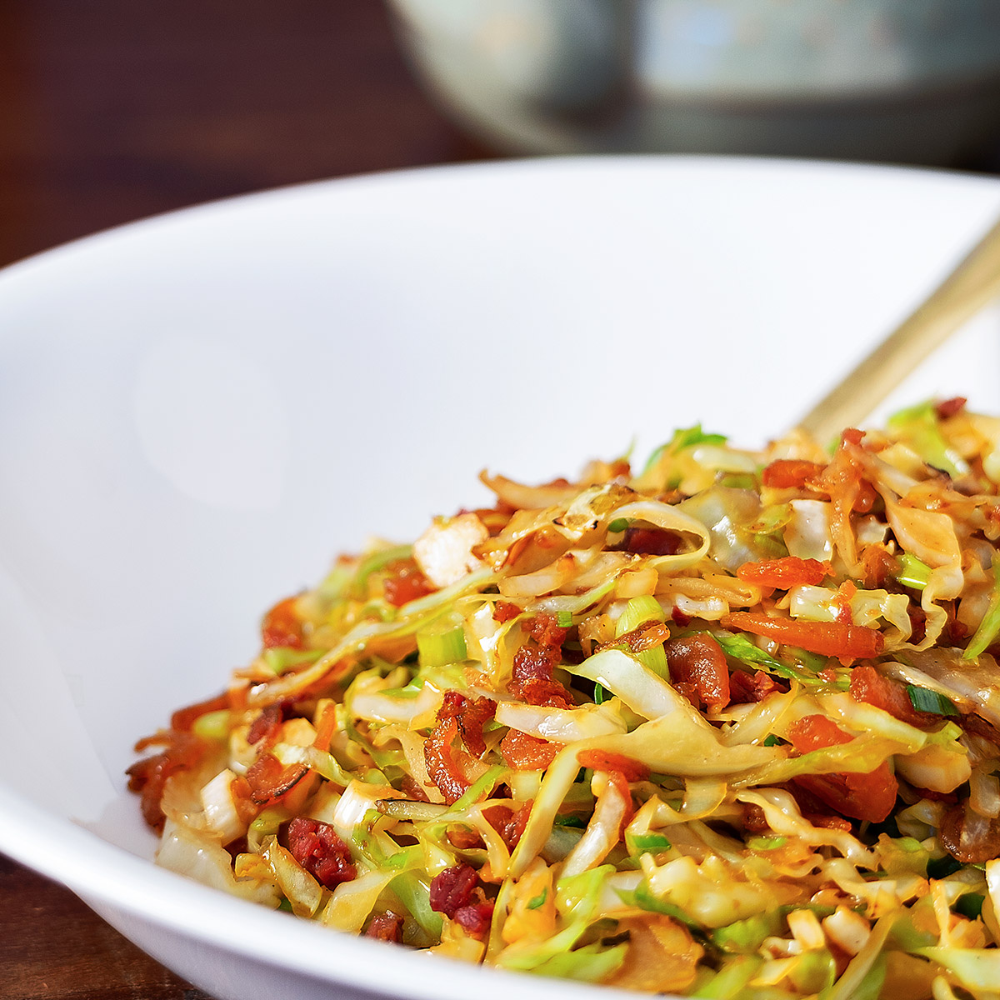

# Taiwanese Cabbage Stir-Fry

*Taiwan's everyday cabbage side: flat cabbage flash-fried in a screaming-hot wok with garlic, dried chillies, soy sauce and a splash of rice wine till the leaves wilt just so and the edges char from the high-heat contact. The simple but technique-driven cabbage dish that turns up at every Taiwanese home meal.*

**Serves:** 4

**Prep Time:** 10 minutes

**Cook Time:** 5 minutes

## Overview
Taiwanese cabbage stir-fry (chao gao li cai) is the country's everyday vegetable side, the dish that turns up at every home meal alongside braised pork, fried fish or noodle soup: flat-shaped Taiwanese cabbage (a slightly sweeter cousin of regular green cabbage, with thinner crisper leaves) torn into bite-sized pieces, flash-fried in a screaming-hot wok with garlic, dried red chillies, ginger, soy, Shaoxing wine and a handful of dried shrimp for umami, finished with sesame oil and white pepper. The dish takes five minutes once you start cooking; the technique is what matters. The point is wok-hei character: slight charring where the cabbage edges hit the smoking wok, a wilt-but-not-soft texture, a bright garlic-and-chilli backdrop. The wok must be properly hot; a cold pan steams. Tear the cabbage into rough 4 to 5 cm chunks rather than thin-slicing; thin slices wilt too fast and lose their crunch. Three minutes max in the wok; longer and the cabbage goes from crisp-tender to soft-and-flabby.

## Ingredients

- 1 medium Taiwanese flat cabbage (about 800 g; or substitute with regular green cabbage; or Savoy cabbage)
- 4 tablespoons vegetable oil (or peanut oil)
- 8 garlic cloves (finely chopped)
- 1 thumb (2 cm) fresh ginger (finely grated)
- 4-6 dried red chillies (broken in half, deseeded for milder)
- 20 g dried shrimp (soaked in 50 ml hot water 10 minutes, drained and chopped; reserve soaking water)
- 1 tablespoon Shaoxing wine (or dry sherry)
- 2 tablespoons light soy sauce
- 1 teaspoon caster sugar
- ½ teaspoon ground white pepper
- ½ teaspoon fine sea salt (or to taste; the soy and dried shrimp are salty)
- 1 tablespoon toasted sesame oil (to finish)
- 2 spring onions (finely sliced; to finish)

## Method

### Stage 1 - Prepare the cabbage
1. Cut out and discard the tough core of the cabbage.
2. Roughly chop (or tear by hand) the leaves into 4-5 cm pieces; don't be too neat. The proper Taiwanese style has irregular chunks.
3. Wash thoroughly in cold water; drain in a colander.
4. Don't dry the cabbage; the residual water helps with the initial steam.

### Stage 2 - Prepare the aromatics and shrimp
1. Drain the soaked dried shrimp; reserve the soaking water.
2. Roughly chop the dried shrimp if they're not already small.
3. Have all the aromatics (garlic, ginger, chillies, shrimp) and seasonings (Shaoxing, soy, sugar, pepper, salt) ready next to the stove; this is a fast cook.

### Stage 3 - Heat the wok properly
1. Heat a wok (or wide heavy frying pan) over high heat till smoking; this is essential.
2. Add the vegetable oil; swirl to coat the wok.
3. The oil should shimmer and ripple immediately; if it doesn't, the wok isn't hot enough.

### Stage 4 - Sizzle the aromatics
1. Add the dried red chillies; sizzle 5 seconds (don't let them burn).
2. Add the chopped garlic and grated ginger; sizzle 10 seconds till fragrant.
3. Add the chopped dried shrimp; sizzle 10 seconds.

### Stage 5 - Add the cabbage and stir-fry
1. Add the cabbage in a big armful; the wok will hiss as the wet leaves hit the hot oil.
2. Use a wok spatula (or two wooden spoons) to lift and turn the cabbage constantly; you want to get every leaf in contact with the hot wok bottom briefly.
3. Stir-fry for 2 minutes; the cabbage should start to wilt but still have crisp texture.

### Stage 6 - Season
1. Pour the Shaoxing wine around the edges of the wok; it'll sizzle and evaporate immediately.
2. Add the soy sauce, sugar, white pepper and salt.
3. Add 2 tablespoons of the reserved shrimp soaking water.
4. Toss everything together for 1 minute.

### Stage 7 - Finish
1. Take off the heat.
2. Drizzle the sesame oil over.
3. Scatter the sliced spring onions.
4. Toss once to combine.

### Stage 8 - Serve
1. Tip into a warm serving plate.
2. Serve immediately alongside steamed rice and a main dish.

## Notes
- **Wok screaming hot:** the proper Taiwanese cabbage stir-fry depends on a screaming-hot wok. The hiss when the cabbage hits the oil should be loud; the wok should smoke briefly. If your stove can't deliver, use a heavy cast-iron pan; the residual heat helps.
- **Tear or rough-chop, not thin-slice:** chunky pieces give the proper texture contrast (crisp middle, slightly wilted edges); thin slices go to uniform soft.
- **Cook fast, 3 minutes max:** Taiwanese cabbage stir-fry is meant to be properly crisp-tender. Longer cooking takes it to soft and the dish loses its character.
- **Dried shrimp give the umami:** the small amount of dried shrimp is what gives the dish its proper Taiwanese savoury depth. Skip them if you want a simpler version; the dish is good without but is less.
- **Don't pre-salt the cabbage:** pre-salting draws moisture and gives a wetter cooking environment. The cabbage should go into the wok with the residual rinse water only.

### Stage 3 alternative for less-hot stoves
1. If your stove can't get a wok properly hot, use a heavy cast-iron pan over medium-high heat (3-4 minutes preheating).
2. Cook in 2 batches; smaller batches give better wok-hei character.

## Variations
- **With pork belly:** add 100 g of thinly sliced pork belly to the wok with the aromatics; cook 2 minutes till the pork renders some fat before adding the cabbage. Common home-cook variation.
- **Vegan version:** skip the dried shrimp; substitute with 1 tablespoon of vegetarian "oyster sauce" or 1 teaspoon of fermented black bean paste for the umami.
- **Spicy cabbage stir-fry:** add 1 tablespoon of doubanjiang (Sichuan fermented broad bean paste) along with the garlic and ginger; gives a properly fierce variation.
- **With dried tofu skin:** add 50 g of dried tofu skin (soaked and cut into strips) along with the cabbage; gives extra texture and protein.

## Serving
- Alongside steamed rice and any Taiwanese main course: braised pork belly, three-cup chicken, lu rou fan, beef noodle soup. Often part of a home-cook multi-dish meal as the green vegetable contribution. Drink: Taiwan Beer, oolong tea, or just water.

## Storage
- Best eaten immediately; the texture suffers as the cabbage cools (it goes from crisp to limp).
- Keeps refrigerated 2 days; reheat in a hot wok or pan for 1-2 minutes with a splash of water (don't microwave; the cabbage goes off-texture).
- Don't freeze; the cabbage goes to mush.
- Day-old cabbage stir-fry can be reheated and used as filling for fried rice or noodle dishes.
