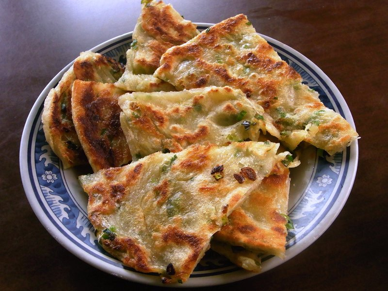

# Scallion Pancakes

*Taiwan's scallion pancakes: hand-rolled flaky discs laminated with sliced scallions, sesame oil and salt, pan-fried shatteringly crisp outside, chewy within.*

**Makes:** 4 pancakes

**Prep Time:** 30 minutes (plus 30 min resting)

**Cook Time:** 20 minutes

## Overview
Scallion pancakes (cong you bing) are the great Taiwanese street snack, hand-rolled flaky discs laminated with sliced spring onions, sesame oil and salt, pan-fried in a slick of oil till shattering-crisp outside and chewy within. The technique that creates the layers is the roll-coil-roll move: roll the dough into a long rectangle, brush with oil and scatter with scallions, roll it up into a tight log, then coil the log into a snail-shape spiral and flatten back down to a disc. The result is a pancake with many fine layers that puff slightly and shatter when bitten. The other key is a boiling-water dough rather than a cold-water one; hot water gelatinises the flour, giving a softer more pliable dough that takes the lamination well. Pour just-boiled water into flour and salt, mix with chopsticks, add a splash of cold water and knead five or six minutes till smooth. Rest 30 minutes covered. Divide into four pieces, roll one at a time into a thin 25 by 35 cm rectangle on a lightly floured surface, brush all over with a sesame-and-vegetable-oil mix, sprinkle with salt, white pepper and a quarter of the sliced spring onions. Roll up tight from the long edge into a log, coil the log into a spiral with the end tucked under, flatten gently with your palm, then roll back out to an 18 to 20 cm disc about 5 mm thick (the spring onions will poke through, which is fine). Heat two tablespoons of oil in a wide non-stick pan over medium, lay in one pancake and cook three or four minutes a side till deep golden with crispy frilled edges, lift onto a wire rack (not paper, which traps steam and softens the crisp). Cut each pancake into eight wedges and eat hot dipped in a sharp soy-vinegar-ginger sauce.

## Ingredients

### Dough
- 300 g plain flour (plus more for rolling)
- ½ teaspoon salt
- 200 ml water (just-boiled)
- 2 tablespoons cold water

### Filling
- 6 spring onions (white and green; thinly sliced)
- 4 tablespoons sesame oil (toasted)
- 4 tablespoons vegetable oil (mixed in for the brush)
- 1 teaspoon salt
- ½ teaspoon white pepper

### Frying
- Vegetable oil

### Dipping sauce
- 4 tablespoons light soy sauce
- 2 tablespoons rice vinegar (Chinese black or rice)
- 1 tablespoon water
- 2 cm ginger (finely grated)
- 1 spring onion (finely sliced)
- 1 teaspoon sesame oil
- A pinch of sugar
- A few drops chilli oil (optional)

## Method

### Stage 1 - Dough
1. Place the flour and salt in a wide bowl.
1. Pour the just-boiled water in slowly while mixing with chopsticks or a fork.
1. Add the cold water; mix.
1. Once cool enough to handle, knead 5-6 minutes until smooth. The dough will be soft.
1. Cover and rest 30 minutes.

### Stage 2 - Sauce
1. Whisk all the dipping sauce ingredients. Set aside.

### Stage 3 - Filling oil
1. Combine the sesame oil and vegetable oil in a small bowl. This brushes onto the rolled dough.

### Stage 4 - Roll, fill, coil
1. Divide the dough into 4 equal balls.
1. Take one ball; on a lightly floured surface, roll into a thin rectangle about 25 x 35 cm.
1. Brush all over with the oil mixture.
1. Sprinkle with a quarter of the salt, white pepper and sliced spring onions.
1. Roll up the rectangle from the long side into a tight log (jelly-roll style).
1. Coil the log into a spiral (snail shape); tuck the end under.
1. Flatten the spiral gently into a disc with your palm.
1. Roll into a 18-20 cm pancake about 5 mm thick (the spring onions will poke out - that's fine).
1. Repeat for all 4 pancakes; stack with parchment between to prevent sticking.

### Stage 5 - Fry
1. Heat 2 tablespoons of oil in a wide non-stick pan over medium heat.
1. Lay one pancake in carefully; cook 3-4 minutes until the underside is deep golden with crispy edges.
1. Flip; cook 3-4 minutes more on the second side.
1. Lift onto a wire rack (not paper - paper traps steam and softens the crisp).
1. Repeat with the rest, adding oil as needed.

### Stage 6 - Serve
1. Cut each pancake into 8 wedges.
1. Eat hot, dipped in the soy-vinegar-ginger sauce.

## Notes
- **Boiling-water dough:** Hot water gelatinises the flour, giving a softer, more pliable dough that takes the lamination well. A cold-water dough turns chewy.
- **Lamination is the technique:** The roll-coil-roll process creates layers that puff slightly and shatter when bitten. Don't skip the steps.
- **Eat fresh:** Crisp lasts about 30 minutes. Reheat in a hot dry pan to revive (don't microwave).

## Storage
- Best eaten immediately. Frozen unfried pancakes (with parchment between) keep 2 months - fry from frozen, adding 1-2 minutes per side.
