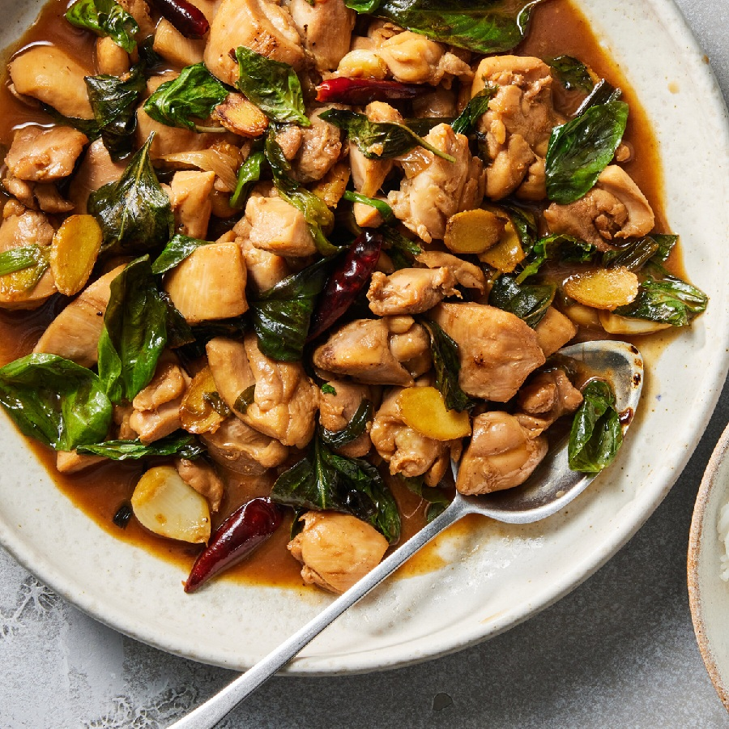

# Three-Cup Chicken

*Taiwan's three-cup chicken: bone-in thigh simmered in a cup each of soy, sesame oil and rice wine with garlic and ginger, finished with Thai basil.*

**Serves:** 4

**Prep Time:** 15 minutes

**Cook Time:** 30 minutes

## Overview
Three-cup chicken (san bei ji) takes its name from the original three cups of equal-parts dark sesame oil, soy and Shaoxing rice wine that go into the pot with bone-in chicken, garlic, ginger and dried chilli, then reduce around the chicken into a glossy lacquered glaze, finished with an enormous handful of Thai holy basil wilted in at the end. Three ingredients are non-negotiable. Dark toasted sesame oil rather than pale untoasted, which gives the nutty foundation; the pale kind burns easily and tastes flat. Whole peeled garlic cloves rather than chopped, which go soft and sweet through the simmer and become little sauce-bombs in the dish. And Thai holy basil (krapow) with its peppery clove-like edge; Italian or Greek basil substitute at a pinch but the result is sweeter. The basil goes in off the heat in a single big handful and wilts in the residual heat; that's how it stays vivid green rather than going army-drab. Served straight from a small clay pot, with jasmine rice, a stir-fried green and a cold beer.

## Ingredients

### Chicken
- 800 g bone-in, skin-on chicken thigh, chopped through the bone into 4 cm pieces (ask your butcher, or use boneless thigh as a substitute)
- ½ teaspoon white pepper

### Aromatics
- 4 tablespoons toasted sesame oil (dark, not light)
- 6 cm fresh ginger (sliced into thick coins)
- 10 garlic cloves (whole, peeled)
- 3 dried red chillies (or 1 fresh red chilli, sliced)

### Sauce
- 4 tablespoons light soy sauce
- 4 tablespoons Shaoxing rice wine
- 2 tablespoons dark soy sauce
- 1 tablespoon rock sugar (or 2 teaspoons soft brown sugar)
- 100 ml water

### To finish
- 30 g Thai holy basil (a very large handful, stems removed; Italian or Greek basil if unobtainable)
- Steamed jasmine rice (to serve)

## Method

### Stage 1 - Prep
1. Pat the chicken pieces dry with kitchen paper. Season lightly with white pepper.
2. Have all aromatics and sauce ingredients measured and to hand, the cook is fast once it starts.

### Stage 2 - Fry the aromatics
1. Heat the sesame oil in a wok or heavy casserole over medium heat. The oil should shimmer but not smoke; sesame oil burns easily.
2. Add the ginger coins and fry 2-3 minutes until the edges curl and turn deep gold.
3. Add the whole garlic cloves and dried chillies; fry 2 minutes until the garlic is light brown.

### Stage 3 - Brown the chicken
1. Turn the heat to medium-high. Add the chicken pieces, skin side down, in a single layer.
2. Brown 4-5 minutes without moving, then turn and brown the other side 3 minutes. The pieces should have golden colour all over.

### Stage 4 - Reduce the sauce
1. Pour in the Shaoxing wine; let it bubble hard for 30 seconds.
2. Add both soy sauces, the rock sugar and the water. Stir to combine.
3. Bring to a brisk simmer. Cover and cook 12 minutes, stirring once or twice.
4. Uncover and turn the heat up. Cook another 6-8 minutes, stirring more often, until the sauce reduces to a thick glossy glaze that coats the chicken like lacquer. The pan should be almost dry at the bottom; the chicken should be sticky and dark.

### Stage 5 - The basil finish
1. Off the heat, throw in the Thai basil all at once.
2. Toss vigorously for 20-30 seconds, the basil should wilt in the residual heat but stay vivid green.
3. Tip straight onto a warm platter or into a small clay pot.
4. Serve at once with steamed jasmine rice.

## Notes
- **Toasted sesame oil, not light:** Dark roasted sesame oil is the foundation of this dish. The pale, untoasted kind won't deliver the nutty backbone. Watch the heat; it burns quickly.
- **Thai holy basil is best:** Holy basil (krapow / horapha) has a peppery, almost clove-like edge. Italian or Greek basil works at a pinch but the result is sweeter and less authentic.
- **Whole garlic cloves:** Don't chop them. After the long simmer they go soft and sweet and become little sauce-bombs in the dish.
- **Bone-in chicken:** The marrow and skin give the sauce body. Boneless thigh works but the result is leaner and less rich. Avoid chicken breast.
- **Reduce hard at the end:** The sauce must coat, not pool. If liquid still pools, keep going on high heat.

## Variations
- **Three-cup mushroom:** Replace chicken with 600 g mixed king oyster and shiitake mushrooms, halved. Reduce cook time to 12-15 minutes total.
- **Three-cup squid:** A coastal variation, quick-fry cleaned squid tubes in place of chicken; total cook 6-8 minutes only or the squid turns rubbery.

## Serving
- **Serve with:** steamed jasmine rice, a simple stir-fried green like garlic water spinach, and a cold beer.
- **Garnish with:** extra Thai basil leaves scattered on top.

## Storage
- Best eaten the day it's made; the basil dulls.
- Sauce and chicken (without basil) keep 3 days refrigerated and reheat well; throw in fresh basil at serving.
