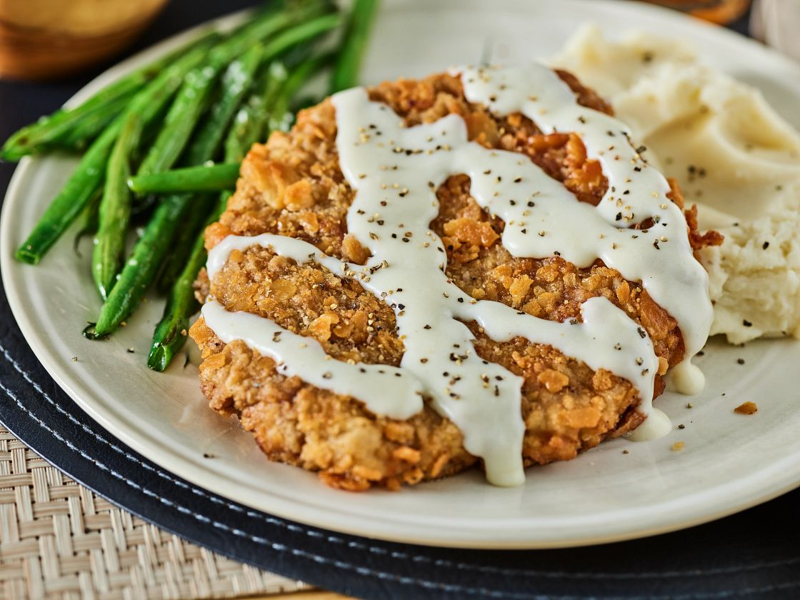

# Tennessee Country Fried Steak

*Tennessee's classic Southern steak: cube steak (tenderised beef) dredged in seasoned flour, pan-fried in lard till deeply golden and crispy, smothered in a thick peppery white milk gravy made from the pan drippings. Served with mashed potatoes and biscuits. The Tennessee diner Sunday breakfast and Wednesday-night supper.*

**Serves:** 4

**Prep Time:** 15 minutes

**Cook Time:** 25 minutes

## Overview
Tennessee country fried steak (also called chicken-fried steak in much of the South; the two names refer to the same dish, with country-fried slightly more associated with Tennessee and Kentucky) is the traditional Southern comfort food: cube steak (round steak that's been mechanically tenderised; or pound out top round yourself) dredged through seasoned flour, then milk-and-egg, then flour again, then pan-fried in hot lard till the crust is deeply golden and crispy. The pan drippings are then used to make a creamy peppery white gravy (also called sawmill gravy), generously ladled over the top of the steak (and any mashed potatoes alongside). Served with mashed potatoes, green beans or collard greens, and biscuits.

## Ingredients

### Steak
- 4 cube steaks (about 200 g each; tenderised round steak)
- 2 teaspoons fine sea salt
- 1 teaspoon ground black pepper
- 1 teaspoon garlic powder

### Dredge
- 250 g plain flour
- 1 tablespoon paprika
- 1 tablespoon garlic powder
- 1 tablespoon onion powder
- 1 tablespoon fine sea salt
- 2 tablespoons coarse ground black pepper
- 1 teaspoon cayenne

### Egg wash
- 2 large eggs
- 250 ml whole milk
- 1 tablespoon hot sauce

### Frying
- 200 ml vegetable oil or lard (for shallow frying)

### White gravy
- 4 tablespoons of the pan drippings (or butter if drippings are skimped)
- 4 tablespoons plain flour
- 600 ml whole milk
- 1 teaspoon fine sea salt
- 1 tablespoon coarse ground black pepper (the gravy should be peppery)
- ½ teaspoon garlic powder

### To serve
- Mashed potatoes
- Buttermilk biscuits
- Green beans or collard greens
- Hot sauce
- Sweet tea

## Method

### Stage 1 - Season steak
1. Season cube steaks with salt, pepper, garlic powder on both sides.

### Stage 2 - Mix dredge and egg wash
1. Whisk flour, paprika, garlic and onion powder, salt, pepper, cayenne.
2. Whisk eggs, milk, hot sauce.

### Stage 3 - Double dredge
1. Press each steak into flour mixture.
2. Dip in egg wash.
3. Press again into flour mixture.
4. Rest 5 min on rack.

### Stage 4 - Pan-fry
1. Heat oil/lard in heavy pan over medium-high heat (175°C).
2. Fry steaks 3-4 min per side till deeply golden.
3. Drain on rack briefly.
4. Keep warm in low oven.

### Stage 5 - Make gravy in same pan
1. Pour off most of the oil; keep 4 tablespoons of drippings plus the brown bits.
2. Add 4 tablespoons flour to the drippings.
3. Whisk over medium heat 2 min till lightly golden.
4. Gradually whisk in milk.
5. Cook 5 min till thickened.
6. Stir in salt, lots of pepper, garlic powder.

### Stage 6 - Serve
1. Place a steak on each plate alongside a heap of mashed potatoes.
2. Ladle generous white gravy over everything.
3. Biscuits, green beans alongside.

## Notes
- **Tenderised cube steak essential.**
- **Double dredge:** for proper crust.
- **Peppery gravy:** lots of black pepper.
- **Ladle gravy generously.**

## Variations
- **With sausage gravy:** add cooked breakfast sausage to the gravy.
- **With pork chop:** swap cube steak for pork loin chops, pounded thin.
- **Buttermilk version:** use buttermilk instead of milk for the egg wash.
- **Spicier:** double cayenne.

## Serving
- Sunday breakfast, Wednesday supper, diner classic.

## Storage
- Best immediately.
- Cooked refrigerate 2 days; gravy separates on reheating.
- Don't freeze fried steak; goes soggy.
