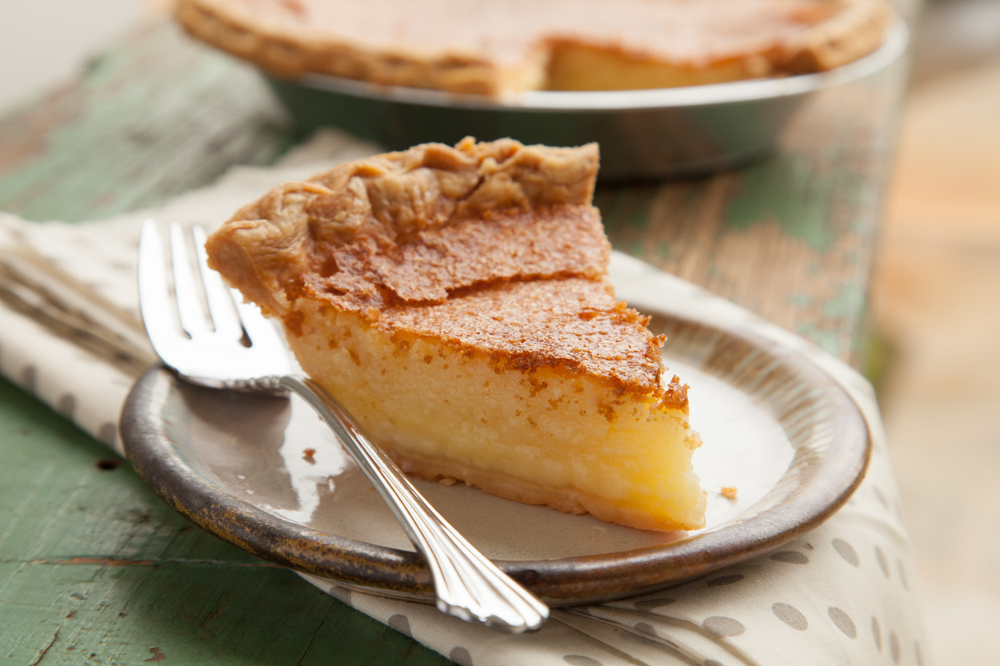

# Tennessee Chess Pie

*Tennessee's classic Southern pantry pie: a sweet custardy filling of butter, sugar, eggs, cornmeal, vinegar and vanilla baked in a buttery pie crust till the top is deeply golden and the inside is just-set with a sugary-creamy texture. The Tennessee Sunday pie; made from things every Southern pantry has.*

**Serves:** 8

**Prep Time:** 20 minutes (plus 30 min pastry chill)

**Cook Time:** 50 minutes

## Overview
Tennessee chess pie is one of the most iconic Southern pies and a Tennessee Sunday-dinner classic: the name's origin is debated (possibly from "chest pie": a pie that keeps in the chest/cupboard without refrigeration; or "just pie" said in a Southern drawl). A simple custard pie made from things every Southern pantry has: butter (lots), sugar (lots), eggs, a teaspoon of cornmeal (the traditional thickener; distinguishes from buttermilk pie), a touch of vinegar (balances the sweetness), vanilla, and a pinch of salt. Poured into a buttery shortcrust pastry shell and baked till the top is deeply golden and the inside is just-set; the texture is sugary-creamy, custardy but firm enough to cut into wedges.

## Ingredients

### Pastry
- 250 g plain flour
- 150 g cold butter (cubed)
- 1 teaspoon fine sea salt
- 1 tablespoon caster sugar
- 1 large egg yolk
- 3-4 tablespoons ice-cold water

### Filling
- 200 g butter (melted, cooled slightly)
- 300 g caster sugar
- 100 g light brown sugar
- 4 large eggs
- 1 tablespoon cornmeal (the signature)
- 1 tablespoon plain flour
- 1 tablespoon apple cider vinegar
- 1 tablespoon vanilla extract
- ½ teaspoon fine sea salt
- 1 teaspoon lemon juice (optional)

### To serve
- Whipped cream
- Vanilla ice cream
- Toasted pecans (optional sprinkle)

## Method

### Stage 1 - Make pastry
1. Whisk flour, salt, sugar.
2. Rub in cold butter to coarse crumbs.
3. Add egg yolk and water; mix to dough.
4. Wrap; chill 30 min.

### Stage 2 - Blind bake crust
1. Preheat oven to 200°C (400°F).
2. Roll pastry; line a 23cm pie dish.
3. Crimp edges.
4. Line with parchment; fill with baking beans.
5. Blind bake 15 min.
6. Remove parchment and beans; bake 5 min more till just dry.
7. Reduce oven to 175°C (350°F).

### Stage 3 - Make filling
1. In a bowl, whisk melted butter with both sugars.
2. Beat in eggs one at a time.
3. Whisk in cornmeal, flour, vinegar, vanilla, salt, lemon juice.
4. Mix till smooth.

### Stage 4 - Pour and bake
1. Pour filling into the par-baked crust.
2. Bake 40-45 min till the top is deep golden and the centre is just-set with a slight wobble.

### Stage 5 - Cool completely
1. Cool 2 hours.
2. The filling firms as it cools.

### Stage 6 - Serve
1. Slice into wedges.
2. Whipped cream or vanilla ice cream.

## Notes
- **Cornmeal is the signature:** distinguishes from buttermilk pie.
- **Vinegar balances sweetness:** essential.
- **Don't overbake:** just-set centre.
- **Cool completely before slicing.**

## Variations
**Lemon chess pie:** add zest of 2 lemons + juice of 1.
**Chocolate chess pie:** add 80 g melted dark chocolate.
**Coconut chess pie:** add 80 g shredded coconut.
**Buttermilk chess pie:** swap vinegar for 100 ml buttermilk.

## Serving
At Sunday dinners, holidays, family gatherings.

## Storage
- Refrigerated 4 days.
- Room temp 1 day.
- Freezes 1 month.
