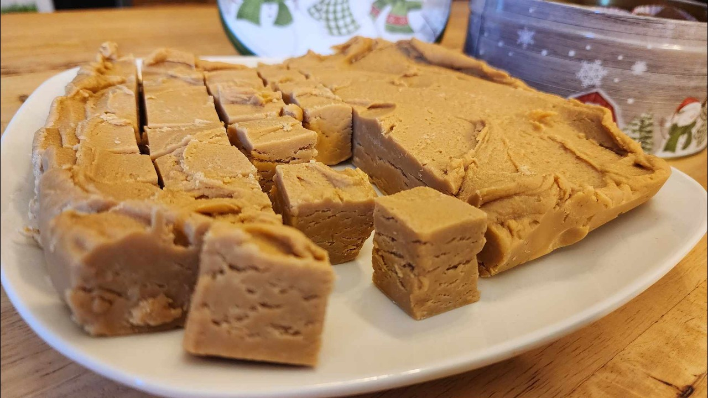

# Tennessee Peanut Butter Fudge

*Tennessee's iconic fudge: a creamy peanut butter fudge made from condensed milk, peanut butter, butter and sugar cooked to soft-ball stage, then poured into a tin to set into rich peanut-butter squares. The Tennessee state-fair and Smoky Mountain souvenir-shop classic.*

**Serves:** Makes 24 squares

**Prep Time:** 15 minutes

**Cook Time:** 15 minutes (plus 2 hours chilling)

## Overview
Tennessee peanut butter fudge is one of the South's most beloved candies and the iconic souvenir of the Great Smoky Mountains and Gatlinburg shopping strips, where every other shop seems to be a fudge shop selling huge slabs of various flavours: the Tennessee classic combines smooth peanut butter with sweetened condensed milk, butter, brown sugar, caster sugar, and vanilla, all cooked together over medium heat to soft-ball stage (115°C/240°F), then poured into a buttered tin to set into rich, dense, creamy peanut-butter squares. Sliced into small cubes and stored at room temperature. Often combined with chocolate fudge in swirled layers ("tiger fudge" is the traditional name).

## Ingredients

- 400 g caster sugar
- 200 g brown sugar
- 200 ml whole milk
- 100 g butter
- 1 tin (400 g) sweetened condensed milk
- 300 g smooth peanut butter
- 2 teaspoons vanilla extract
- ½ teaspoon fine sea salt
- Optional: 100 g chopped roasted peanuts (for crunch)
- Optional: 100 g chocolate chips (for swirl)

## Method

### Stage 1 - Prep tin
1. Butter a 20cm square tin.
2. Line with parchment paper, leaving an overhang.

### Stage 2 - Combine sugar mixture
1. In a heavy saucepan, combine both sugars, milk, butter, condensed milk.
2. Stir over medium heat till sugars dissolve.

### Stage 3 - Cook to soft-ball
1. Bring to gentle boil, stirring constantly.
2. Cook 8-10 min, stirring, till the mixture reaches 115°C (240°F) on a candy thermometer.
3. Or drop a small amount in cold water; should form a soft ball you can shape with fingers.

### Stage 4 - Add peanut butter
1. Off heat, stir in peanut butter till smooth.
2. Add vanilla and salt.
3. Optional: stir in chopped peanuts.

### Stage 5 - Beat
1. Beat with wooden spoon 3-4 min till the fudge loses its gloss and starts to thicken.

### Stage 6 - Pour
1. Pour into prepared tin.
2. Smooth top.
3. Optional: melt chocolate chips, drizzle, and swirl with a knife for tiger fudge.

### Stage 7 - Set
1. Rest at room temp 30 min.
2. Refrigerate 2 hours till firm.

### Stage 8 - Slice
1. Lift out using parchment overhang.
2. Cut into 24 squares with a sharp knife.

## Notes
- **Soft-ball stage 115°C/240°F:** crucial.
- **Don't overcook:** gets grainy.
- **Beat after peanut butter:** for proper texture.
- **Set 2 hours.**

## Variations
**Chocolate swirl (tiger fudge):** drizzle melted chocolate, swirl.
**With nuts:** chopped peanuts or pecans.
**With Reese's pieces:** sprinkle on top before setting.
**Maple peanut:** swap vanilla for maple syrup.

## Serving
At state fairs, family gatherings, Christmas. As gift.

## Storage
- Room temp in sealed tin 2 weeks.
- Refrigerate 1 month.
- Freezes 3 months.
