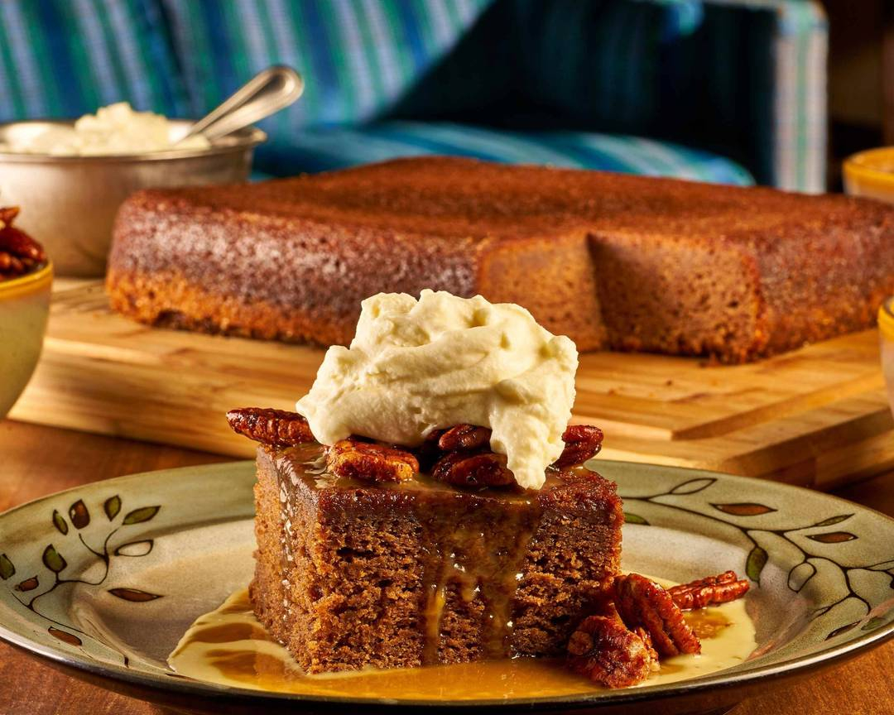

# Tennessee Whiskey Cake

*Tennessee's bundt cake: a rich brown sugar pound cake studded with toasted pecans, baked till deep golden, then soaked while still warm in a hot butter-sugar-Tennessee whiskey glaze that the cake absorbs into a deeply moist, boozy crumb. The Jack Daniel's distillery and Southern celebration cake.*

**Serves:** 12

**Prep Time:** 25 minutes

**Cook Time:** 1 hour

## Overview
Tennessee whiskey cake is the canonical Tennessee celebration cake, particularly associated with Jack Daniel's distillery in Lynchburg, Tennessee (where the distillery shop sells their own version): a rich brown sugar pound cake batter (butter + brown sugar + caster sugar creamed, eggs, vanilla, sour cream or buttermilk, flour + baking powder + salt) studded with toasted chopped pecans, baked in a bundt pan till deep golden brown. While the cake is still warm in the pan, a hot glaze of butter, sugar and Tennessee whiskey is poured over and around, soaking deeply into the cake to give a deeply moist, boozy, caramel-and-pecan crumb. Tastes better after 24 hours. The classic Southern celebration cake for birthdays, Christmas, Sunday dinners. Three details: bundt pan, soak warm with whiskey glaze, age 24 hours.

## Ingredients

### Cake
- 280 g butter (softened)
- 300 g caster sugar
- 200 g brown sugar
- 5 large eggs
- 2 tablespoons vanilla extract
- 250 ml sour cream
- 400 g plain flour
- 1 ½ teaspoons baking powder
- ½ teaspoon baking soda
- 1 teaspoon fine sea salt
- 1 teaspoon ground cinnamon
- 200 g toasted chopped pecans

### Whiskey glaze
- 200 g butter
- 200 g caster sugar
- 100 ml water
- 120 ml Tennessee whiskey (Jack Daniel's or George Dickel)
- 1 teaspoon vanilla

## Method

### Stage 1 - Prep pan
1. Generously butter and flour a 10-cup bundt pan.
2. Preheat oven to 175°C (350°F).

### Stage 2 - Cream butter and sugars
1. Cream butter with both sugars 5 min till pale and fluffy.

### Stage 3 - Add eggs and vanilla
1. Add eggs one at a time, beating between.
2. Beat in vanilla and sour cream.

### Stage 4 - Mix dry
1. Whisk flour, baking powder, baking soda, salt, cinnamon.

### Stage 5 - Combine
1. Fold dry into wet alternating with sour cream.
2. Don't overmix.
3. Fold in toasted pecans.

### Stage 6 - Bake
1. Pour batter into prepared bundt pan.
2. Bake 55-65 min till a tester comes out clean.

### Stage 7 - Cool 15 min in pan
1. Let cake rest in pan 15 min.

### Stage 8 - Make hot glaze
1. While cake cools, combine butter, sugar, water in saucepan.
2. Bring to boil; cook 4 min till slightly thickened.
3. Off heat, stir in whiskey and vanilla.
4. The alcohol partly cooks off in the warm glaze.

### Stage 9 - Soak the cake
1. Cake should still be warm in the bundt pan.
2. Poke holes all over the bottom (still in pan) with a thin skewer.
3. Pour about a third of the hot glaze over the bottom of the cake while in the pan.
4. Wait 5 min to absorb.

### Stage 10 - Invert and soak more
1. Carefully invert cake onto a plate.
2. Poke holes all over the top with skewer.
3. Brush remaining glaze all over the top and sides repeatedly till absorbed.

### Stage 11 - Rest 24 hours
1. Cover loosely.
2. Let rest at room temp 24 hours for the flavours to meld.

### Stage 12 - Serve
1. Slice into wedges.
2. Optional: serve with whipped cream or vanilla ice cream.

## Notes
- **Bundt pan with deep grooves.**
- **Soak warm:** absorbs glaze.
- **Age 24 hours:** flavour deepens.
- **Toasted pecans essential.**

## Variations
**Without pecans:** plain whiskey cake.
**With raisins:** add 200 g soaked in whiskey.
**Bourbon version:** Kentucky bourbon (similar but different oak character).
**With cinnamon-sugar coating:** dust before glazing.

## Serving
At Tennessee celebrations, Sunday family dinners, Christmas.

## Storage
- Sealed at room temp 1 week (gets better).
- Refrigerate 2 weeks.
- Freezes 2 months.
