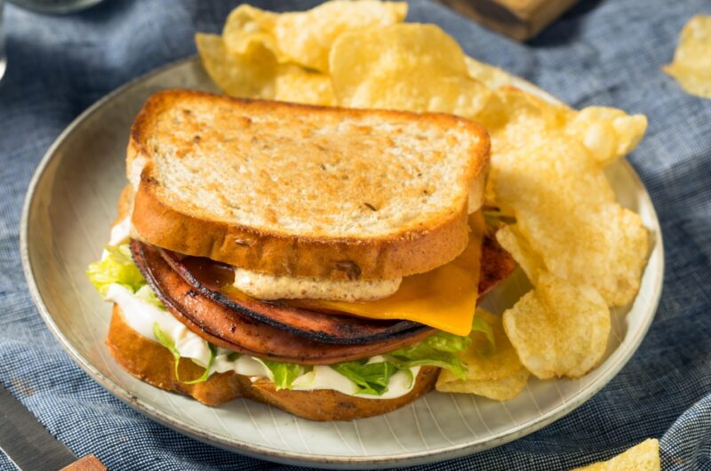

# Fried Bologna Sandwich

*Tennessee's working-class comfort sandwich: thick-cut bologna slices pan-fried in butter till the edges crisp and curl, melted American cheese on top, stacked on soft white bread with mayo, mustard, lettuce, tomato and dill pickles. The Tennessee diner and lunchbox classic.*

**Serves:** 4

**Prep Time:** 10 minutes

**Cook Time:** 10 minutes

## Overview
The fried bologna sandwich is one of Tennessee's most underrated everyday meals and a deep working-class Southern tradition: thick-cut sliced bologna (the traditional American luncheon meat; Oscar Mayer or local Memphis-area brands) cut with a small slit at each side to prevent curling, pan-fried in butter till the edges go crispy-brown and slightly curled, topped with a slice of melty American cheese (or pepper jack). Built on soft white bread (traditional; soft potato rolls work too) with mayonnaise, yellow mustard, dill pickle chips, iceberg lettuce and a slice of tomato. The Tennessee version of a working-class lunch; pantry-simple, fast, deeply satisfying.

## Ingredients

### Sandwich
- 8 thick slices bologna (5-7 mm thick; about 100 g each)
- 4 tablespoons butter
- 8 slices American cheese (or pepper jack for spicier)
- 8 slices soft white bread (or 4 soft potato rolls)
- 4 tablespoons mayonnaise
- 4 tablespoons yellow mustard
- 16 dill pickle chips
- 4 iceberg lettuce leaves
- 4 tomato slices
- 1 small red onion (sliced; optional)
- Hot sauce (Crystal or Tabasco; optional)

### To serve
- Crisp salt-and-vinegar chips
- Sweet tea or cold beer
- Pickle spear

## Method

### Stage 1 - Prep bologna
1. With a sharp knife, cut 4 small slits (1 cm each) around the edge of each slice.
2. This prevents the bologna from curling into a bowl shape.

### Stage 2 - Fry bologna
1. Heat 2 tablespoons butter in a wide pan over medium-high heat.
2. Add bologna slices.
3. Fry 2 min per side till the edges are crispy-brown and the slices are puffed in the centre.
4. Top each with a slice of cheese in the last 30 sec to melt.

### Stage 3 - Toast bread
1. Butter the bread slices on one side.
2. Toast in a separate pan 60 sec per side, or:
3. Toast lightly in a toaster.

### Stage 4 - Build sandwich
1. Mayo on the bottom slice.
2. Mustard on the top slice.
3. Lettuce, tomato, red onion (if using) on bottom.
4. Two slices of cheese-topped bologna.
5. Dill pickle chips on top of bologna.
6. Optional: hot sauce.
7. Close.

### Stage 5 - Serve
1. Cut diagonally.
2. With chips, pickle spear, sweet tea or beer.

## Notes
- **Cut slits to prevent curling:** essential.
- **Thick-cut bologna:** for proper bite.
- **American cheese traditional:** melts properly.
- **Soft white bread:** the working-class bread.

## Variations
**With egg:** add a fried egg.
**With caramelised onions:** instead of raw.
**Open-face:** with melted cheese under the grill.
**Spicy:** pepper jack + jalapeños.

## Serving
For lunch with chips and a pickle. Bar food. Lunchbox.

## Storage
- Best immediately.
- Bologna pre-fried keeps refrigerated 2 days; reheat briefly.
- Don't assemble in advance.
