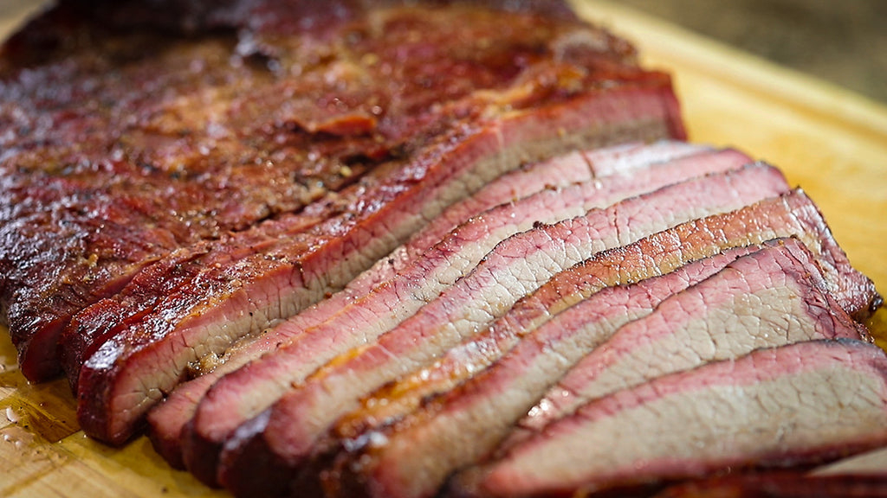

# Memphis Smoked Brisket

*Memphis BBQ's beef brisket: a whole beef brisket rubbed with sweet-savoury dry rub, slow-smoked over hickory at 110°C for 10-14 hours till the meat is fork-tender, sliced against the grain. Served with Memphis vinegar slaw, baked beans and a thin red Memphis BBQ sauce on the side. The Tennessee beef BBQ tradition; less famous than Texas but equally serious.*

**Serves:** 8-10

**Prep Time:** 30 minutes (plus 12 hours dry rub time)

**Cook Time:** 10-14 hours

## Overview
Memphis smoked brisket is the Tennessee beef counterpart to Memphis pulled pork (pulled pork being the primary Memphis BBQ meat, with brisket second): a whole brisket (about 5-6 kg with both flat and point connected) rubbed with the Memphis dry-rub spice blend (sweet-savoury; less peppery than Texas brisket rub), slow-smoked over hickory wood (the traditional Memphis wood) at 110°C for 10-14 hours till the internal temperature reaches 95°C and the meat is fork-tender. The defining differences from Texas brisket: Memphis uses sweeter rub, hickory not post-oak, and serves with a thin red Memphis sauce rather than no sauce or wet Kansas City sauce. Sliced against the grain into 5mm slices.

## Ingredients

### Brisket
- 1 whole packer brisket (5-6 kg; with flat and point intact)
- 4 tablespoons yellow mustard (binder for the rub)

### Dry rub
- 80 g brown sugar
- 4 tablespoons paprika
- 3 tablespoons mild chilli powder
- 2 tablespoons garlic powder
- 2 tablespoons onion powder
- 2 tablespoons fine sea salt
- 2 tablespoons coarse ground black pepper
- 1 tablespoon mustard powder
- 1 tablespoon ground cumin
- 1 tablespoon cayenne

### Smoker
- 3 kg hickory wood chunks

### Mop sauce
- 200 ml apple cider vinegar
- 100 ml beef stock
- 50 ml Worcestershire sauce
- 2 tablespoons dry rub

### Memphis BBQ sauce (for the side)
- 250 ml ketchup
- 100 ml apple cider vinegar
- 50 g brown sugar
- 2 tablespoons Worcestershire sauce
- 1 tablespoon yellow mustard

### To serve
- Memphis vinegar coleslaw
- Baked beans
- Skillet cornbread
- Pickle chips
- Sweet tea

## Method

### Stage 1 - Trim
1. Trim excess fat from brisket; leave 5-7 mm fat cap on top.

### Stage 2 - Apply rub
1. Brush brisket with mustard (binder).
2. Mix dry rub ingredients.
3. Coat brisket all over.
4. Wrap; refrigerate 12 hours.

### Stage 3 - Set up smoker
1. Bring brisket to room temp 30 min.
2. Heat smoker to 110°C (225°F).
3. Add hickory wood chunks.

### Stage 4 - Smoke fat-side-up
1. Place brisket fat-cap-up on smoker.
2. Smoke 10-14 hours.
3. Maintain steady 110°C and steady smoke.

### Stage 5 - Mop occasionally
1. After 4 hours, mop with mop sauce every 1-2 hours.

### Stage 6 - The stall
1. Around internal temp 70-75°C, the brisket "stalls" as moisture evaporates.
2. Push through by wrapping in pink butcher paper (the "Texas crutch" but Memphis-style).

### Stage 7 - Finish
1. Continue smoking till internal temp reaches 95°C (203°F).
2. Probe should slide in like butter.

### Stage 8 - Rest 1 hour
1. Wrap in foil + towel.
2. Rest in cooler 1 hour minimum.

### Stage 9 - Slice
1. Separate flat from point (different grains).
2. Slice flat against the grain into 5mm slices.
3. Slice point into chunks (or chop for sandwiches).

### Stage 10 - Make Memphis sauce
1. Whisk all sauce ingredients; simmer 8 min.

### Stage 11 - Serve
1. Pile sliced brisket on platter.
2. Sauce on the side.
3. Slaw, beans, cornbread alongside.

## Notes
- **Hickory smoke traditional Memphis.**
- **10-14 hour cook.**
- **Internal 95°C.**
- **Rest 1 hour.**
- **Slice against grain.**

## Variations
**With burnt ends:** chop the point separately; coat with sauce; smoke 1 more hour.
**Oven version:** at 110°C for 12 hours; less smoky.
**Smaller cut:** flat only (faster cook).

## Serving
Memphis BBQ joints, Sunday gatherings.

## Storage
- Sliced brisket refrigerate 4 days.
- Reheat in oven covered with stock.
- Freeze 3 months.
