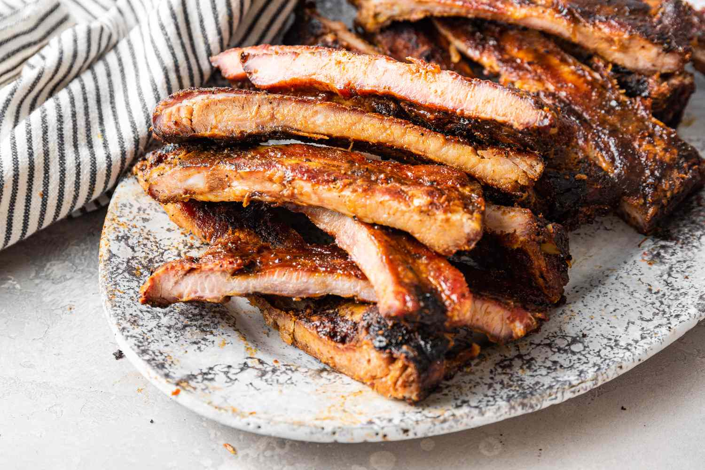

# Memphis Dry-Rub BBQ Ribs

*Memphis BBQ's signature ribs style: pork ribs rubbed with a sweet-savoury dry spice blend, slow-smoked low-and-slow over hickory wood for 5-6 hours till the meat is tender and the bark is deeply dark, served bone-on with extra dry rub sprinkled on top. No sauce required; the Memphis dry style distinct from Kansas City wet ribs.*

**Serves:** 6

**Prep Time:** 30 minutes (plus 4-24 hours dry rub time)

**Cook Time:** 5-6 hours

## Overview
Memphis dry-rub ribs are the canonical Memphis ribs style and one of the four major American BBQ traditions (alongside Kansas City wet-sauce ribs, Carolina vinegar ribs, and Texas brisket): pork spareribs or baby back ribs rubbed with a sweet-savoury dry spice blend (similar to pulled pork rub, with the addition of celery salt and slightly more paprika), left to penetrate 4-24 hours, then slow-smoked at 110-115°C over hickory wood for 5-6 hours till the meat is tender and the bark is deeply dark. The defining feature is that no sauce is applied (Memphis dry-style); instead the ribs are sprinkled with additional dry rub just before serving, with sauce only available on the side as an option. Three details: dry rub on for hours, hickory smoke, no sauce while cooking.

## Ingredients

### Ribs
- 2 racks pork spareribs (about 1.5 kg each); or baby back ribs

### Dry rub
- 80 g brown sugar
- 4 tablespoons paprika
- 3 tablespoons mild chilli powder
- 2 tablespoons ground cumin
- 2 tablespoons garlic powder
- 2 tablespoons onion powder
- 1 tablespoon mustard powder
- 1 tablespoon celery salt
- 1 tablespoon dried oregano
- 2 tablespoons fine sea salt
- 2 tablespoons ground black pepper
- 1 tablespoon cayenne

### Smoker
- 2 kg hickory wood chunks

### Mop sauce (optional)
- 200 ml apple cider vinegar
- 100 ml apple juice
- 2 tablespoons dry rub

### Memphis BBQ sauce (on the side)
- 250 ml ketchup
- 100 ml apple cider vinegar
- 50 g brown sugar
- 2 tablespoons Worcestershire sauce
- 1 tablespoon yellow mustard
- 1 tablespoon paprika
- 1 teaspoon hot sauce

### To serve
- Memphis vinegar coleslaw
- Baked beans
- Cornbread
- Pickle chips
- Sweet tea
- Cold beer

## Method

### Stage 1 - Prep ribs
1. Remove silver skin from back of ribs (peel away the thin membrane).
2. Pat dry.

### Stage 2 - Apply rub
1. Mix all dry rub ingredients.
2. Rub generously on both sides of ribs (reserve some for finishing).
3. Wrap; refrigerate 4-24 hours.

### Stage 3 - Set up smoker
1. Bring ribs to room temp 30 min before cooking.
2. Heat smoker to 110-115°C (225-240°F).
3. Add hickory wood chunks.

### Stage 4 - Smoke
1. Place ribs bone-side-down on smoker.
2. Smoke 5-6 hours.
3. The "3-2-1 method" (3 hours smoking, 2 hours wrapped, 1 hour unwrapped) is popular for spareribs; for baby backs use "2-2-1".

### Stage 5 - Optional: 3-2-1 method
1. After 3 hours, wrap each rack tightly in foil with a splash of apple juice; smoke 2 hours.
2. Unwrap; smoke 1 hour more.
3. Optional final mop with mop sauce.

### Stage 6 - Test doneness
1. Ribs are done when meat pulls back from the bone 5-7 mm and a toothpick slides easily between the bones.
2. Internal temp 90-95°C (195-203°F).

### Stage 7 - Rest and finish
1. Rest 10 min.
2. Sprinkle generously with the reserved dry rub.
3. Slice between bones into individual ribs (or serve as half-racks).

### Stage 8 - Serve
1. Pile on platters.
2. Sauce on the side (not on the ribs).
3. Slaw, beans, cornbread alongside.

## Notes
- **No sauce on the ribs:** Memphis dry style.
- **Hickory smoke canonical.**
- **Silver skin off:** essential.
- **Final rub sprinkle:** the dry-style signature.

## Variations
**Kansas City wet style:** apply BBQ sauce in last 30 min of cooking.
**With St. Louis cut ribs:** trimmed spareribs.
**Oven version:** at 110°C for 5-6 hours; less smoky.
**Reverse sear:** smoke 4 hours; finish on hot grill for char.

## Serving
At Memphis BBQ joints (Rendezvous, Central BBQ). Sunday family dinners.

## Storage
- Ribs refrigerate 3 days.
- Reheat wrapped in foil at 150°C for 30 min.
- Freeze cooked 2 months.
