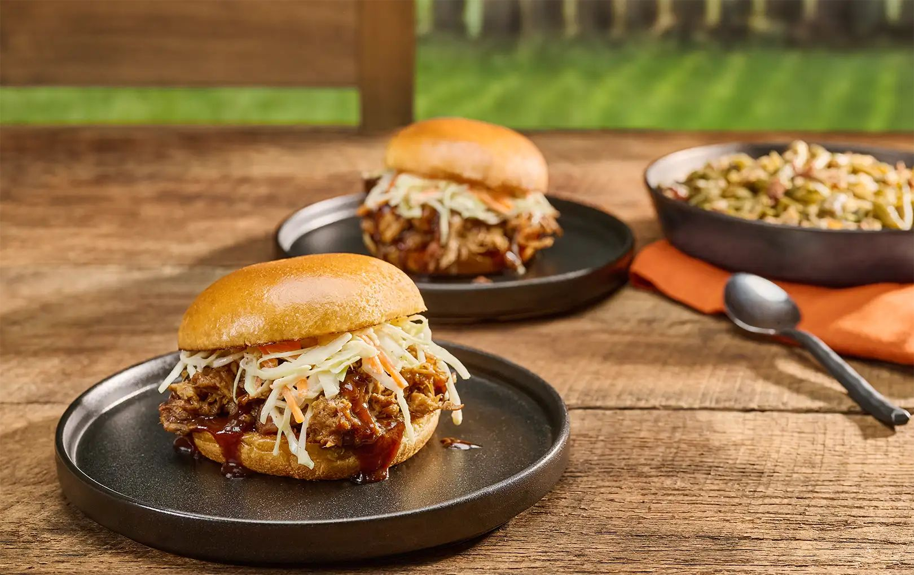

# Memphis Pulled Pork

*Memphis BBQ's signature dish: a whole pork shoulder rubbed with a sweet-savoury dry spice blend, slow-smoked low-and-slow over hickory wood for 10-12 hours till bark forms outside and the inside pulls apart in juicy strands. Served on a soft white bun with vinegar slaw and a thin Memphis-style red sauce. The Memphis Beale Street tradition; the "BBQ" that defines the city.*

**Serves:** 10-12

**Prep Time:** 30 minutes (plus 12-24 hours dry rub time)

**Cook Time:** 10-12 hours

## Overview
Memphis pulled pork is the dish that defines Memphis BBQ and the centrepiece of every Memphis BBQ restaurant (Charlie Vergos' Rendezvous, Central BBQ, Payne's Bar-B-Que): a whole pork shoulder rubbed with a sweet-savoury dry spice blend and slow-smoked low-and-slow over hickory till the bark forms outside and the inside pulls apart in juicy strands. The dry rub is the Memphis flavour foundation; brown sugar carries the sweetness, paprika and cayenne the warm heat, with mustard powder, garlic, onion, cumin and black pepper rounding the savoury depth. Hickory is the only acceptable smoke wood; oak and pecan give different woods entirely and the traditional Memphis profile is hickory alone. The 12-to-24-hour dry-rub rest before the smoke is non-negotiable for the seasoning to penetrate the meat rather than sitting on the surface. The hour of rest after smoking lets the juices redistribute so the shredded strands stay moist. Served on soft white buns with vinegar-based Memphis coleslaw piled on top and a thin red Memphis-style BBQ sauce.

## Ingredients

### Dry rub
- 1 boneless pork shoulder (4-5 kg) (or bone-in equivalent)
- 80 g brown sugar
- 4 tablespoons paprika
- 3 tablespoons mild chilli powder
- 2 tablespoons ground cumin
- 2 tablespoons garlic powder
- 2 tablespoons onion powder
- 1 tablespoon mustard powder
- 1 tablespoon dried oregano
- 2 tablespoons fine sea salt
- 2 tablespoons ground black pepper
- 1 tablespoon cayenne

### Smoker
- 2 kg hickory wood chunks (or apple wood)

### Mop sauce (optional, applied during cook)
- 200 ml apple cider vinegar
- 100 ml water
- 50 ml apple juice
- 2 tablespoons of the dry rub

### Memphis BBQ sauce
- 250 ml ketchup
- 100 ml apple cider vinegar
- 50 g brown sugar
- 2 tablespoons Worcestershire sauce
- 1 tablespoon yellow mustard
- 1 tablespoon paprika
- 1 teaspoon garlic powder
- 1 teaspoon onion powder
- 1 teaspoon hot sauce
- 1 teaspoon fine sea salt

### To serve
- 12 soft white burger buns
- 1 kg Memphis vinegar coleslaw
- Dill pickle chips
- Hot sauce
- Sweet tea
- Cold beer

## Method

### Stage 1 - Apply dry rub
1. Mix all dry rub ingredients.
2. Pat pork shoulder dry.
3. Rub generously all over.
4. Wrap; refrigerate 12-24 hours.

### Stage 2 - Set up smoker
1. Bring meat to room temp 30 min before cooking.
2. Heat smoker to 110-115°C (225-240°F).
3. Add soaked hickory wood chunks.

### Stage 3 - Smoke
1. Place pork fat-side-up on smoker.
2. Smoke 10-12 hours till internal temperature reaches 95°C (203°F).
3. Maintain steady smoke and temperature.
4. Optional: mop with mop sauce every 2 hours after first 4 hours.

### Stage 4 - Wrap (optional, "Texas crutch")
1. When internal temp reaches 75°C (165°F), some pitmasters wrap in pink butcher paper to push through the "stall".
2. Continue smoking till 95°C.

### Stage 5 - Rest
1. Remove from smoker.
2. Wrap in foil + towel; rest in cooler 1 hour.
3. Crucial; juices redistribute.

### Stage 6 - Pull
1. Discard any large fat chunks.
2. Pull apart with bear claws or two forks into shreds.
3. Toss with any juices.
4. Sprinkle with a little more dry rub.

### Stage 7 - Make BBQ sauce
1. Whisk all sauce ingredients in saucepan.
2. Simmer 10 min.
3. Cool.

### Stage 8 - Build sandwiches
1. Toast buns lightly.
2. Pile pulled pork on bottom.
3. Drizzle with BBQ sauce.
4. Top with coleslaw.
5. Close.

## Notes
- **Hickory wood traditional.**
- **Low and slow:** 110-115°C for 10-12 hours.
- **Rest before pulling.**
- **Coleslaw on top:** Memphis signature.

## Variations
- **Oven version (no smoker):** roast at 110°C wrapped in foil for 10 hours; less smoky but works.
- **With Carolina vinegar sauce:** Eastern North Carolina style.
- **With white BBQ sauce:** Alabama style.
- **Pork shoulder tacos:** alternative serving.

## Serving
- Memphis BBQ joints, family gatherings, tailgates.

## Storage
- Pulled pork refrigerates 4 days.
- Freezes 3 months.
- Reheat with splash of stock.
