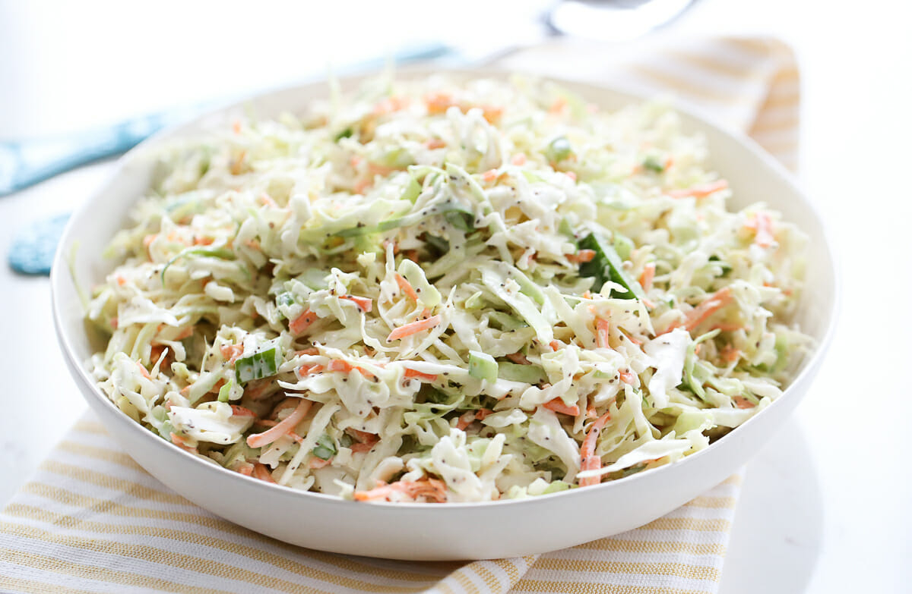

# Memphis Vinegar Slaw

*Memphis's tangy BBQ slaw: shredded cabbage, carrot and red onion tossed with a vinegar-mustard-sugar dressing (not mayonnaise-based). The canonical BBQ sandwich topping in Memphis; the slaw that gets piled directly on pulled pork sandwiches.*

**Serves:** 8

**Prep Time:** 20 minutes (plus 1 hour chilling)

**Cook Time:** None

## Overview
Memphis vinegar slaw (also called BBQ slaw or red slaw) is the canonical Memphis BBQ topping and the slaw style that distinguishes Memphis BBQ from Kansas City and Texas: instead of the creamy mayonnaise-based slaw of much of America, Memphis uses a tangy vinegar-mustard-sugar dressing with a touch of ketchup for the canonical orange-pink colour. Shredded green cabbage (sometimes with a touch of red cabbage and shredded carrot) tossed with this dressing, chilled 1 hour for the flavours to meld and the cabbage to soften slightly. Piled directly on pulled pork sandwiches; served alongside ribs, brisket, and other BBQ.

## Ingredients

### Slaw
- 1 large head green cabbage (about 1.5 kg; finely shredded)
- ½ small head red cabbage (finely shredded; optional, for colour)
- 2 large carrots (grated)
- 1 small red onion (very thinly sliced)

### Dressing
- 200 ml apple cider vinegar
- 80 g caster sugar
- 4 tablespoons ketchup
- 4 tablespoons yellow mustard
- 2 tablespoons Worcestershire sauce
- 1 tablespoon hot sauce
- 1 tablespoon paprika
- 1 ½ teaspoons fine sea salt
- 1 teaspoon ground black pepper
- 1 teaspoon celery salt
- 1 teaspoon caraway seeds (optional)

## Method

### Stage 1 - Make dressing
1. In a saucepan, whisk vinegar, sugar, ketchup, yellow mustard, Worcestershire, hot sauce, paprika, salt, pepper, celery salt, caraway seeds (if using).
2. Warm over medium heat 3 min till sugar dissolves.
3. Cool 10 min.

### Stage 2 - Shred vegetables
1. Finely shred both cabbages (mandoline or sharp knife).
2. Grate carrots.
3. Slice onion thinly.

### Stage 3 - Combine
1. In a large bowl, toss cabbages, carrot, onion.
2. Pour warm dressing over.
3. Toss thoroughly.

### Stage 4 - Chill
1. Cover; refrigerate 1 hour minimum (or up to 8 hours).
2. The cabbage softens and absorbs the dressing.

### Stage 5 - Toss and serve
1. Toss again before serving.
2. Pile on BBQ sandwiches.
3. Or serve alongside ribs, brisket.

## Notes
- **Vinegar dressing not mayo:** the Memphis signature.
- **Chill 1 hour minimum.**
- **Better after 4 hours.**
- **Toss before serving.**

## Variations
**With mayo (less canonical):** add 4 tablespoons mayonnaise to the dressing.
**Spicier:** double hot sauce.
**With pickled jalapeños:** add chopped.
**Sweeter:** double sugar.

## Serving
On Memphis pulled pork sandwiches; alongside ribs, brisket. Sunday BBQ.

## Storage
- Keeps refrigerated 5 days; gets better.
- Don't freeze.
