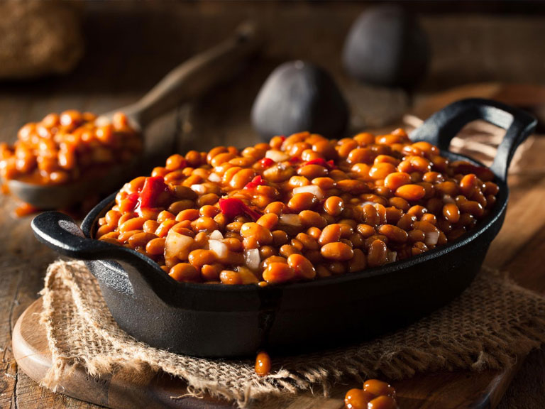

# Tennessee Baked Beans

*Tennessee's smoky BBQ-pit beans: navy beans slow-baked in a sauce of bacon, brown sugar, ketchup, mustard, Worcestershire, onion and Tennessee whiskey till the beans are creamy and the sauce is thick and dark. The Memphis BBQ joint canonical side; sweet, smoky, with a touch of whiskey warmth.*

**Serves:** 8

**Prep Time:** 20 minutes (plus overnight bean soak; or use canned for shortcut)

**Cook Time:** 2 hours

## Overview
Tennessee baked beans are the canonical Memphis BBQ-joint side and Tennessee summer-supper staple: dried navy beans (the canonical small white bean) soaked overnight then slow-baked in a savoury-sweet-smoky sauce of bacon, finely chopped onion, brown sugar, ketchup, yellow mustard, Worcestershire, molasses, apple cider vinegar, paprika and (the Tennessee twist) a generous splash of Tennessee whiskey. Slow-baked covered for 2 hours till the beans are creamy and the sauce thickens to a glossy dark glaze. Often the bacon stays in the dish (chopped). Served alongside ribs, pulled pork, brisket, fried chicken. Three details: navy beans, bacon backbone, whiskey twist.

## Ingredients

- 500 g dried navy beans (soaked overnight, drained); or 3 tins (400 g each) navy beans
- 300 g thick-cut bacon (diced)
- 2 large onions (chopped)
- 8 garlic cloves (crushed)
- 1 green bell pepper (chopped)
- 200 ml ketchup
- 100 g brown sugar
- 4 tablespoons molasses
- 4 tablespoons yellow mustard
- 4 tablespoons Worcestershire sauce
- 2 tablespoons apple cider vinegar
- 60 ml Tennessee whiskey (Jack Daniel's or George Dickel)
- 1 tablespoon paprika
- 1 tablespoon smoked paprika
- 2 teaspoons fine sea salt
- 1 teaspoon ground black pepper
- 1 teaspoon cayenne
- 800 ml chicken stock (or bean cooking liquid)

### To finish
- 1 bunch spring onions (sliced)
- 1 small bunch fresh parsley

## Method

### Stage 1 - Pre-cook beans (if using dried)
1. Drain soaked beans.
2. Cover with water in pot; simmer 45 min till tender but not falling apart.
3. Drain (reserve cooking liquid).

### Stage 2 - Render bacon
1. In a heavy oven-safe pot, cook bacon over medium heat till crispy 8 min.
2. Remove some for garnish; leave the fat.

### Stage 3 - Sauté aromatics
1. In bacon fat, add onion and bell pepper; cook 8 min.
2. Add garlic; cook 30 sec.

### Stage 4 - Add sauce
1. Stir in ketchup, brown sugar, molasses, mustard, Worcestershire, vinegar.
2. Carefully add whiskey (away from flame).
3. Stir in paprika, smoked paprika, salt, pepper, cayenne.
4. Cook 3 min.

### Stage 5 - Add beans and bake
1. Stir in beans.
2. Add chicken stock to almost cover.
3. Preheat oven to 160°C (320°F).
4. Cover; bake 90 min.
5. Uncover; bake 30 min more till sauce thickens and glazes the beans.

### Stage 6 - Finish
1. Taste; adjust salt and sweetness.
2. Scatter reserved bacon, spring onions, parsley.

## Notes
- **Navy beans canonical.**
- **Bacon backbone.**
- **Whiskey twist:** Tennessee signature.
- **Slow-bake covered then uncovered.**

## Variations
**Vegetarian:** skip bacon; add smoked paprika + liquid smoke.
**With pulled pork:** add 300 g shredded pork.
**Without whiskey:** still good; less specifically Tennessee.
**Spicier:** double cayenne.

## Serving
At BBQ joints; alongside ribs, pork, brisket. Tennessee summer suppers.

## Storage
- Refrigerated 5 days; flavour deepens.
- Freezes 3 months.
- Reheat covered.
