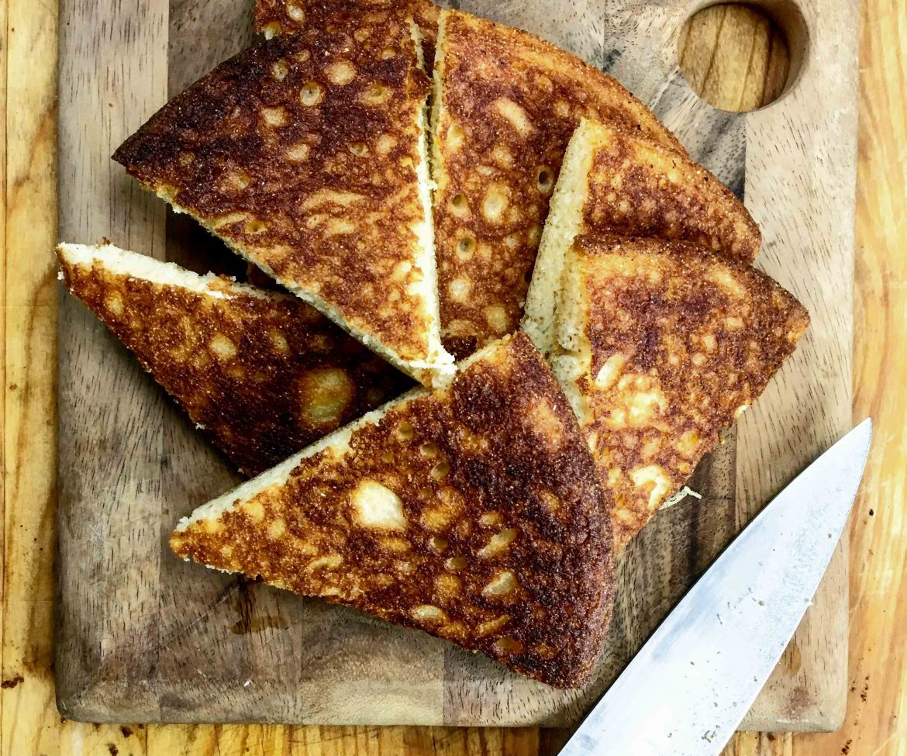

# Tennessee Skillet Cornbread

*Tennessee's cast-iron cornbread: a classic Southern cornbread (yellow cornmeal, buttermilk, egg, oil and just enough flour to bind) baked in a screaming-hot cast-iron skillet greased with bacon fat till the crust is deeply golden and crispy. Less sweet than Northern cornbread; the Tennessee BBQ-joint and family-table standard.*

**Serves:** 8

**Prep Time:** 10 minutes

**Cook Time:** 25 minutes

## Overview
Tennessee skillet cornbread is the traditional Southern cornbread style (less sweet than Northern cornbread; more cornmeal than flour; cast-iron skillet for the crust): yellow cornmeal as the dominant grain, with just enough plain flour to bind, leavened with baking powder + baking soda, mixed with buttermilk, egg, melted butter (or bacon fat), and a pinch of sugar (some Tennessee purists insist on NO sugar; others allow a teaspoon). Poured into a screaming-hot cast-iron skillet that has been preheated with a generous slick of bacon fat or butter, baked at 220°C for 20-25 minutes till the crust is deeply golden and crispy and the inside is soft and moist. Served warm with butter; alongside BBQ, beans, fried chicken, greens.

## Ingredients

- 300 g coarse yellow cornmeal
- 80 g plain flour
- 1 tablespoon caster sugar (some omit; up to you)
- 1 tablespoon baking powder
- 1 teaspoon baking soda
- 1 ½ teaspoons fine sea salt
- 2 large eggs
- 400 ml buttermilk
- 80 g melted butter (or bacon fat)
- 4 tablespoons bacon fat or vegetable oil (for the skillet)
- Optional: 100 g sweet corn kernels
- Optional: 100 g grated cheddar
- Optional: 1 chopped jalapeño

## Method

### Stage 1 - Preheat skillet
1. Preheat oven to 220°C (425°F).
2. Place a 25cm cast-iron skillet in the oven.
3. Heat 10 min.

### Stage 2 - Mix dry
1. Whisk cornmeal, flour, sugar, baking powder, baking soda, salt.

### Stage 3 - Mix wet
1. Whisk eggs, buttermilk, melted butter.

### Stage 4 - Combine
1. Pour wet into dry; mix to a thick batter (don't overmix).
2. Stir in corn kernels, cheese, or jalapeño if using.

### Stage 5 - Grease skillet
1. Carefully remove hot skillet from oven.
2. Add bacon fat or oil; swirl to coat.
3. The pan should hiss.

### Stage 6 - Pour batter
1. Immediately pour batter into hot greased skillet.
2. The batter should sizzle.

### Stage 7 - Bake
1. Return to oven.
2. Bake 20-25 min till deep golden on top and a toothpick comes out clean.

### Stage 8 - Rest and serve
1. Rest 5 min in skillet.
2. Slice into wedges.
3. Serve warm with butter.

## Notes
- **Screaming-hot skillet:** for proper crust.
- **Bacon fat traditional:** flavour and crust.
- **Less sweet than Northern.**
- **Don't overmix:** keeps it tender.

## Variations
**Sweet:** add 4 tablespoons more sugar.
**With cheese and jalapeño:** classic addition.
**With corn:** add fresh corn kernels.
**As muffins:** bake in muffin tin 15 min.

## Serving
With butter alongside BBQ, beans, greens, chili.

## Storage
- Best fresh.
- Wrapped at room temp 1 day.
- Refrigerate 3 days.
- Freeze 1 month.
- Reheat in oven covered.
