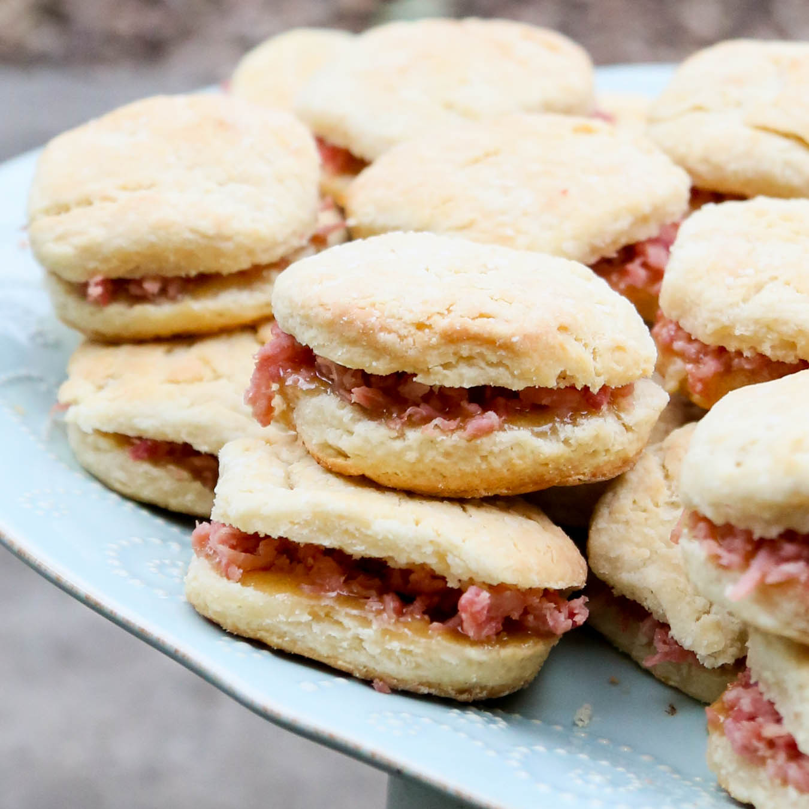

# Country Ham Biscuits

*Tennessee's iconic breakfast and party canapé: fluffy buttermilk biscuits split warm, smeared with butter or honey mustard, and filled with a slice of salty Tennessee country ham. The classic Southern wedding-reception appetiser and Sunday-morning breakfast.*

**Serves:** Makes 16 biscuit halves (8 sandwiches)

**Prep Time:** 30 minutes

**Cook Time:** 15 minutes

## Overview
Country ham biscuits are one of the most iconic Southern (and particularly Tennessee/Kentucky) foods, appearing at every wedding reception, christening, baby shower and church social: small fluffy buttermilk biscuits (cut about 6 cm wide for the traditional canapé size) split warm and filled with a thin slice of dry-cured Tennessee country ham (the salty, deeply ham-flavoured cured ham; distinct from "city ham" which is the wet-cured smoked variety; country ham is cured in salt for months and aged 9-12 months for the deep flavour, similar to prosciutto but smokier). The salt of the ham balances the buttery biscuit. Often served with honey mustard or a touch of honey directly on the ham.

## Ingredients

### Buttermilk biscuits
- 500 g plain flour
- 1 ½ tablespoons baking powder
- 1 teaspoon baking soda
- 1 ½ teaspoons fine sea salt
- 1 tablespoon caster sugar
- 200 g cold butter (cubed) (or 100 g butter + 100 g lard)
- 400 ml cold buttermilk

### Filling
- 300 g thinly-sliced Tennessee country ham (or substitute: prosciutto + a bit of smoked ham)
- 4 tablespoons honey mustard
- 2 tablespoons honey
- 80 g butter (softened, optional)

### Egg wash
- 1 egg (beaten with 1 tablespoon milk)

## Method

### Stage 1 - Make biscuits
1. Whisk flour, baking powder, baking soda, salt, sugar.
2. Rub in cold butter to coarse crumbs (don't fully blend; some butter chunks remain).
3. Pour in cold buttermilk.
4. Stir gently till just combined (lumpy is fine).

### Stage 2 - Fold
1. Tip dough onto floured surface.
2. Pat into a rectangle 3 cm thick.
3. Fold in half; pat down again.
4. Repeat 2 more times (creates layers; like rough puff).

### Stage 3 - Cut
1. Pat dough to 2 cm thick.
2. Cut 6 cm rounds with sharp cutter (don't twist; press straight down).
3. Re-pat scraps and cut more.

### Stage 4 - Bake
1. Preheat oven to 220°C (425°F).
2. Place biscuits on parchment-lined sheet, just touching each other (for tall biscuits).
3. Brush tops with egg wash.
4. Bake 12-15 min till golden.

### Stage 5 - Prep ham
1. Warm slices briefly in dry pan 30 sec per side (or microwave 20 sec).

### Stage 6 - Assemble
1. Split warm biscuits.
2. Spread bottom half with honey mustard (or butter and a drizzle of honey).
3. Add a slice of country ham folded to fit.
4. Top with the lid.

### Stage 7 - Serve immediately
1. Warm.
2. Pile on platters for parties.

## Notes
- **Country ham not city ham:** the salty dry-cured kind.
- **Don't twist the cutter:** for proper rise.
- **Biscuits touching:** taller rise.
- **Eat warm.**

## Variations
- **With pimento cheese:** spread between biscuit and ham.
- **With apple butter:** instead of honey mustard.
- **Without ham (just biscuits):** for the biscuit alone.
- **Cheese biscuits:** add 200 g grated cheddar to dough.

## Serving
- At weddings, baby showers, brunches; Sunday breakfasts.

## Storage
- Biscuits best fresh; keep 1 day at room temp.
- Reheat in oven at 180°C 5 min.
- Assemble at the last moment.
- Biscuits freeze 1 month.
