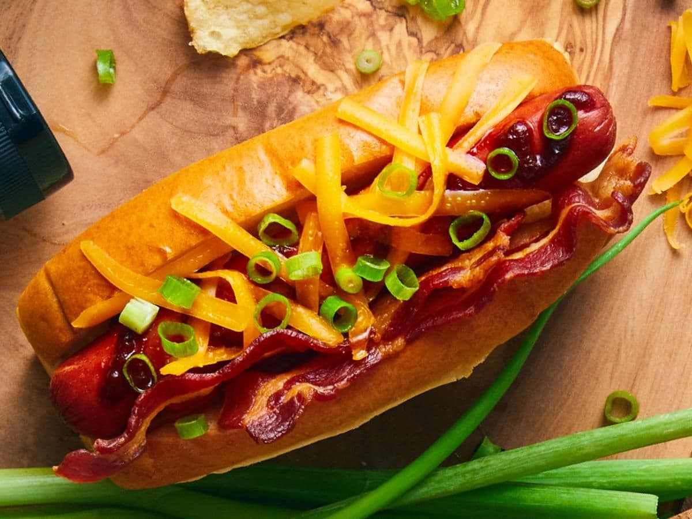

# Memphis BBQ Hot Dog

*Memphis's BBQ-style hot dog: a frankfurter wrapped in smoked bacon, grilled till the bacon crisps, laid in a toasted bun and drowned in tangy-sweet Memphis-style BBQ sauce, topped with shredded smoked cheddar and a heap of chopped spring onion. The Beale Street pit-stop dog; the Memphis BBQ pit master's snack-time creation.*

**Serves:** 4

**Prep Time:** 15 minutes

**Cook Time:** 20 minutes

## Overview
The Memphis BBQ hot dog is a Tennessee adaptation of the American hot dog that takes its cues from the city's deep BBQ tradition (Memphis being one of the great American BBQ capitals alongside Kansas City, Texas and the Carolinas): an all-beef frankfurter (or a smoked pork-and-beef sausage) is wrapped tightly in a strip of thin smoked streaky bacon, then grilled or roasted till the bacon crisps and gives up its fat into the dog, then laid in a toasted potato bun and drowned in warm Memphis-style BBQ sauce (the tangy-sweet tomato-mustard sauce of Memphis, with apple cider vinegar, brown sugar, paprika and a touch of Tennessee whiskey for the local twist), topped with a generous heap of grated smoked cheddar (it melts in contact with the warm sauce-dog) and chopped spring onion. Eat alongside pulled pork sandwiches at Memphis BBQ joints.

## Ingredients

### Dogs and bacon
- 4 all-beef frankfurters (or smoked pork-and-beef sausages)
- 8 strips thin smoked streaky bacon (2 per dog)
- Wooden toothpicks (to hold the bacon)

### Memphis BBQ sauce (makes about 400 ml)
- 200 ml ketchup
- 80 ml apple cider vinegar
- 50 g brown sugar
- 2 tablespoons Worcestershire sauce
- 2 tablespoons yellow mustard
- 1 tablespoon paprika
- 1 tablespoon smoked paprika
- 1 teaspoon garlic powder
- 1 teaspoon onion powder
- 1 teaspoon hot sauce
- 30 ml Tennessee whiskey (optional; for the local twist)
- 1 tablespoon molasses
- 1 teaspoon fine sea salt
- ½ teaspoon ground black pepper

### Toppings and bun
- 4 potato hot dog buns (or soft white buns)
- 2 tablespoons butter (for toasting buns)
- 200 g grated smoked cheddar (or aged cheddar smoked at home over wood chips)
- 1 small bunch spring onions (sliced thin)
- Optional: dill pickle slices, sliced jalapeños

### To serve
- Memphis vinegar coleslaw on the side ([memphis BBQ slaw](../side-dishes/memphis-bbq-slaw.md))
- Tennessee baked beans
- Cold beer

## Method

### Stage 1 - Make BBQ sauce
1. In a saucepan, whisk ketchup, vinegar, brown sugar, Worcestershire, mustard, paprika, smoked paprika, garlic and onion powder, hot sauce, whiskey (if using), molasses, salt and pepper.
2. Simmer over medium heat 12-15 minutes till thickened slightly and glossy.
3. Keep warm.

### Stage 2 - Wrap dogs in bacon
1. Take each frankfurter; wrap 2 strips of streaky bacon around it in a spiral, slightly overlapping.
2. Secure both ends with a toothpick (you'll remove these before serving).

### Stage 3 - Cook the bacon-wrapped dogs
1. **Option A (grill):** Heat a barbecue or grill pan to medium-high. Grill the dogs 8-10 minutes, turning occasionally, till the bacon is deep golden-brown and crispy.
2. **Option B (oven):** Preheat to 200°C (400°F); roast on a wire rack over a baking tray 15-18 minutes till the bacon crisps.
3. **Option C (smoker):** If you have a smoker running for ribs/brisket, throw the dogs on for 20-25 minutes for true Memphis flavour.

### Stage 4 - Toast the buns
1. Spread the soft butter on the bun cut sides.
2. Toast cut-side-down in a wide pan 90 seconds till golden.

### Stage 5 - Remove toothpicks and build
1. Remove the toothpicks from each cooked bacon-wrapped dog.
2. Place each dog in a toasted bun.
3. Generously spoon warm Memphis BBQ sauce over each (it should pool in the bun).
4. A heap of grated smoked cheddar over the warm sauce (the heat melts it).
5. A scatter of sliced spring onion.
6. Optional: pickle slices or jalapeños for crunch.

### Stage 6 - Serve immediately
1. With Memphis slaw, baked beans, and a cold beer.
2. Extra BBQ sauce on the side for dipping.

## Notes
- **Bacon-wrapped, not bacon-bits:** the wrapped bacon is the dish's structural and flavour signature.
- **Smoked cheddar:** the smoke note ties the bacon and sauce together.
- **Memphis-style sauce (tangy-sweet, not Kansas-City-thick):** apple cider vinegar is essential.
- **Toothpicks come out before serving:** safety reminder.

## Variations
- **Smoked sausage instead of frankfurter:** swap the dog for a Memphis-style smoked pork sausage.
- **With chopped pulled pork on top:** the Memphis-on-Memphis variant.
- **With white BBQ sauce:** swap the tomato sauce for Alabama-style white BBQ sauce (mayo + vinegar + horseradish + pepper).
- **Spicier:** double the hot sauce + jalapeños on top.
- **Vegetarian:** swap dog for a chunky grilled portobello; skip the bacon or use a vegan bacon.

## Serving
- At a Memphis BBQ joint. At a Tennessee Sunday BBQ. At home with slaw, beans, and a cold beer.

## Storage
- BBQ sauce refrigerates 2 weeks.
- Cooked bacon-wrapped dogs refrigerate 3 days.
- Don't assemble in advance.
