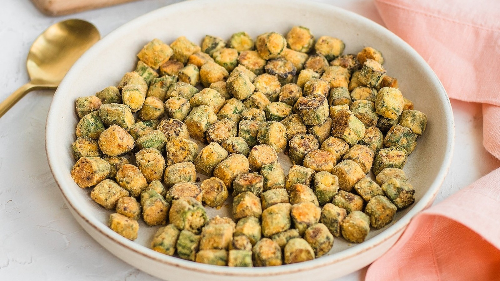

# Tennessee Fried Okra

*Tennessee's crispy Southern vegetable snack: fresh okra pods sliced into rounds, tossed in buttermilk, dredged in seasoned cornmeal, and deep-fried till the rounds are golden and crispy. The Southern garden-to-table classic; the traditional accompaniment to BBQ and fried catfish.*

**Serves:** 4-6

**Prep Time:** 15 minutes

**Cook Time:** 10 minutes

## Overview
Tennessee fried okra is a classic Southern-Tennessee summer vegetable dish: fresh okra pods (best when small, firm, and bright green) sliced into 1cm rounds (the green star-shaped slices that fry up beautifully), tossed briefly in buttermilk, then dredged in seasoned cornmeal-and-flour, and deep-fried till the slices are golden and crispy outside. The cornmeal crust and the natural starches of the okra crisp up around the seeds, with the slime that often turns people off raw okra completely transformed. Served as a side to ranch dressing or honey mustard, alongside BBQ, fried chicken, or fried catfish.

## Ingredients

- 600 g fresh okra (small pods preferred)
- 250 ml buttermilk
- 1 tablespoon hot sauce
- 200 g coarse yellow cornmeal
- 80 g plain flour
- 1 tablespoon paprika
- 1 tablespoon garlic powder
- 1 tablespoon onion powder
- 1 ½ teaspoons fine sea salt
- 1 teaspoon ground black pepper
- 1 teaspoon cayenne

### Frying
- Vegetable oil for deep-frying (about 800 ml)

### To serve
- Ranch dressing
- Honey mustard
- Hot sauce
- Lemon wedges

## Method

### Stage 1 - Slice okra
1. Trim stems off okra.
2. Slice into 1cm rounds.

### Stage 2 - Buttermilk dip
1. Whisk buttermilk with hot sauce.
2. Toss okra slices in mixture.

### Stage 3 - Mix dredge
1. Whisk cornmeal, flour, paprika, garlic and onion powder, salt, pepper, cayenne.

### Stage 4 - Coat
1. Lift okra from buttermilk; let excess drip.
2. Toss in cornmeal mixture; press to coat.

### Stage 5 - Heat oil
1. Heat oil to 180°C (360°F) in deep pan.

### Stage 6 - Fry
1. Fry in batches 3 min till golden and crispy.
2. Don't overcrowd.
3. Drain on paper towels.

### Stage 7 - Salt immediately
1. Sprinkle with extra salt while hot.

### Stage 8 - Serve
1. With ranch, honey mustard, or hot sauce.

## Notes
- **Small fresh okra:** ideal.
- **Cornmeal coating:** crispy texture.
- **180°C oil:** crucial.
- **Eat immediately:** lose crispness.

## Variations
**With pickle:** brine okra in pickle juice 1 hour first.
**Spicier:** double cayenne.
**Whole pods:** fry whole; longer cook time.
**Air-fried:** less traditional but lower fat.

## Serving
Alongside BBQ, fried chicken, catfish.

## Storage
- Best immediately.
- Don't refrigerate cooked; goes soggy.
- Coated raw refrigerate 1 hour; fry just before.
