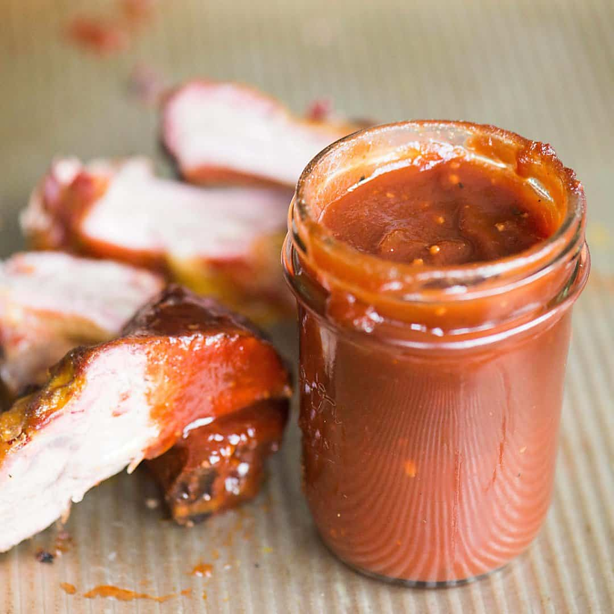

# Tennessee Whiskey BBQ Sauce

*Tennessee's whiskey-spiked BBQ sauce: ketchup, brown sugar, apple cider vinegar, Worcestershire, mustard, garlic and Jack Daniel's Tennessee whiskey, simmered till thick and glossy with a deep amber colour. The traditional sauce for ribs, pulled pork, brisket, chicken; and the dipping sauce alongside Memphis-style ribs.*

**Serves:** Makes 700 ml

**Prep Time:** 10 minutes

**Cook Time:** 30 minutes

## Overview
Tennessee whiskey BBQ sauce is the Tennessee twist on the wider American BBQ sauce tradition, using the state's most famous export (Jack Daniel's, or any Tennessee whiskey such as George Dickel) as the signature flavour: a base of ketchup, brown sugar, apple cider vinegar, Worcestershire sauce, yellow mustard, garlic, onion, paprika, smoked paprika, cayenne and black pepper, with a generous splash of Tennessee whiskey added at the start so the alcohol cooks off but the toasted-oak-and-corn flavour remains. Simmered 25-30 minutes till thick and glossy with a deep red-brown colour. Used as a glaze for ribs in the last 30 minutes of smoking, on Memphis pulled pork sandwiches, as a dipping sauce alongside dry-rub ribs, or brushed on grilled chicken.

## Ingredients

- 400 ml ketchup
- 200 ml apple cider vinegar
- 150 g dark brown sugar
- 100 ml Tennessee whiskey (Jack Daniel's or George Dickel)
- 4 tablespoons Worcestershire sauce
- 2 tablespoons yellow mustard
- 2 tablespoons molasses
- 1 small onion (finely chopped)
- 8 garlic cloves (crushed)
- 2 tablespoons paprika
- 1 tablespoon smoked paprika
- 1 teaspoon mustard powder
- 1 teaspoon cayenne
- 1 teaspoon ground black pepper
- 1 teaspoon fine sea salt
- 2 tablespoons butter
- 1 teaspoon hot sauce
- 1 tablespoon liquid smoke (optional)

## Method

### Stage 1 - Sauté
1. Melt butter in saucepan.
2. Add chopped onion; cook 6 min till soft.
3. Add garlic; cook 30 sec.

### Stage 2 - Add whiskey
1. Carefully pour in Tennessee whiskey (away from flame).
2. Let flame off if it lights, or burn 30 sec.

### Stage 3 - Build sauce
1. Add ketchup, vinegar, brown sugar, Worcestershire, mustard, molasses.
2. Stir in paprika, smoked paprika, mustard powder, cayenne, pepper, salt, hot sauce, liquid smoke (if using).

### Stage 4 - Simmer
1. Bring to gentle simmer.
2. Reduce heat to lowest.
3. Cook 25-30 min, stirring occasionally, till thickened and glossy.

### Stage 5 - Blend smooth (optional)
1. Blitz briefly with stick blender for smoother sauce.
2. Or leave as is for chunkier.

### Stage 6 - Cool and store
1. Cool completely.
2. Transfer to jar.

### Stage 7 - Use
1. Glaze ribs in last 30 min of smoking.
2. On pulled pork sandwiches.
3. As dipping sauce.
4. On grilled chicken.

## Notes
- **Tennessee whiskey, not bourbon:** different oak character.
- **Simmer 25-30 min:** for proper thickness.
- **Balance sweet-tangy-smoky.**

## Variations
- **Spicier:** double cayenne + extra hot sauce.
- **Sweeter:** double brown sugar.
- **Without whiskey (kid-friendly):** add 1 teaspoon vanilla + 1 teaspoon liquid smoke.
- **With bourbon:** for a Kentucky version (different oak profile).

## Serving
- On every Tennessee BBQ table.

## Storage
- Refrigerated 1 month.
- Freezes 6 months.
- Better after 24 hours.
