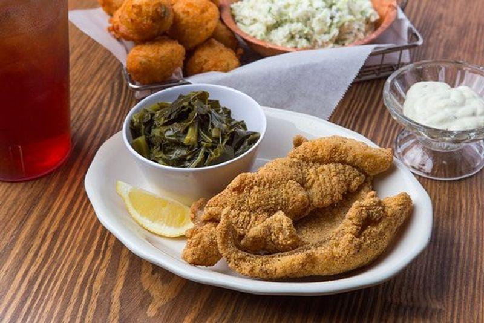

# Tennessee Cornmeal-Crusted Catfish

*Tennessee's freshwater fish classic: catfish fillets coated in seasoned cornmeal, pan-fried in cast iron till the crust is deeply golden and crispy, served with hush puppies, slaw and tartar sauce. The Tennessee diner and lakefront-fish-fry standard, slightly different from Louisiana style with more black pepper and less cayenne.*

**Serves:** 4

**Prep Time:** 15 minutes

**Cook Time:** 15 minutes

## Overview
Tennessee cornmeal-crusted catfish is Tennessee's freshwater fish staple; the catfish that fills every lakeside restaurant, country diner, and Friday-night family kitchen across the state. Distinct from the Louisiana version (slightly less spicy; more black pepper than cayenne; sometimes pan-fried in cast iron rather than deep-fried), the Tennessee approach uses farm-raised catfish fillets dipped briefly in seasoned buttermilk, then coated in a cornmeal-flour mix flavoured with paprika, garlic powder, salt, lots of black pepper, and a touch of cayenne. Pan-fried in hot oil or shallow lard in a cast-iron skillet (the canonical Tennessee vessel) till the crust is deeply golden and the fish inside flakes white and tender. Served with hush puppies, coleslaw, French fries, lemon wedges and tartar sauce.

## Ingredients

### Fish
- 4 catfish fillets (about 200 g each)
- 400 ml buttermilk
- 1 tablespoon hot sauce
- 1 teaspoon fine sea salt

### Coating
- 250 g coarse yellow cornmeal
- 80 g plain flour
- 1 tablespoon paprika
- 1 tablespoon garlic powder
- 1 tablespoon onion powder
- 1 tablespoon coarse ground black pepper
- 1 ½ teaspoons fine sea salt
- 1 teaspoon cayenne

### Frying
- 200 ml vegetable oil (or 50/50 oil and lard)

### To serve
- Hush puppies
- Coleslaw
- French fries
- Lemon wedges
- Tartar sauce
- Hot sauce
- Sweet tea

## Method

### Stage 1 - Buttermilk soak
1. Whisk buttermilk, hot sauce, salt.
2. Submerge catfish; rest 20 min (or refrigerate up to 4 hours).

### Stage 2 - Mix coating
1. Whisk cornmeal, flour, paprika, garlic and onion powder, black pepper, salt, cayenne.

### Stage 3 - Coat
1. Lift fish from buttermilk; let excess drip.
2. Press into cornmeal mixture, coating both sides.

### Stage 4 - Heat oil
1. Heat oil in cast-iron skillet over medium-high to 175°C.
2. Oil should be 1 cm deep (shallow-fry).

### Stage 5 - Pan-fry
1. Place fillets in pan.
2. Fry 4 min per side till the crust is deeply golden and the fish flakes when pierced.
3. Drain on paper towels briefly.

### Stage 6 - Season immediately
1. Sprinkle with a little extra salt while hot.

### Stage 7 - Serve
1. With hush puppies, slaw, fries, lemon, tartar.

## Notes
- **Cornmeal-flour mix:** 3:1 ratio.
- **Cast-iron skillet canonical.**
- **Lots of black pepper:** Tennessee signature.
- **Eat immediately:** crust softens.

## Variations
**Whole catfish:** scaled and gutted; pan-fried whole.
**Spicier:** double cayenne; add Cajun seasoning.
**Blackened (not coated):** rub with blackening spice; sear in dry hot cast iron.
**With remoulade:** instead of tartar.

## Serving
Friday fish fries, lakeside meals.

## Storage
- Best immediately.
- Don't refrigerate cooked; goes soggy.
- Coated raw refrigerate 1 hour.
