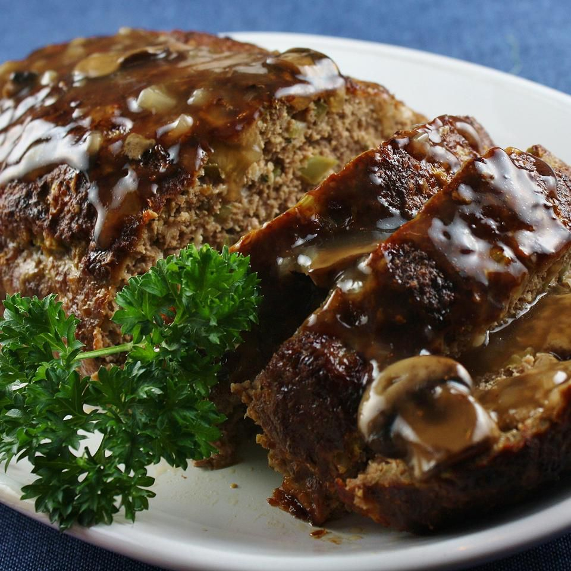

# Tennessee Meatloaf

*Tennessee's Sunday meatloaf: ground beef and pork mixed with onion, garlic, breadcrumbs, milk, eggs, Worcestershire, paprika, salt and pepper, shaped into a loaf, glazed with a ketchup-and-brown-sugar topping and baked till just-cooked-through. The Sunday diner classic; the dish your Tennessee grandmother makes every other week.*

**Serves:** 6

**Prep Time:** 20 minutes

**Cook Time:** 1 hour 15 minutes

## Overview
Tennessee meatloaf is the traditional Southern American meatloaf and the dish that defines Tennessee Sunday-dinner comfort cooking, distinct from Northeastern versions by the addition of more spice (paprika, smoked paprika, a touch of cayenne), Worcestershire sauce in the mix (essential), and the classic tangy-sweet ketchup-and-brown-sugar glaze on top. A 50/50 mixture of ground beef chuck (80/20 fat) and ground pork shoulder gives the proper rich texture; soaked breadcrumbs (in milk) keeps it tender; eggs bind; onion + garlic + Worcestershire flavours. Shaped into a free-form loaf on a sheet pan (better browning than a loaf tin), glazed with the traditional ketchup-brown-sugar-mustard mixture, and baked till the internal temperature is 70°C. Served with mashed potatoes, green beans and skillet cornbread.

## Ingredients

### Meatloaf
- 700 g ground beef chuck (80/20)
- 500 g ground pork shoulder
- 1 large onion (finely chopped)
- 8 garlic cloves (crushed)
- 200 g panko breadcrumbs
- 200 ml whole milk
- 2 large eggs (beaten)
- 4 tablespoons Worcestershire sauce
- 2 tablespoons Dijon mustard
- 2 tablespoons tomato paste
- 1 tablespoon paprika
- 1 tablespoon smoked paprika
- 1 teaspoon dried thyme
- 2 teaspoons fine sea salt
- 1 ½ teaspoons ground black pepper
- 1 teaspoon cayenne
- 1 small bunch fresh parsley (chopped)

### Glaze
- 200 ml ketchup
- 80 g dark brown sugar
- 2 tablespoons apple cider vinegar
- 2 tablespoons Worcestershire sauce
- 1 tablespoon Dijon mustard
- 1 teaspoon hot sauce
- ½ teaspoon ground black pepper

### To serve
- Mashed potatoes
- Green beans
- Skillet cornbread
- Pickles

## Method

### Stage 1 - Soak breadcrumbs
1. Pour milk over breadcrumbs in a bowl.
2. Rest 5 min till absorbed.

### Stage 2 - Sauté aromatics
1. Heat 2 tablespoons oil; cook chopped onion 6 min till soft.
2. Add garlic; cook 30 sec.
3. Cool 5 min.

### Stage 3 - Mix meatloaf
1. In a large bowl, combine beef, pork, soaked breadcrumbs, cooled onion and garlic, eggs, Worcestershire, mustard, tomato paste, paprika, smoked paprika, thyme, salt, pepper, cayenne, parsley.
2. Mix gently with hands (don't overwork; gives tough loaf).

### Stage 4 - Shape
1. Line a baking sheet with parchment.
2. Shape meat into a free-form loaf about 25 cm long, 12 cm wide, 8 cm high.

### Stage 5 - Bake initial
1. Preheat oven to 175°C (350°F).
2. Bake 45 min.

### Stage 6 - Make and apply glaze
1. Whisk all glaze ingredients in a small pan.
2. Simmer 3 min till slightly thickened.
3. Brush half the glaze on top of meatloaf.

### Stage 7 - Continue baking
1. Bake 25-30 min more till internal temp 70°C (160°F).
2. Brush with remaining glaze in last 10 min.

### Stage 8 - Rest and serve
1. Rest 10 min before slicing.
2. Slice into thick slices.
3. With mashed potatoes, green beans, cornbread.

## Notes
- **50/50 beef + pork:** proper texture.
- **Milk-soaked breadcrumbs:** tender meatloaf.
- **Don't overwork:** keeps it tender.
- **Free-form on sheet pan:** better browning.
- **Glaze in two coats.**

## Variations
**Bacon-wrapped:** lay bacon strips across before baking.
**All beef:** less rich but works.
**With cheese stuffing:** mozzarella core.
**Spicier:** double cayenne.

## Serving
Sunday dinner with mashed potatoes, green beans, cornbread. Leftovers make excellent meatloaf sandwiches.

## Storage
- Cooked refrigerate 4 days.
- Slices freeze 2 months.
- Reheat covered.
