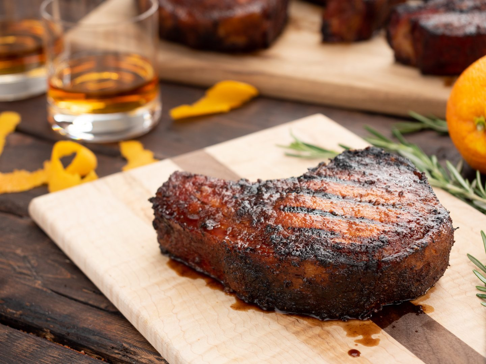

# Tennessee Whiskey Pork Chops

*Tennessee's signature pork: thick-cut bone-in pork chops seared then glazed with a sticky Tennessee whiskey-and-brown-sugar sauce made with Jack Daniel's, brown sugar, garlic, mustard and Worcestershire. The Tennessee Sunday dinner classic; the dish where the local whiskey becomes the star.*

**Serves:** 4

**Prep Time:** 15 minutes (plus 1 hour brine; optional)

**Cook Time:** 25 minutes

## Overview
Tennessee whiskey pork chops are the traditional Tennessee Sunday-dinner pork preparation, using the state's signature spirit (Jack Daniel's or another Tennessee whiskey such as George Dickel) as the centerpiece of a sticky-sweet glaze: thick-cut bone-in pork chops seared in a hot cast-iron pan till deeply browned, then glazed with a reduced sauce of Tennessee whiskey, brown sugar, butter, garlic, Dijon mustard, Worcestershire sauce, and a pinch of cayenne. The alcohol burns off and the sugars caramelise into a sticky deep-amber glaze. Served with mashed potatoes, collard greens or green beans, and skillet cornbread.

## Ingredients

### Optional brine (worth it)
- 2 litres cold water
- 80 g salt
- 50 g brown sugar
- 1 tablespoon black peppercorns
- 4 garlic cloves (smashed)
- 4 bay leaves

### Chops
- 4 thick-cut bone-in pork chops (3-4 cm thick; about 350 g each)
- 2 tablespoons vegetable oil
- 2 teaspoons fine sea salt
- 1 teaspoon ground black pepper

### Tennessee whiskey glaze
- 60 ml Tennessee whiskey (Jack Daniel's or George Dickel)
- 80 g dark brown sugar
- 4 tablespoons butter
- 6 garlic cloves (crushed)
- 2 tablespoons Dijon mustard
- 2 tablespoons Worcestershire sauce
- 1 tablespoon apple cider vinegar
- ½ teaspoon cayenne
- ½ teaspoon ground black pepper
- 1 teaspoon fresh thyme

### To finish
- 1 small bunch fresh parsley
- Lemon wedges (optional)

### To serve
- Mashed potatoes
- Collard greens or green beans
- Skillet cornbread
- Apple sauce (optional)

## Method

### Stage 1 - Optional brine
1. Dissolve salt and brown sugar in water; add aromatics.
2. Submerge chops; refrigerate 1 hour.
3. Drain; pat dry.

### Stage 2 - Season
1. Season chops generously with salt and pepper.

### Stage 3 - Sear
1. Heat oil in heavy cast-iron pan over high heat.
2. Sear chops 4 min per side till deeply browned.
3. Remove to plate.

### Stage 4 - Make glaze in same pan
1. Reduce heat to medium.
2. Add butter; melt.
3. Add garlic; cook 30 sec.
4. Carefully pour in whiskey (away from flame; or off heat).
5. Return to heat; let flame off or burn 30 sec.
6. Add brown sugar, mustard, Worcestershire, vinegar, cayenne, pepper, thyme.
7. Simmer 3 min till glaze thickens to syrup.

### Stage 5 - Glaze chops
1. Return chops to pan.
2. Spoon glaze over.
3. Cook 4 min more, basting, till internal temp 65°C (149°F).

### Stage 6 - Rest
1. Remove chops to plate; rest 5 min.
2. Spoon remaining glaze over.

### Stage 7 - Serve
1. Scatter parsley.
2. Mashed potatoes, greens, cornbread alongside.

## Notes
- **Thick chops 3-4 cm:** for juicy results.
- **Tennessee whiskey:** Jack Daniel's or George Dickel.
- **Don't overcook:** 65°C internal.
- **Rest before serving.**

## Variations
- **With apple slices:** add 2 sliced apples to glaze.
- **With smoked paprika:** for smokier flavour.
- **Bourbon version:** use Kentucky bourbon (similar but not "Tennessee whiskey" technically).
- **With grits:** instead of mashed potatoes.

## Serving
- Sunday dinner with mashed potatoes, greens, cornbread.

## Storage
- Refrigerated 3 days.
- Reheat gently; glaze separately if storing.
- Don't freeze.
