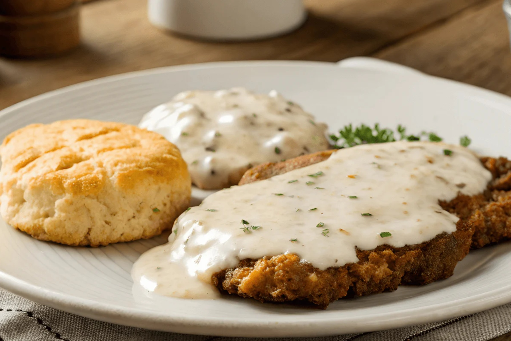

# Chicken-Fried Steak

*The state dish of Texas: tenderised beef cube steak pounded thin, dredged in seasoned flour, fried golden, and smothered in milky black-pepper gravy made from the drippings in the pan. Eaten with mashed potatoes and a side of greens.*

**Serves:** 4

**Prep Time:** 15 minutes

**Cook Time:** 25 minutes

## Overview
Chicken-fried steak is the unofficial state dish of Texas (and, separately, the unofficial state dish of Oklahoma; both claim it). The name is the technique: a tough cut of beef is treated as if it were a piece of chicken - pounded thin, dredged in seasoned flour, fried in shallow fat until golden, and served under a white gravy made from the pan drippings, flour and milk. The result is a comfort-food masterpiece: crisp golden crust, tender beef underneath, peppery white gravy bringing it all together.

The dish has German-Texan origins (it is a close cousin of Wiener schnitzel, brought by German settlers in the Hill Country in the 1800s) and was a Depression-era favourite because it turned tough cheap cuts into a generous-feeling meal. Modern recipes use cube steak (beef round tenderised by being run through a mechanical cuber), which gives the dish its characteristic uneven, almost lacy surface.

Eaten with mashed potatoes, country gravy poured over everything, and a side of greens or biscuits. The state of Texas eats roughly 800,000 chicken-fried steaks a day.

## Ingredients

### Steaks
- 4 cube steaks (about 175 g each; or beef sirloin/round, pounded between cling film to 5 mm thick)
- 1 tsp salt (for seasoning the steaks directly)
- 1 tsp black pepper

### Egg wash
- 2 eggs
- 250 ml whole milk
- 1 tsp Louisiana hot sauce

### Dredge
- 200 g plain flour
- 1 tsp salt
- 1 tsp black pepper
- 1 tsp garlic powder
- 1 tsp paprika
- ½ tsp cayenne (optional, for heat)
- ½ tsp baking powder (for crispness)

### Frying
- 100 ml neutral oil (vegetable or peanut)
- 50 g lard or bacon fat (for flavour; substitute more oil if unavailable)

### Gravy
- 3 tbsp drippings from the pan (after frying)
- 3 tbsp plain flour
- 500 ml whole milk (warmed)
- ½ tsp salt
- 1 tsp coarsely ground black pepper (this is a black pepper gravy)
- Pinch of cayenne (optional)

## Method

### Stage 1 - Prepare the steaks
1. Pat the steaks dry. Season both sides with salt and pepper. Let sit at room temperature for 15 minutes.

### Stage 2 - Set up the dredging station
1. Beat the eggs, milk and hot sauce in a wide shallow dish.
1. In a second shallow dish, combine the flour, salt, black pepper, garlic powder, paprika, cayenne and baking powder.

### Stage 3 - Dredge
1. Take a steak. Press both sides into the seasoned flour, shaking off the excess.
1. Dip into the egg wash, letting any excess drip off.
1. Press into the seasoned flour a second time, again on both sides, pressing the coating on firmly.
1. Lay the dredged steak on a wire rack. Repeat with the rest.
1. Let the dredged steaks rest 5 minutes; this helps the coating bind to the meat.

### Stage 4 - Fry
1. Heat the oil and lard in a wide heavy skillet (cast iron is ideal) over medium-high heat. The fat should be 6-7 mm deep and at about 175°C (350°F). A pinch of flour should sizzle vigorously without burning.
1. Lay 2 steaks in the hot fat (do not crowd). Fry 3-4 minutes per side, until the crust is deep golden brown and the meat is just cooked through.
1. Lift onto a warm plate, lined with paper towel. Keep warm in a low oven.
1. Repeat with the remaining 2 steaks.

### Stage 5 - Make the gravy
1. Pour off most of the fat from the skillet, leaving 3 tablespoons and the crusty browned bits at the bottom (these are flavour).
1. Set the skillet on medium heat. Sprinkle in the flour and whisk into the fat to form a paste.
1. Cook 2 minutes, whisking, until the paste is pale gold and smells nutty.
1. Pour in the warm milk in three additions, whisking smooth between each. The mixture will thicken to a pourable gravy.
1. Bring to a gentle simmer. Stir in the salt, generous black pepper and cayenne (if using).
1. Simmer 2-3 minutes, until the gravy coats the back of a spoon. Taste; adjust salt and pepper. The pepper should be assertive; this is a black pepper gravy.

### Stage 6 - Serve
1. Plate each steak with a scoop of mashed potatoes alongside.
1. Pour generous gravy over the steak and the potatoes.
1. Serve at once with a side of greens or biscuits.

## Notes
- **Double dredge for the crust.** Flour, then egg, then flour again. Single-dredged steaks have a thin coating that doesn't crisp properly.
- **Mix lard and oil for the fry.** Lard gives flavour and colour; oil provides a higher smoke point. The combination is the Texan default. All-oil is fine; all-lard burns too quickly.
- **Make the gravy in the same pan.** The browned bits from frying are the foundation of the gravy. Pouring them off and starting fresh gives a paler, less flavourful sauce.
- **Black pepper is the star of the gravy.** Use coarsely ground; finely ground pepper is too sharp. A teaspoon is the starting point, but real Texans push it further.
- **Cube steak is the right cut.** Top round, sirloin or skirt all work if pounded thin (5 mm); each gives a slightly different texture.

## Variations
- **Chicken-fried chicken:** the same technique with pounded chicken breast, fried 3-4 minutes per side.
- **Country-fried steak:** essentially the same dish, but the gravy is brown rather than white (made with beef broth instead of milk). Often used interchangeably outside Texas.
- **With sausage gravy:** crumble 200 g pork breakfast sausage into the pan after pouring off most of the fat; cook through, then proceed with the flour-and-milk gravy.

## Serving
The canonical Texan plate: chicken-fried steak, mashed potatoes, gravy poured over everything, a heap of cooked greens (mustard, collard or turnip), and a wedge of cornbread or two biscuits on the side. Sweet iced tea to drink; a beer if it is the weekend.

## Storage
- Best fresh; the crust softens within an hour.
- Day-old steaks can be revived in a hot oven (200°C for 8 minutes) or air fryer; reheat the gravy separately and pour fresh.
- The gravy keeps 3 days in the fridge; thin with a splash of milk on reheat.
- Do not freeze the assembled dish; the crust loses its texture entirely.
