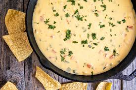

# Chile Con Queso

*The molten Tex-Mex cheese dip: melted American cheese, green chile, tomato and onion in a wide bowl, eaten with warm tortilla chips. The starter that every Texas Mexican restaurant brings to the table before the menu arrives.*

**Serves:** 4-6 as a starter

**Prep Time:** 10 minutes

**Cook Time:** 12 minutes

## Overview
Queso (or chile con queso, the full name) is the molten cheese dip that defines Tex-Mex appetiser culture. It is the bowl that appears at every Texan Mexican restaurant before the menu does, served with a basket of tortilla chips and eaten compulsively while you wait for the fajitas. The dish is San Antonio in origin, traceable back to the late 1800s, and built on a deceptively simple idea: melt a low-moisture cheese with green chile, tomato and onion until it is a glossy molten dip rather than a clump.

The cheese matters. Authentic Tex-Mex queso uses Velveeta or another processed American cheese; it melts smoothly without breaking and stays glossy as it cools. Real cheddar or Monterey Jack break, get stringy and form an oil slick on top. Texans who object to processed cheese will substitute a half-and-half of sharp cheddar and Monterey Jack stabilised with evaporated milk and a teaspoon of cornflour; the version below uses that approach.

## Ingredients
- 1 tbsp neutral oil
- 1 small onion (very finely chopped)
- 2 garlic cloves (minced)
- 1 large tomato (deseeded and finely chopped, or 100 g tinned diced tomatoes drained)
- 1 small can chopped green chiles (Hatch or generic; about 100 g; mild or hot to taste)
- 1 small jalapeño (finely chopped; seeds in for heat)
- ½ tsp ground cumin
- ½ tsp smoked paprika
- 200 g sharp cheddar cheese (grated)
- 100 g Monterey Jack cheese (grated)
- 1 tbsp cornflour
- 200 ml evaporated milk (or whole milk if unavailable)
- Salt to taste
- Small handful fresh coriander (chopped)
- Tortilla chips, to serve

## Method

### Stage 1 - Sauté the vegetables
1. Heat the oil in a heavy saucepan over medium heat. Add the chopped onion and cook 4-5 minutes, until soft and translucent.
1. Stir in the garlic, jalapeño, cumin and smoked paprika. Cook 30 seconds.
1. Add the chopped tomato and green chiles. Cook 2-3 minutes, until the tomato has broken down slightly.

### Stage 2 - Melt the cheese
1. Toss the grated cheddar and Monterey Jack with the cornflour in a bowl until evenly coated. (The cornflour helps the cheese melt without breaking.)
1. Reduce the heat under the saucepan to low.
1. Pour in the evaporated milk. Stir.
1. Add the cheese in three batches, stirring continuously after each. Wait for one batch to fully melt before adding the next. The mixture should go glossy and molten; if it starts to look broken (oily on top, grainy underneath), pull off the heat and whisk in a tablespoon of cold milk until it comes back together.
1. Once all the cheese is melted, taste for salt; the cheese itself is salty so add cautiously.

## Stage 3 - Serve
1. Tip the queso into a warm wide shallow bowl (a pre-warmed terracotta dish is traditional).
1. Scatter fresh coriander over the top.
1. Serve immediately with warm tortilla chips on the side.

## Notes
- **Cornflour-coated grated cheese is the key trick.** The starch coats each cheese particle and prevents the proteins from clumping as the cheese melts. Skipping this step is how you get the oil-slick-on-cheese-clump that home cooks complain about.
- **Evaporated milk over regular milk.** Evaporated milk has less water and a richer body; the queso holds together longer with it. Whole milk works but the dip cools faster.
- **Keep the heat low.** High heat splits the cheese. Low and slow with constant stirring keeps it glossy.
- **Velveeta version:** if you can find Velveeta or another processed American cheese, cube 350 g, melt with 200 ml evaporated milk over low heat, stir in the sautéed vegetables. Faster, smoother and more "authentic Tex-Mex" in flavour, though purists vary on this. The cornflour-and-real-cheese version is closer to the modern-restaurant approach.

## Variations
- **Queso flameado** (literally "flamed queso"): pour 30 ml warm tequila or mezcal over the queso just before serving and light briefly. The flame burns off the alcohol and adds a faint char. Theatrical.
- **Queso fundido:** the Mexican original (different from Tex-Mex queso) is queso oaxaca melted with chorizo, served in a cast-iron skillet, eaten with tortillas. Use chorizo and oaxaca cheese.
- **With pico de gallo:** stir in 2 tbsp fresh pico de gallo (diced tomato, onion, jalapeño, lime, coriander) just before serving.

## Serving
A bowl of queso, a basket of tortilla chips, a cold beer (Mexican lager is the proper pairing - Pacifico, Modelo, Tecate). The queso is the snack while you order; the meal comes after.

## Storage
- Best fresh. The queso firms up as it cools and rewarms unevenly.
- Refrigerated leftovers (2 days) can be returned to a low heat with a splash of milk to bring back the texture; it will not be quite the same.
- Do not freeze; the cheese separates.
