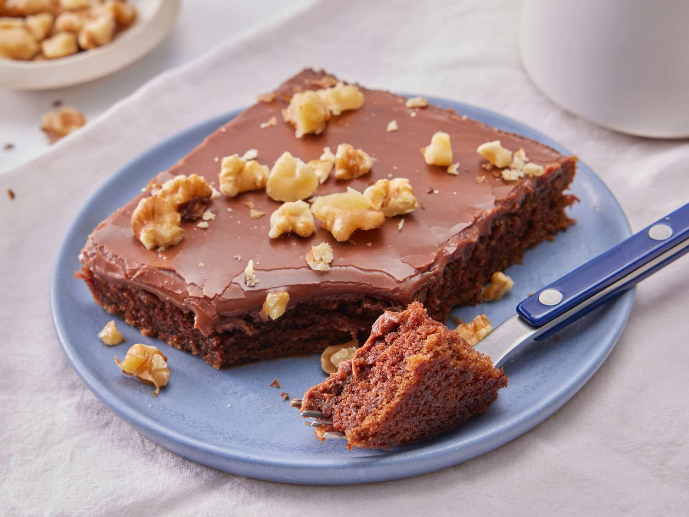

# Texas Sheet Cake

*The bake-sale Texan sheet cake: a flat, thin, intensely chocolatey cake with a warm pourable chocolate-pecan icing poured over while the cake is still hot, setting to a glossy fudge crust. Feeds a crowd; lasts five minutes.*

**Serves:** 20 (cuts into squares from a large rectangular tin)

**Prep Time:** 20 minutes

**Cook Time:** 22 minutes (plus 30 minutes cooling)

## Overview
Texas sheet cake is the bake-sale and church-supper standard of the American South, traceable to mid-20th-century home-cookery columns in Texas newspapers. The name comes from the size and shape - the cake is baked thin in a large rectangular sheet pan (the classic American "jelly roll pan" or a half-sheet) and serves a small crowd. The cake itself is dense and intensely chocolatey; the icing is made on the stovetop while the cake is in the oven and poured over the still-warm cake, where it spreads into a smooth thin layer and sets glossy. Toasted pecans are stirred into the icing just before pouring.

The technique is unusual for a cake: it uses a melted-butter-and-cocoa method rather than creamed butter, which gives a denser, more brownie-like crumb. The buttermilk gives tang and tenderness; the boiling water in the batter dissolves the cocoa fully and gives a darker colour. The icing on top is essentially a thin chocolate fudge, poured while still hot so it self-levels.

Pecans are standard; chopped walnuts or no nuts at all also appear. The cake is meant to be cut into small squares and eaten by hand at a picnic.

## Ingredients

### Cake
- 250 g plain flour
- 400 g granulated sugar
- 1 tsp bicarbonate of soda
- ½ tsp fine salt
- 1 tsp ground cinnamon (optional but classic)
- 250 g unsalted butter
- 60 g unsweetened cocoa powder
- 250 ml water
- 100 ml buttermilk
- 2 large eggs
- 1 tsp vanilla extract

### Icing
- 175 g unsalted butter
- 60 g unsweetened cocoa powder
- 100 ml whole milk
- 400 g icing sugar (sifted)
- 1 tsp vanilla extract
- 100 g toasted pecans (chopped)
- Pinch of salt

## Method

### Stage 1 - Prepare the tin
1. Preheat the oven to 180°C (350°F).
1. Line a 38 x 25 cm (15 x 10 inch) sheet pan with baking parchment, or grease and dust with flour.

### Stage 2 - Make the cake batter
1. Whisk the flour, sugar, bicarbonate of soda, salt and cinnamon together in a large bowl.
1. In a saucepan, combine the butter, cocoa and water. Bring to a boil over medium heat, stirring until the butter melts. Take off the heat.
1. Pour the hot cocoa-butter mixture into the dry ingredients. Whisk to combine.
1. Whisk in the buttermilk, eggs and vanilla. The batter will be thin and pourable; this is correct.
1. Pour into the prepared tin and spread evenly.

### Stage 3 - Bake
1. Bake 20-22 minutes. The cake is done when a skewer inserted in the centre comes out with a few moist crumbs (not wet batter). The top should be set and the edges just pulling away from the tin.
1. While the cake bakes, make the icing.

### Stage 4 - Make the icing (during the last 5 minutes of baking)
1. Combine the butter, cocoa and milk in a saucepan. Bring to a boil over medium heat, stirring continuously.
1. Off the heat, whisk in the icing sugar and vanilla until smooth. The icing should be glossy and pourable; if too thick, whisk in a tablespoon of hot milk.
1. Stir in the toasted pecans and a pinch of salt.

### Stage 5 - Ice the cake (while still hot)
1. As soon as the cake comes out of the oven, pour the warm icing over the warm cake. The icing will spread on its own as it hits the heat.
1. Help it along by tilting the tin gently if any corners are bare.
1. Let cool in the tin for at least 30 minutes. The icing sets into a glossy thin fudge layer.

### Stage 6 - Serve
1. Cut into 20 squares with a sharp knife. Lift each square out with a small offset spatula.
1. Eat from the hand; no plates necessary.

## Notes
- **The icing goes on while the cake is hot.** This is the structural trick. Warm icing on warm cake self-levels and bonds; cooled icing on cooled cake sits on top in a thick layer. Time the icing to be ready as the cake comes out.
- **The hot-water method matters.** Pouring boiling water over the cocoa (in the butter-cocoa-water mixture) blooms the cocoa fully and gives the deeper chocolate flavour. Cold water gives a paler, less chocolatey cake.
- **Toast the pecans first.** Raw pecans in the icing taste of nothing; toasted pecans give the warm, caramelised note the icing needs. Toast in a dry pan for 4 minutes or in a 180°C oven for 6.
- **A jelly roll pan is the right size.** Standard half-sheet pans are slightly larger and give a thinner cake; both work, but check that the cake is not over-baked.
- **Cinnamon is optional but Texan.** The cinnamon-in-chocolate combination is a Mexican-influenced Texas convention. A teaspoon is subtle but noticeable; leave it out for a straighter chocolate cake.

## Variations
- **Walnut sheet cake:** swap pecans for chopped walnuts in the icing.
- **Coffee sheet cake:** stir 2 tsp espresso powder into the cocoa-butter-water mixture; gives a deeper, slightly more sophisticated chocolate flavour.
- **Without nuts:** the cake works fine without; just an icing-glazed chocolate sheet.

## Serving
A bake-sale staple: 20 small squares served at room temperature, on a paper plate, eaten by hand. A glass of cold milk on the side; coffee for the adults. Travels well; perfect for a picnic.

## Storage
- Keeps 4 days at room temperature in an airtight container.
- Refrigerates 1 week; bring to room temperature 30 minutes before serving as the icing firms up cold.
- Freezes 3 months wrapped tightly. Defrost overnight in the fridge.
