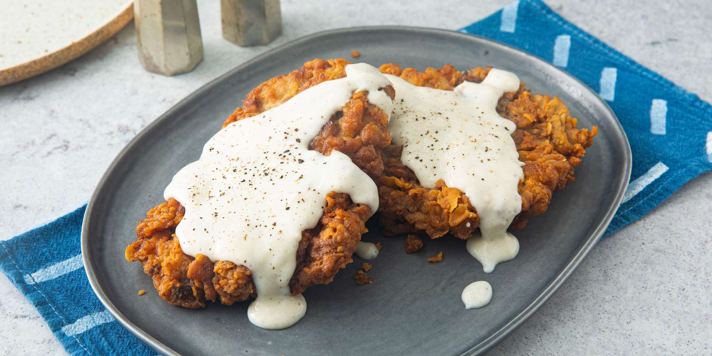

# Chicken-Fried Steak

*Texas's diner classic: a tenderised cube steak dredged in seasoned flour, dipped in egg, dredged again, and pan-fried in oil till the outside is deeply crispy and the inside stays tender. Smothered in white cream gravy made from the pan drippings. The Texas diner standard, the canonical "Texas plate".*

**Serves:** 4

**Prep Time:** 20 minutes

**Cook Time:** 25 minutes

## Overview
Chicken-fried steak (CFS, or country-fried steak in some Southern states) is Texas's quintessential diner dish and one of the most beloved working-class meals in the state: a tenderised cube steak dredged in seasoned flour, dipped in egg, dredged again for a double-coat crispy crust, then pan-fried till the outside is deeply golden and the inside stays tender. Smothered in white cream gravy made from the pan drippings, served with mashed potatoes (also smothered in gravy), buttered green beans and a hot biscuit on the side. Roots in German and Austrian immigrants in Texas (the technique resembles Wiener schnitzel) but thoroughly Texan by the 20th century. Cube steak is essential; the pre-tenderised cut gives the proper texture after pounding. The double coat (flour, egg, flour) is non-negotiable; single coat falls off in the pan. The white cream gravy is canonical Texas; not red sauce, not brown gravy.

## Ingredients

### Steaks
- 4 cube steaks (about 200 g each; pre-tenderised)
- 1 ½ teaspoons fine sea salt
- 1 teaspoon ground black pepper

### Dredge
- 300 g plain flour
- 2 teaspoons fine sea salt
- 2 teaspoons ground black pepper
- 2 teaspoons garlic powder
- 2 teaspoons onion powder
- 1 teaspoon paprika
- 1 teaspoon cayenne pepper

### Egg wash
- 3 large eggs
- 200 ml whole milk
- 1 tablespoon hot sauce (Tabasco or Frank's)

### Frying
- 500 ml vegetable oil (or peanut oil)

### Cream gravy
- 4 tablespoons pan drippings (from the frying)
- 4 tablespoons plain flour
- 700 ml whole milk (warmed)
- 2 teaspoons fine sea salt
- 2 teaspoons coarse ground black pepper (use plenty; the canonical Texas style)

### To serve
- Mashed potatoes
- Buttered green beans (or collards)
- Buttermilk biscuits
- Hot sauce
- Sliced tomato

## Method

### Stage 1 - Season the steaks
1. Pat steaks dry; sprinkle with salt and pepper.
2. Set aside while you prepare the dredges.

### Stage 2 - Prepare dredges
1. In one wide shallow dish: flour + salt + pepper + garlic powder + onion powder + paprika + cayenne (mix well).
2. In another: whisk eggs + milk + hot sauce.

### Stage 3 - Double-coat the steaks
1. Dredge each steak in flour; press to coat.
2. Dip into egg-milk; let excess drip off.
3. Dredge again in flour; press firmly to coat.
4. Place on a tray.
5. Let stand 10 minutes (the coating sets and adheres better).

### Stage 4 - Heat the oil
1. Heat the vegetable oil in a wide heavy pan (1.5 cm depth) to 175°C (350°F).

### Stage 5 - Fry the steaks
1. Add steaks in batches (don't overcrowd).
2. Fry 3-4 minutes per side till deeply golden and crispy.
3. The internal temperature should reach 65°C (medium).
4. Lift onto a wire rack to drain (don't on paper or they'll get soggy underneath).

### Stage 6 - Make the gravy
1. Pour off the frying oil; keep 4 tablespoons of the pan drippings (the browned bits at the bottom are essential for the gravy).
2. Return the pan to medium heat.
3. Sprinkle the flour over the drippings; whisk constantly for 2 minutes to make a brown roux.
4. Gradually pour in the warm milk, whisking continuously to prevent lumps.
5. Cook 5-7 minutes till the gravy thickens to a creamy consistency.
6. Add salt and (especially) plenty of black pepper; the canonical CFS gravy is heavily peppered.
7. Taste; adjust salt.

### Stage 7 - Serve
1. Place a steak on each plate.
2. Add a generous scoop of mashed potatoes alongside.
3. Pour cream gravy generously over both the steak and the potatoes.
4. Add buttered green beans.
5. Hot biscuit on the side.

## Notes
- **Cube steak essential:** pre-tenderised; without this, the meat is tough.
- **Double-coat:** flour-egg-flour for crispy crust.
- **White cream gravy from pan drippings:** canonical.
- **Plenty of black pepper in the gravy:** the Texas signature.
- **Wire rack for draining:** not paper.

## Variations
**With sausage gravy:** swap pan drippings for crumbled cooked breakfast sausage; gives sausage gravy. Common variation.
**Buttermilk version:** use buttermilk instead of milk for the gravy; gives slight tang.
**Sweet tea variation (less canonical):** brush the cooked steak with sweet tea reduction; modern Texas variation.
**Pork tenderloin chicken-fried (German-Texas):** swap beef for pork tenderloin pounded thin; closer to Wiener schnitzel.

## Serving
On a wide plate with mashed potatoes, green beans, biscuit. Smothered in gravy. Drink: sweet iced tea, cold beer (Shiner Bock, Lone Star), or buttermilk.

## Storage
- Best eaten immediately.
- Cooked steak keeps refrigerated 2 days; reheat in hot oven 8 minutes.
- Gravy keeps refrigerated 3 days; reheat with extra milk.
- Don't freeze.
