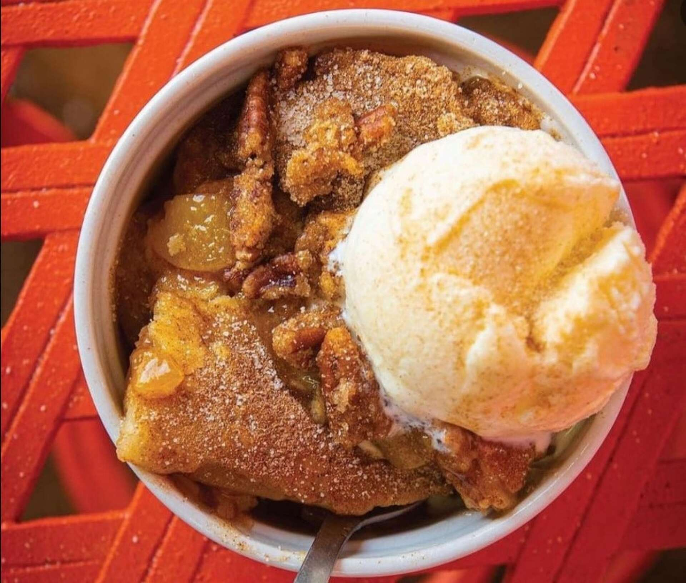

# Texas Peach Cobbler

*Texas's stone-fruit dessert: fresh sliced peaches with sugar, butter, vanilla and cinnamon, topped with a sweet biscuit-style batter that bakes into a golden crust over the bubbling fruit. The Texan summer dessert, the canonical use of Fredericksburg peaches (the famous Texan peach-growing region).*

**Serves:** 8

**Prep Time:** 20 minutes

**Cook Time:** 50 minutes

## Overview
Texas peach cobbler is Texas's iconic summer dessert and one of the most beloved cobbler variations in America: fresh sliced peaches (the Texan Fredericksburg peaches are the canonical choice - sweet, fragrant, juicy; or any ripe peach in season) tossed with brown sugar, vanilla, lemon juice, cornstarch, butter and cinnamon, poured into a baking dish, topped with a biscuit-style batter (a wet thick batter - not a pie crust - made from flour, sugar, baking powder, salt, milk and melted butter), and baked till the batter rises and bakes into a golden crust over the bubbling peach filling. Served warm with a scoop of vanilla ice cream or a heap of whipped cream. The dish is a Texas summer institution, particularly during peach season (June-August in Texas). Fresh peaches in season give the best result; frozen work in winter. Biscuit-style batter on top, never pie crust; that's what distinguishes Texas cobbler from pie. Served warm with a scoop of vanilla ice cream.

## Ingredients

### Peach filling
- 1.5 kg fresh peaches (peeled, pitted, sliced); or 1.2 kg frozen peach slices (thawed)
- 200 g brown sugar
- 2 tablespoons cornstarch
- 1 tablespoon ground cinnamon
- 1 teaspoon ground nutmeg
- 1 teaspoon vanilla extract
- 2 tablespoons fresh lemon juice
- 80 g unsalted butter (cubed; for dotting on top)
- Pinch of salt

### Biscuit batter
- 250 g plain flour
- 150 g caster sugar
- 2 teaspoons baking powder
- ½ teaspoon fine sea salt
- 1 teaspoon ground cinnamon
- 200 ml whole milk
- 100 g unsalted butter (melted)
- 1 teaspoon vanilla extract
- 1 large egg

### Topping
- 2 tablespoons demerara sugar (for sprinkling)
- 1 teaspoon ground cinnamon (extra for sprinkling)

### To serve
- Vanilla ice cream
- Whipped cream

## Method

### Stage 1 - Prep the peaches
1. Preheat the oven to 180°C (350°F).
2. Grease a wide deep baking dish (25 cm × 35 cm; or any 3-litre capacity).

### Stage 2 - Mix the peach filling
1. In a wide bowl, combine the peach slices, brown sugar, cornstarch, cinnamon, nutmeg, vanilla, lemon juice and salt.
2. Toss to coat.
3. Tip into the baking dish.
4. Dot the cubed butter over the top.

### Stage 3 - Make the biscuit batter
1. In another bowl, whisk together flour, sugar, baking powder, salt and cinnamon.
2. In a smaller bowl, whisk together milk, melted butter, vanilla and egg.
3. Pour the wet into the dry; stir till just combined.

### Stage 4 - Top the peaches
1. Spoon the biscuit batter in dollops over the peach filling (don't smooth completely; the dollops bake into a rustic top).
2. Sprinkle with demerara sugar and extra cinnamon.

### Stage 5 - Bake
1. Bake at 180°C for 40-50 minutes till the topping is deeply golden and the peach filling is bubbling around the edges.

### Stage 6 - Rest and serve
1. Let rest 10 minutes (the filling firms up).
2. Spoon generously into bowls.
3. Top with vanilla ice cream or whipped cream.
4. Serve warm.

## Notes
- **Fresh peaches in season:** the canonical Texan version.
- **Biscuit batter, not pie crust:** Texas cobbler distinct.
- **Don't smooth the topping:** rustic dollops are the look.
- **Serve warm:** the contrast with ice cream is the point.

## Variations
**With blueberries:** add 200 g of blueberries to the peach filling; gives mixed-berry-peach.
**With bourbon:** add 2 tablespoons of bourbon to the peach filling; gives extra depth.
**Spiced version:** add ¼ teaspoon ground ginger and ¼ teaspoon ground cloves to the peaches.
**Mixed stone fruit:** combine peaches with plums and nectarines; gives a layered fruit cobbler.

## Serving
Warm with vanilla ice cream or whipped cream. After Texas BBQ, Sunday dinner, or as the canonical Texan summer dessert.

## Storage
- Keeps refrigerated 4 days; reheat in oven.
- Freezes 3 months.
- Best fresh and warm; the topping crisps when reheated.
