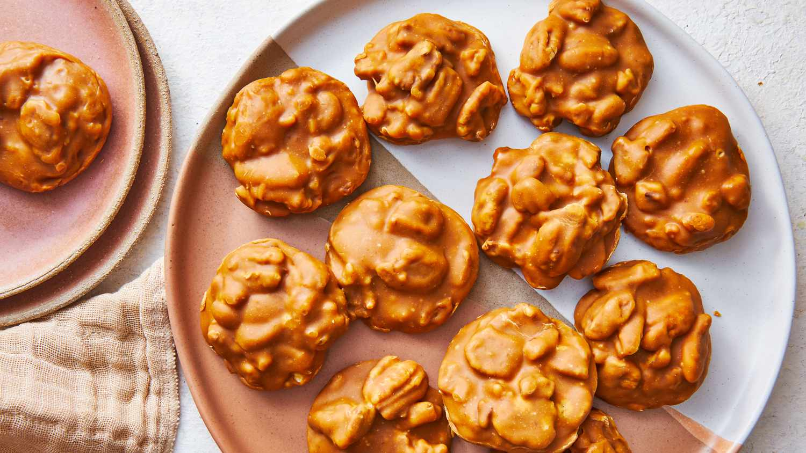

# Texas Pecan Pralines

*Texas's pecan candy: brown sugar, cream and butter cooked together to soft-ball stage, then beaten with toasted pecans and dropped in spoonfuls onto parchment to set into chewy-grainy candies. The Texas-Louisiana praline tradition, pecan-rich, brown-sugar-deep, candy-shop-classic.*

**Serves:** Makes 24 pralines

**Prep Time:** 15 minutes

**Cook Time:** 25 minutes

## Overview
Pecan pralines are one of Texas's most iconic candies and a tradition shared with neighbouring Louisiana (the dish has French and Creole roots; came to America with French settlers in Louisiana, then spread to Texas via the pecan-growing regions): a candy made from dark brown sugar, granulated sugar, double cream, butter and toasted pecans cooked together to the soft-ball stage (114-118°C / 237-244°F), then beaten vigorously off the heat for a few minutes till the mixture starts to thicken and crystallise slightly, then dropped quickly in spoonfuls onto parchment paper where each praline sets into a flat 6-7 cm disc, chewy, grainy, deeply brown-sugar-flavored, packed with toasted pecans. A candy thermometer is essential to hit soft-ball stage; too hot gives hard candy, too cool and they don't set. The beating off-heat is what crystallises the sugar slightly and gives the proper grainy-chewy texture. Work quickly once it sets in the pan; the candy hardens fast, with maybe sixty seconds to scoop and drop.

## Ingredients

- 250 g dark brown sugar
- 250 g granulated sugar
- 250 ml double cream
- 80 g unsalted butter (cubed)
- 1 teaspoon vanilla extract
- 1 teaspoon fine sea salt
- 300 g pecan halves (toasted; some halved, some left whole)

### Equipment
- Heavy saucepan
- Candy thermometer
- Parchment paper
- Tablespoon for dropping

## Method

### Stage 1 - Prep
1. Toast the pecans: spread on a dry tray; bake at 180°C for 8-10 minutes till fragrant. Cool slightly.
2. Line a baking sheet with parchment paper.

### Stage 2 - Combine sugars and cream
1. In a heavy saucepan, combine brown sugar, granulated sugar, cream and salt.
2. Stir over medium heat till the sugars dissolve.

### Stage 3 - Cook to soft-ball
1. Bring to a boil; insert candy thermometer.
2. Cook 12-15 minutes, stirring occasionally, till the temperature reaches 115°C / 240°F (soft-ball stage).
3. The mixture will be a deep caramel colour.

### Stage 4 - Add butter and vanilla
1. Take off the heat.
2. Add the cubed butter and vanilla; stir till the butter melts.

### Stage 5 - Add pecans and beat
1. Stir in the toasted pecans.
2. Beat vigorously with a wooden spoon for 60-90 seconds till the mixture starts to thicken and lose its sheen (slight crystallisation).

### Stage 6 - Drop quickly
1. Working quickly (you have about 60 seconds): drop tablespoons of the mixture onto the prepared parchment.
2. Try to keep each praline about 6 cm wide and 1 cm thick.
3. Space 4-5 cm apart.

### Stage 7 - Set
1. Let cool at room temperature 30-45 minutes till fully set.

### Stage 8 - Store and serve
1. Once set, peel off the parchment.
2. Store in a sealed container with parchment between layers.

## Notes
- **Candy thermometer essential:** soft-ball stage is the doneness test.
- **Beat off heat:** crystallises slightly.
- **Work quickly:** 60 seconds to drop.
- **Use toasted pecans:** for proper flavour.
- **Heavy saucepan:** prevents burning.

## Variations
- **With bourbon:** add 1 tablespoon of bourbon with the vanilla; gives sweet smoky depth.
- **With chocolate drizzle:** drizzle melted chocolate over the set pralines.
- **Salted pralines:** sprinkle flaky salt on each before they set; gives a salty-sweet contrast.
- **Smaller pralines:** drop teaspoons instead of tablespoons; makes 48 small ones.

## Serving
- As Texas candy after meals, with coffee, or as a Christmas gift. With strong coffee or after a Texan dinner.

## Storage
- Keeps in a sealed container at room temperature 2 weeks.
- Don't refrigerate; the texture goes sticky.
- Don't freeze; the texture suffers.
